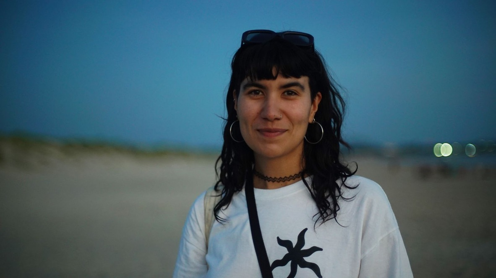

# Sobre mi

Soy Diseñadora Industrial especializada en textil e indumentaria, graduada en diciembre de 2019 de la [Escuela Universitaria Centro de Diseño](https://www.fadu.edu.uy/eucd/institucion/) (EUCD) de la FADU/UdelaR en Montevideo, Uruguay. Mi tesis, "[Diseñando el Cuerpo](https://www.colibri.udelar.edu.uy/jspui/handle/20.500.12008/39703)" exploró el vínculo entre la lencería y el cuerpo, y cómo las campañas publicitarias influyen en la creación de discursos corporales. 

En 2020, durante la pandemia, comencé mi formación en Educación Sexual Integral (ESI) en el [Instituto de Sexología Integral](http://www.sexur.uy/) (SEXUR). 
He realizado numerosos cursos y talleres sobre upcycling, estampa crítica, moda y feminismo, diseño e ilustración de personajes, producción musical y gestión cultural.
Actualmente, trabajo en el [Instituto Nacional de la Juventud](https://www.gub.uy/ministerio-desarrollo-social/juventud) (INJU) del Ministerio de Desarrollo Social (MIDES), gestionando eventos artísticos y culturales para jóvenes. 
También soy productora en eventos culturales como [Senderos](https://www.instagram.com/quebradauy/) y Sofar Sounds Montevideo. He adquirido experiencia en la producción de eventos y la gestión cultural, con un enfoque especial en el arte, danza y la música como formas de creación cultural.
He participado en la creación de vestuario para diversas obras de teatro y danza, y en la ilustración de afiches para convocatorias de danza, conciertos, cine y tapas de discos. Además, he sido docente en talleres de estampado y serigrafía, y en talleres de costura para niños.

Mi trabajo está profundamente influenciado por el transfeminismo, la teoría queer y la diversidad. Me interesa que el diseño sea funcional y estético, reflejando la identidad de cada proyecto. 
Con la Especialización en Fabricación Digital e Innovación, busco seguir formándome para expandir mis conocimientos y adquirir nuevas herramientas innovadoras, contribuyendo a la sociedad y la cultura desde una perspectiva de equidad.

