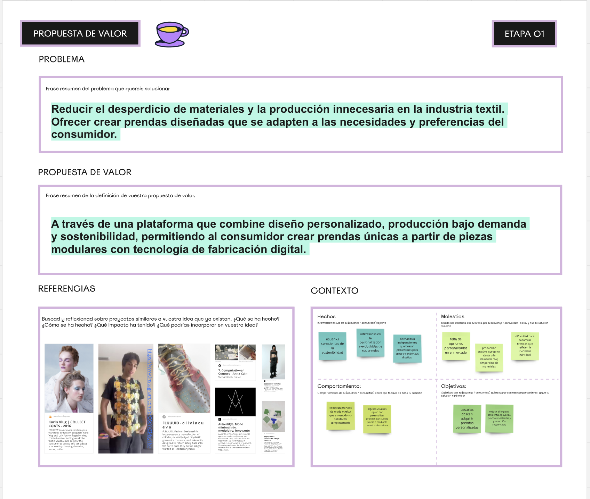
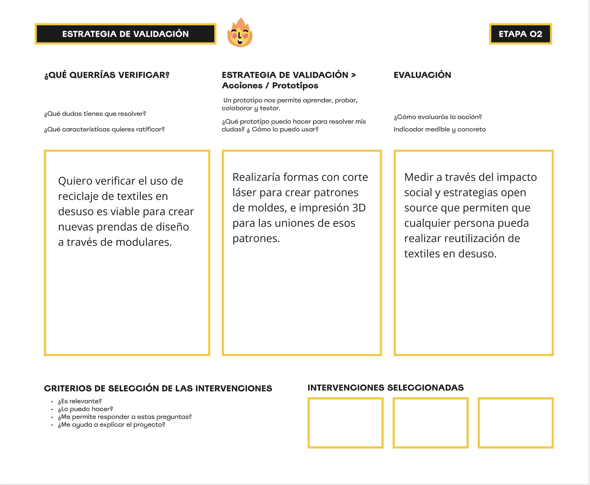

---
hide:
    - toc
---

# MD02 Diseño

## **Proyecto y diseño**

####**Introducción**

Este módulo consistió en empezar a definir nuestro proyecto final integral de la Especialización. Para ello, repasamos las metodologías utilizadas en los MD01 y MI01 y se sumó la metodología de Design Thinking para profundizar en el desarrollo de las estrategias de diseño.

####**Glosario**

**Design thinking**
Es una metodología de diseño que busca entender para poder crear. Consiste en identificar las características y necesidades específicas del usuario y definir estrategias para atenderlas.  
El proceso de Design Thinking se organiza en cinco etapas: empatizar > definir > idear > prototipar > testear > producto final.

**Empatizar**: Conocer al usuario para descubrir sus necesidades mediante la observación, entrevistas, encuestas, diferentes perspectivas, escucha activa, entre otras herramientas.  
**Definir**: Organizar y analizar la información identificando patrones, formulando el problema, estableciendo criterios y generando requisitos clave.  
**Idear**: Generar ideas creativas fomentando la colaboración entre diversas personas, utilizando herramientas como mapas mentales, lluvias de ideas, entre otras.  
**Prototipar**: Dar forma tangible a las ideas, creando prototipos en baja o alta fidelidad, ya sean estéticos o funcionales. Que puede adoptar diferentes formas: un objeto, una aplicación digital, un proceso, una política pública, un proyecto político o un sistema. 
**Testear**: Evaluar los prototipos llevando el producto o servicio a su contexto real, realizando pruebas con usuarios y ajustando según los objetivos establecidos.

Es importante destacar que esta metodología no sigue un orden rígido; las etapas se interrelacionan y pueden solaparse.

####**Documentación del proceso**
Repasamos las metodologías de diseño e innovación para iniciar el proceso de nuestro proyecto final integrador.  
En el MD01, Jana Tothill nos presentó el Atlas of weak signals, una herramienta para la creación de espacios de diseño, permitiéndonos escalar nuestras ideas y analizar su impacto, así como identificar posibles presentes alternativos.  
La documentación de ese módulo está disponible aquí: [Documentación MD01](https://bitacoralu.github.io/lucia_rossi/diseno/md01/) 

En el MI01, Paola Zanchetta nos acercó los conceptos de innovación abierta y diseño distribuido, con un enfoque sostenible que considera dimensiones sociales, económicas y ambientales.  
La documentación de ese módulo está disponible aquí: [Documentación MI01](https://bitacoralu.github.io/lucia_rossi/innovacion/mi01/)

Antes de completar la actividad del MD02, que implica llevar la idea a la realidad, realicé una lluvia de ideas sobre los temas que considero interesantes para trabajar. Para orientarme, utilicé preguntas clave del Atlas que me ayudaron a evaluar qué es viable y qué me motiva más, en relación con señales débiles como la innovación no heteropatriarcal, el género fluido, la tecnología para la igualdad y los cambios necesarios para lograr equidad. Identifiqué áreas de oportunidad como la educación creativa, la investigación centrada en la idea y el diseño, el diseño para la innovación social y el desarrollo de materiales. También reconocí detonantes como el diseño impulsado por materiales, las compras de identidad, la moda digital, la reconfiguración de hábitos, la innovación open source, el espacio doméstico productivo, el diseño generativo, el diseño emocional y la diversidad cognitiva, todo orientado a la creación de futuros alternativos y sus posibles acciones.

En este módulo, realizamos un ejercicio en [Miro](https://miro.com/app/board/uXjVK9Q-_oY=/) que teníamos que completar la propuesta de valor y las estrategias de validación.

Además realizamos una actividad en la que debíamos completar las siguientes preguntas vinculadas a la metodología de Design Thinking:
Empatizar: ¿Quiénes son mis usuarios? ¿Qué necesidades tiene?. Definir: ¿Cuál es el problema? Idear: ¿Cuál es mi idea/solución? Prototipar: ¿Cómo lo prototipo? ¿Qué materiales uso? Testear: ¿Dónde lo pongo a prueba? 
Como son parte del proceso del proyecto final, dejaré el registro en la sección de [Proyecto integrador final/Ideas iniciales](https://bitacoralu.github.io/lucia_rossi/proyecto/proyecto/)

####**Reflexiones**
Este módulo me ayudó a organizar las ideas que tengo en mente y a adjuntar las referencias que voy encontrando. Además, estoy sistematizando todo en la pestaña del proyecto integrador para avanzar de manera más estructurada. Entiendo que la idea que planteo en este momento puede cambiar por completo.