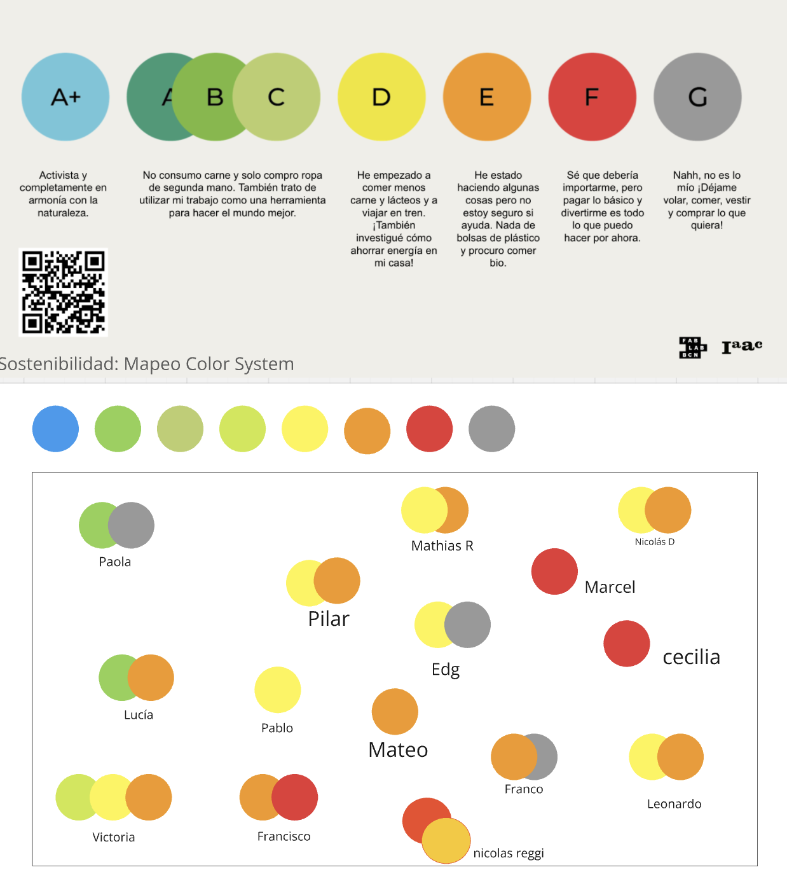
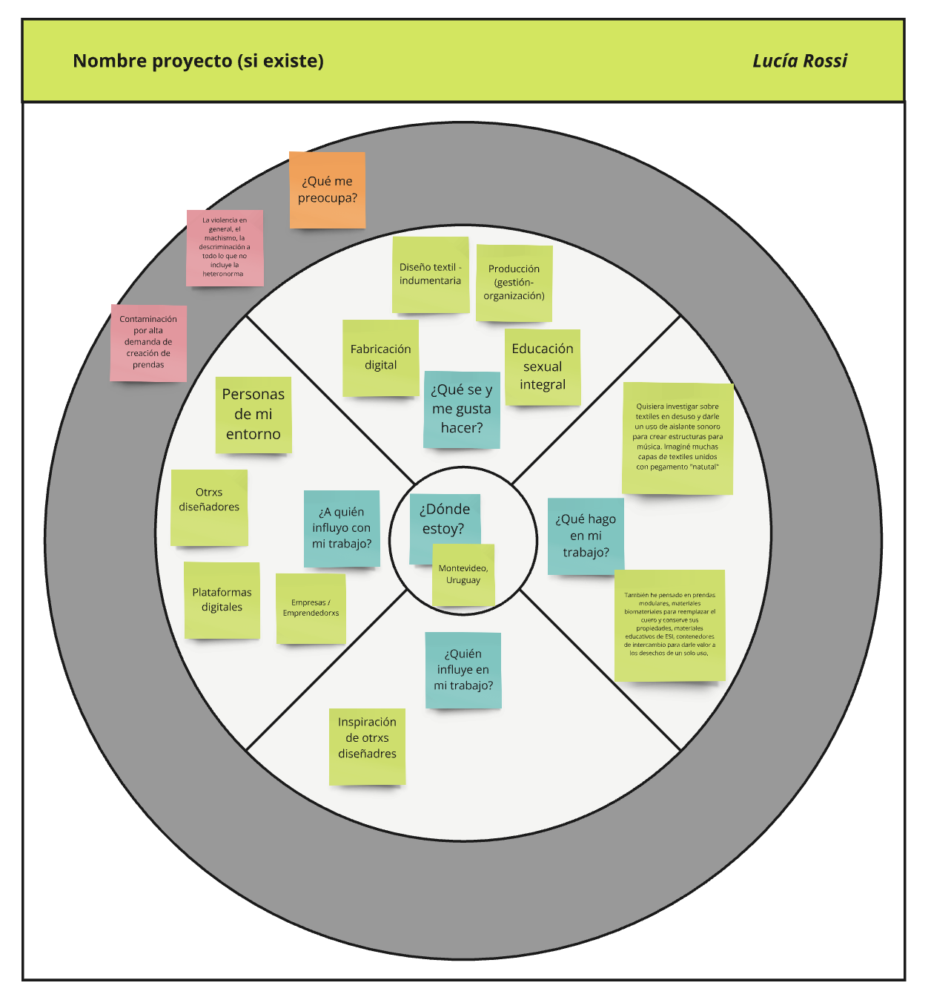
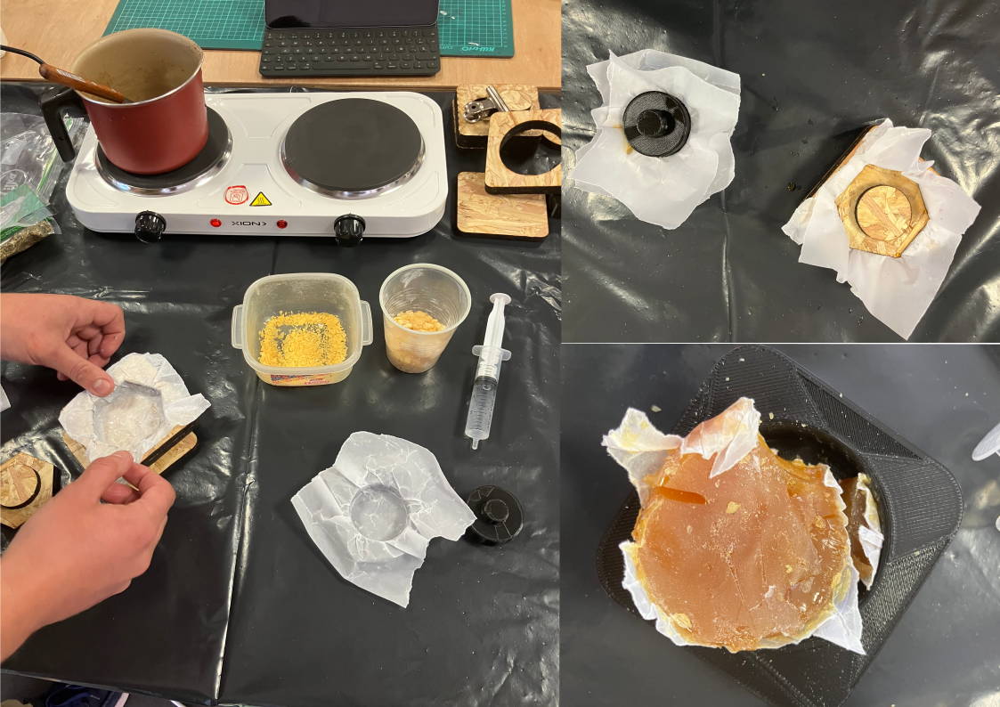

---
hide:
    - toc
---

# MI02 Innovación y Sostenibilidad

## **Desarrollo sostenible y economía circular**

#### **Introducción**
  
En este módulo, Paola nos presentó proyecto y teoría sobre desarrollo sostenible y economía circular. 

#### **Glosario** **Documentación del proceso** 

**¿Cuánto de sostenible es nuestro estilo de vida?**  
Paola nos presentó una escala de colores y letras para cuestionarnos cómo es nuestra sostenibilidad y economía circular en nuestro estilo de vida. 

Al principio había marcado solo los colores azul y verde, pero luego me sentí hipócrita. El azul representa lo que me gustaría ser, pero al reflexionar, me doy cuenta de que muchas veces opto por la comodidad y el consumo rápido. Intento ser sostenible, pero no lo soy en todos los aspectos de mi vida. Me identifico más con el verde, ya que no consumo carne, suelo comprar ropa de segunda mano y apoyo producciones locales con una visión sostenible. En mis trabajos, trato de estar atenta a los desechos y al uso de energía, entre otras cosas. El color naranja refleja mis pequeños aportes, como ir a la feria con bolsas de tela y optar por envases retornables. 

**Círculo de influencia**  
Utilizamos un círculo de influencia para mapear nuestra posición y analizar qué cambios podemos hacer para mejorar la economía circular en nuestro contexto. 
En el [Miro](https://miro.com/app/board/uXjVKjpb7U4=/) se lee mejor. 

**Ciclos**  
Hablamos sobre los ciclos: ineal, reciclar, circular, regenerativo. Reflexionamos sobre el enfoque regenerativo, donde muchos proyectos utilizan biomateriales para devolver los recursos a la tierra.

Con esto es pensar es pensar en lo regenerativo que muchos proyectos utilizan biomateriales para devolver a la tierra. 

**Clase presencial de Biomateriales en LATU**

En esta clase, diseñadores nos mostraron cómo crear productos más sostenibles. Por ejemplo, en montajes de arte o ferias, se pueden construir con biomateriales. Vimos un escaparate de la marca Mango que utilizaba carozo de aceitunas y cochinilla (un colorante natural). También se nos mostró cómo utilizar cartelería hecha con biomateriales y técnicas de fabricación digital como el corte láser para el texto.

Después, en la segunda parte de la clase, que la presentó Clara, realizó una presentación teórica y luego pasamo a ejercicios prácticos en cuatro estaciones, cada una con diferentes recetas que preparamos en equipo. Aprendimos que el proceso de fabricación de biomateriales implica **preparación, elaboración y secado.**

**Componentes principales de biomateriales:**

**Biopolímeros:** aglutinan los demás ingredientes (gelatina, agar agar, resina de pino, alginato de sodio).  
**Plastificantes:** la cantidad utilizada determina si el material será más flexible o rígido.  
**Aditivo:** incluyen residuos alimenticios o flora, previamente triturados y secos, para generar color y/o texturas.  
**Solvente:** disuelve el biopolímero para integrar los ingredientes. Se usa agua o alcohol dependiendo del biopolímero. Este solvente se evapora durante la fabricación. 

También utilizamos vinagre para evitar la aparición de hongos o bacterias. 

### **Recetas**

**Bioplásticos en base de Gelatina**

Receta de Gelatina:  
- 200 ml de agua  
- 1 cucharada pequeña de vinagre  
- 5 a 15 ml de glicerina  
- 40 gr de gelatina  
- 20 gr a 40 gr de aditivos.  

Instrucciones:  
Agregar el agua, el vinagre y la glicerina a la olla en frío, revolver para que se incorpore y dejar calentar a fuego medio. Agregar de a poco la gelatina y revolver para disolver hasta que suelte un hervor. Bajar la temperatura y agregar los aditivos o colorantes y revolver. Dejar reposar y que entibie, cuando la mezcla se pegue a los dedos, verter.

**Biocompuesto en base a Resina**

Receta de Resina: 
- 50 gr de colofonia  
- 15 ml de alcohol  
- 5 gr de cera carnauba  
- 40 gr / 60 gr de aditivos según cual use.  

Instrucciones:  
Preparar los moldes con papel de horno. Agregar la colofonia y el alcohol en la olla cuando esté fría, encender a fuego medio bajo y tapar la olla. Esperar a que esté todo derretido sin revolver. Una vez que esté derretido, agregar la cera carnauba y revolver. Agregar el o los aditivos, incorporar toda la mezcla hasta que esté uniforme y densa. Volver a tapar para que derrita todo junto. Una vez que la mezcla está homogénea verter en el molde y aplastar con fuerza. Dejar enfriar en el molde antes de desmoldar.

Para limpiar : volver a poner alcohol en la olla y dejar hervir nuevamente en el hornillo. Retirar la resina con papel de cocina, repitiendo la operación cuanta veces sea necesario hasta que la olla y los utensilios estén limpios.

**Bioplástico en base a agar agar**

Receta de Agar Agar  
- 200 ml de agua  
- 7,5 gr de agar agar  
- 12 ml de glicerina  
- 10 gr a 15 gr de aditivos.  

Instrucciones:  
Agregar el agua, y el agar agar a la olla en frío y disolver. Agregar la glicerina. Revolviendo siempre, calentar a temperatura baja durante 2 minutos. Subir la temperatura paulatinamente cada 2 minutos. Agregar los aditivos o colorantes. La mezcla debiese cambiar su textura entre el minuto 6 y 8. Se vierte en ese momento apenas comienza a parecerse a una crema liquida.

**Biocerámica en base a Alginato de sodio**

Receta de Alginato de sodio:  
- 4 gr de alginato de sodio  
- 200 ml de agua  
- 8 ml de vinagre  
- 15 - 20 gr de aditivo cáscaras de huevo  

Instrucciones:  
Mezclar el agua con el alginato de sodio, procesar con mixer para mezclar bien. Reservar en heladera 24hs.
Mezclar las cáscaras de huevo con la preparación de alginato de sodio y agua, evitando que se formen burbujas. Una vez mezclado, colocar con cuchara sobre el molde y acomodar, y luego verter suavemente por encima el vinagre. Comenzará a reaccionar y coagularse. Luego de 15 minutos separar la mezcla del molde suavemente para dejar espacio para que el vinagre penetre por los lados. Esperar una hora. Luego sacar la muestra del molde y darle la vuelta para permitir que el vinagre llegue al otro lado del biocompuesto. Dejar reposar por una hora más.

Por último, lavar el mismo debajo de la canilla para eliminar el vinagre.

Las recetas fueron extraídas de la [presentación de Clara](https://docs.google.com/presentation/d/1wTZXYWXdhkgF0UQx17UuUuHrYGS0hKnOEQMr177-cI0/edit#slide=id.g22482a2fcbe_0_40).

#### **Reflexiones**

En la mayoría de las recetas no pudimos ver los resultados debido al tiempo de secado. En el caso de la mesa de resina de pino, el resultado no fue el esperado, ya que el material se quebró. Entiendo que estas recetas pueden variar y que el trabajo con biomateriales implica un proceso de ensayo y error para lograr el resultado deseado. Me encantó tener una clase presencial, compartir con los compañeros, hacer preguntas y trabajar manualmente. Este tema me interesa mucho para aplicarlo en mi proyecto final, que se enfocará en el reciclado de textiles en desuso.

