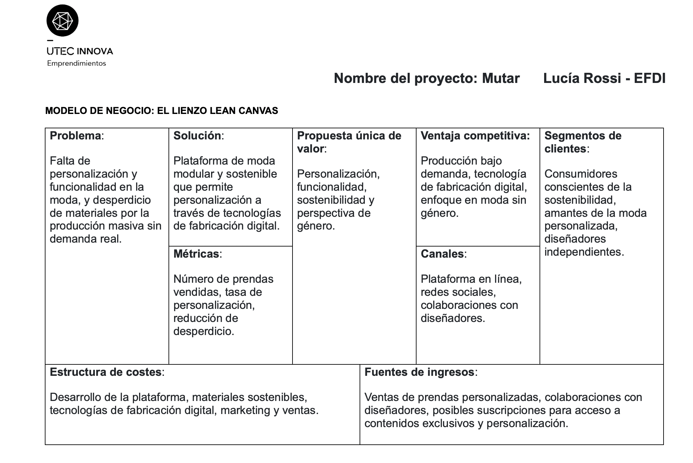

---
hide:
    - toc
---

# MI03 Innovación y Sostenibilidad

## **Emprendimiento**

#### **Introducción**

Este módulo consistó en un [Programa de Emprendimientos](https://utec.edu.uy/es/innovacion/programa-de-emprendimientos/) y se dividió en etapas  
1. Actitud Emprendedora (autogestiva)  
2. Generación de Ideas de Negocios (clases sincrónicas)

####**Glosario** **Documentación del proceso**

**Instancia 1 - Actitud Emprendedora**

En esta etapa, el enfoque estuvo en el autoconocimiento, un aspecto clave para desarrollar una actitud emprendedora efectiva. Entender mi personalidad me permitirá enfrentar los desafíos de un emprendimiento con mayor claridad. Este proceso de autoconocimiento es fundamental para comprender cómo reaccionar ante situaciones comunes en el mundo emprendedor, como identificar oportunidades, planificar, gestionar riesgos e incertidumbres, y establecer relaciones con socios, empleados y clientes.

**Herramientas para el Autoconocimiento**:

1. **Tipo de Personalidad**  
Para descubrir mi tipo de personalidad, realicé un test disponible en [16Personalities](https://www.16personalities.com/es/test-de-personalidad). Aprendí que mi personalidad es ENFJ-T(Protagonista), caracterizada por ser carismática, compasiva, idealista, y persuasiva, con una inclinación natural hacia el liderazgo y el brillo en entornos sociales.

  
2. **Características del Comportamiento Emprendedor (CCE)**  
   Exploré diversos comportamientos típicos de los emprendedores, como la búsqueda de oportunidades, la toma de riesgos calculados, la persistencia, la planificación y la persuasión. Reflexioné sobre la importancia del trabajo en equipo y comprendí que para que un emprendimiento tenga éxito, no es necesario dominar personalmente todas estas habilidades, sino más bien contar con un equipo complementario.

3. **Tipo de Inteligencia**  
   Las diferentes categorías de inteligencia, como la lingüística, matemática, interpersonal, kinestésica, intrapersonal, entre otras, me permitieron identificar mis fortalezas y áreas de desarrollo. Estos conocimientos son valiosos para seguir potenciando mi crecimiento personal y el de mi emprendimiento.  
   Test disponible en [Psicoactiva](https://www.psicoactiva.com/test/educacion-y-aprendizaje/test-de-las-inteligencias-multiples/)

4. **Análisis FODA**  
   Realicé un análisis FODA, una herramienta que permite evaluar las Fortalezas, Oportunidades, Debilidades y Amenazas tanto a nivel personal como del emprendimiento. Esto me ayudó a tener una visión más clara sobre cómo optimizar mis recursos y enfrentar los desafíos del negocio.

**Instancia 2 - Generación de Ideas de Negocio**

Durante esta segunda instancia, liderada por Ricardo Rodríguez, nos enfocamos en aprender a detectar oportunidades y desarrollar la creatividad para generar ideas de negocio. Se trabajó en cómo pensar "fuera del cuadrado" y convertir una idea en una oportunidad viable.

**Conceptos clave**

- **Emprendedor**: Según Jeffrey Timmons, el emprendedor identifica oportunidades y consigue recursos para aprovecharlas.  
- **Creatividad**: Es la capacidad de cuestionar suposiciones, romper límites y generar nuevas conexiones. La creatividad puede ejercitarse y es fundamental para generar ideas innovadoras.  
- **Innovación**: Introducir un nuevo producto, proceso o método organizativo. La creatividad lleva a la innovación, lo que a su vez genera diferenciación y resultados.

**Barreras de la Creatividad**: 
- Externas: Sistema educativo, cultural y familiar.  
- Internas: Bloqueos mentales perceptivos, emocionales y culturales.

**Técnicas de Generación de Ideas**:  
1. **Brainstorming**: Lluvia de ideas para explorar todas las posibilidades sin limitaciones.  
2. **4x4x4**: Proceso en el que cada participante escribe 4 ideas, se forman parejas y se generan 4 ideas más a partir de las compartidas. 
3. **PNI** (Positivo, Negativo, Interesante): Evaluación de ideas desde tres perspectivas.  
4. **Sinéctica**: Combina conceptos de diferentes perspectivas para generar ideas.

Después de las clases sincrónicas, que incluyeron ejercicios prácticos para identificar oportunidades de negocio, nos enfocamos en desarrollar ideas basadas en problemas, experiencias laborales o intereses personales. Este proceso culminó con la elaboración de un cuestionario clave para dar forma a la idea de negocio y la creación de un Lean Canvas.

Mi idea es crear una plataforma de moda sostenible y personalizada llamada "Mutar", que permita a los usuarios diseñar prendas modulares utilizando tecnologías como la impresión 3D y el corte láser, reduciendo el desperdicio y apoyando la sostenibilidad. Donde tuvimos que enviar un cuestionario del proyecto y realizar un canvas. 

[Formulario](https://docs.google.com/forms/d/e/1FAIpQLSeQ1902ebLqkTRwpPWyTwsFvFWPCOKXhLRU2rJ-2DruP8n62w/viewform) del curso generación de ideas / Tarea Final

### Resumen de la Idea de Negocio (hasta 500 caracteres)

Crear una plataforma de moda sostenible que permita a los clientes diseñar prendas personalizadas a partir de piezas modulares. Utilizando tecnologías de fabricación digital, como impresión 3D y corte láser, se ofrece la personalización y funcionalidad de prendas con una perspectiva sin género. La producción bajo demanda reduce el desperdicio y apoya prácticas sostenibles.

### Preguntas de Negocio  

1. **¿Tengo un problema o necesidad identificada que valga la pena resolver? ¿Cuál es?**  
   Sí, la falta de personalización y funcionalidad en la moda, junto con el desperdicio significativo de materiales debido a la producción masiva sin demanda real.

2. **¿A quién le voy a vender? ¿Quién es realmente mi cliente? ¿Quién es mi usuario?**  
   Los clientes son personas interesadas en moda sostenible y personalizada, así como diseñadores de moda que desean usar la plataforma para crear sus propias colecciones modulares.

3. **¿Cuál es la competencia?**  
   Empresas de moda sostenible, plataformas de personalización de moda y marcas que ofrecen prendas modulares.

4. **¿Cómo se espera que evolucione este mercado?**
   Se espera un crecimiento en la demanda de moda sostenible y personalizada, con un aumento en la adopción de tecnologías de fabricación digital y una mayor conciencia ambiental.

5. **¿Qué recursos tengo para poner en marcha mi emprendimiento?**
   Experiencia en diseño textil y en tecnología de fabricación digital, contactos en la industria de la moda y la tecnología, y conocimiento en sostenibilidad y ESI.

6. **¿Qué recursos necesito y cómo los puedo obtener?**
   Inversión inicial para la plataforma digital y equipos de fabricación, colaboración con expertos en tecnología digital y materiales sostenibles, y apoyo para marketing y ventas.

7. **¿A quién puedo incorporar a mi red de contactos?**
   Diseñadores independientes, expertos en tecnología digital, proveedores de materiales sostenibles, y profesionales de marketing y ventas.

8. **¿Quiénes componen el equipo emprendedor?**
   Actualmente, la usuaria como fundadora y diseñadora principal. Se buscarán colaboradores en áreas de tecnología, producción y marketing.

9. **¿Qué conocimientos y experiencia tiene el equipo que es relevante para el desarrollo del emprendimiento?**
   Experiencia en diseño de moda, tecnología de fabricación digital, sostenibilidad, y educación en sexualidad integral.

10. **¿Qué roles están cubiertos y qué roles estarían faltando?**
    Cubiertos: Diseño de moda, sostenibilidad y educación integral.  
    Faltando: Desarrollo de la plataforma digital, marketing y ventas, y gestión de producción.

####**Reflexiones**

Este módulo fue interesante, especialmente porque no conocía los test de autoconocimiento y las clases ofrecieron perspectivas diversas al contar con alumnes de diferentes áreas. Sin embargo, siento que, en lo relacionado con los emprendimientos, muchas veces todo queda en el plano de las ideas sin profundizar en cómo concretarlas. Sé que es un proceso largo y que existen herramientas para llevar los proyectos a la realidad, pero al final la responsabilidad recae completamente en uno mismo. Además, percibo una tendencia a romantizar los proyectos, guiándolos hacia un enfoque idealizado, sin ofrecer una mirada integral o fomentar un cuestionamiento crítico más profundo.
