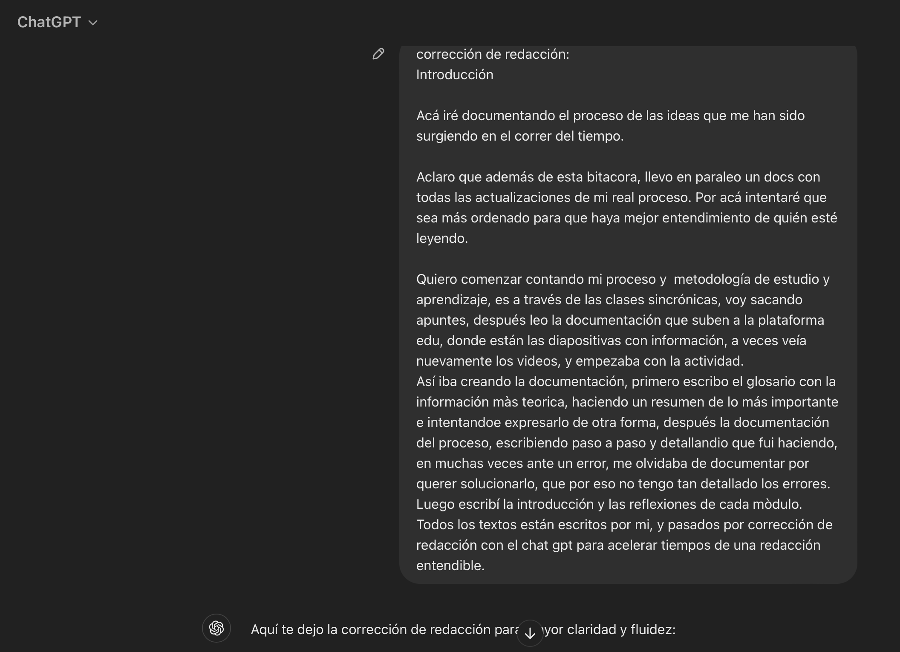
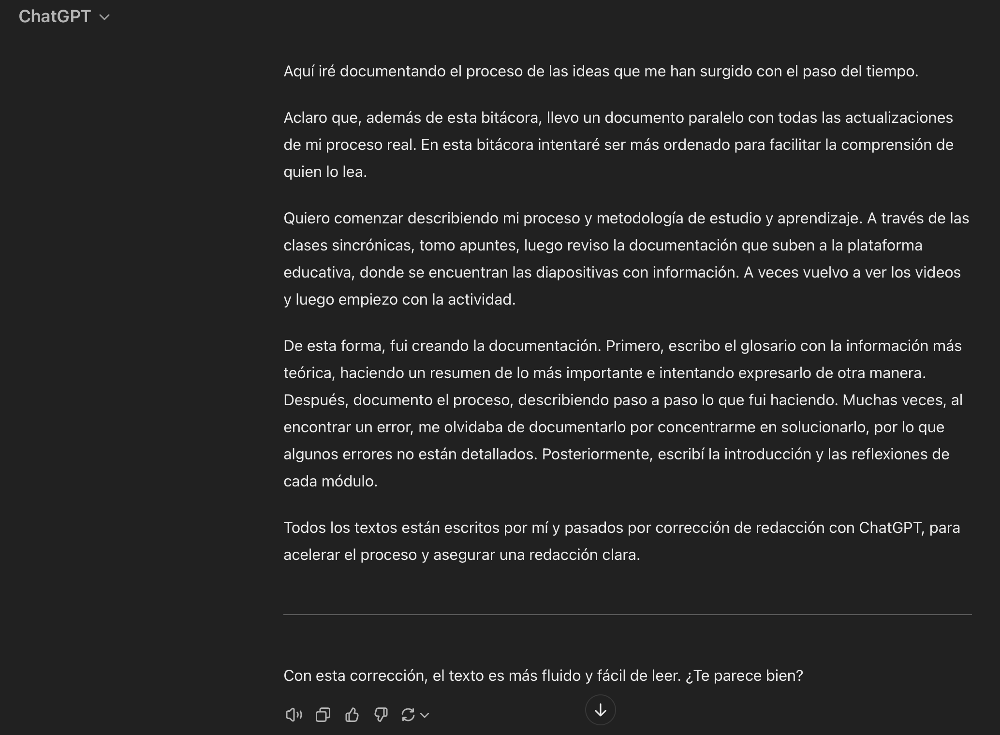

---
hide:
    - toc
---

# Proyecto Integrador 

## **Ideas iniciales**

# Ideas Iniciales

### **Introducción**

Aquí iré documentando el proceso de las ideas que me han surgido con el paso del tiempo.

Además de esta bitácora, llevo un documento paralelo con todas las actualizaciones de mi proceso real. En esta bitácora intentaré ser más ordenada para facilitar la comprensión de quien lo lea.

Quiero comenzar describiendo mi proceso y metodología de estudio y aprendizaje. A través de las clases sincrónicas, tomo apuntes, luego reviso la documentación que suben a la plataforma educativa, donde se encuentran las diapositivas con información. A veces vuelvo a ver los videos y luego empiezo con la actividad.

De esta forma, fui creando la documentación. Primero, escribo el glosario con la información más teórica, haciendo un resumen de lo más importante e intentando expresarlo de otra manera. Después, documento el proceso, describiendo paso a paso lo que fui haciendo. Muchas veces, al encontrar un error, me olvidaba de documentarlo por concentrarme en solucionarlo, por lo que algunos errores no están detallados. Posteriormente, escribo la introducción y las reflexiones de cada módulo.

Todos los textos están escritos por mí y pasados por corrección de redacción con ChatGPT, para acelerar el proceso y asegurar una redacción clara.

### **Documentación del proceso**

Aquí compartiré las ideas iniciales de los proyectos que se me han ocurrido este año, inspirados en los módulos de fabricación digital y metodologías de diseño, y que me gustaría ejecutar en el futuro.  
En la siguiente pestaña, desarrollaré la idea que elegí y en la que estoy trabajando e investigando actualmente.

**Idea: PELUCHES**

**¿Quiénes son mis usuarios? ¿Qué necesidades tienen?**  
Mis usuarios son principalmente niñes y adultes. Tienen la necesidad de encontrar juguetes que fomenten el apego y la identificación, así como la inclusión de diversas identidades y expresiones de género. Los diseños de los peluches deben reflejar esta diversidad, promoviendo una relación afectiva más abierta y diversa.

**¿Cuál es el problema?**  
El mercado actual ofrece una mayoría de juguetes de plástico que siguen normas heteronormativas y estereotipos de género. Esto limita la diversidad y la creatividad en la infancia y adultez. Mi objetivo es diseñar peluches que reflejen la diversidad e inclusión, promoviendo la creatividad y fomentando una elección sin desperdicio, creando un impacto positivo tanto en niñes como en adultes.

**¿Cuál es mi idea creativa?**  
Desarrollar una plataforma accesible que permita a les usuaries diseñar sus propios peluches personalizados. Esta plataforma será inclusiva y permitirá que personas con diversas habilidades, gustos e identidades creen peluches que representen su individualidad. Además, se buscará que la producción de los peluches sea consciente y sostenible.

**¿Cómo lo prototipo? ¿Qué materiales uso?**  
Comenzaré creando moldes predeterminados que puedan adaptarse a diferentes estilos y preferencias, permitiendo su personalización. Los materiales principales serán textiles sostenibles, combinados con piezas hechas mediante impresión 3D para asegurar la adaptabilidad y la modularidad de los diseños.

**¿En qué comunidad lo pongo a prueba?**  
Mi comunidad de prueba inicial serán padres, madres y niñes, para evaluar la respuesta y recoger retroalimentación sobre los diseños y la funcionalidad de los peluches personalizados.

_Referencias_
[Peluche personalizado](https://piccoloartista.com/es/peluche-personalizado/)  
[Bloques que forman personajes](https://distributeddesign.eu/talent/kuti-kuti/)

**Idea: ESI**: 

**¿Quiénes son mis usuarios? ¿Qué necesidades tienen?**  
Mis usuarios principales son educadores sexuales y familiares de niñeces. Tienen la necesidad de contar con herramientas lúdicas que permitan enseñar Educación Sexual Integral (ESI) de manera accesible y respetuosa, abordando la diversidad sexual y de género. A través del juego, se busca facilitar la enseñanza de ESI en un ambiente inclusivo y comprensible.

**¿Cuál es el problema? ¿Cuál es el objetivo?**  
El problema es la falta de recursos tangibles y accesibles para la enseñanza de la ESI. El objetivo es desarrollar herramientas que promuevan la educación sexual integral, inclusiva y accesible para todes, facilitando la comprensión de temas relacionados con la sexualidad, el cuerpo y la diversidad.

**¿Cuál es mi idea creativa?**  
La idea es crear juegos interactivos que representen temas como los ciclos menstruales, las vulvas y los penes, entre otros. Estos juegos funcionarían como una herramienta educativa accesible para diferentes grupos demográficos. Si se desarrollan en formato digital, podrían distribuirse como software educativo de código abierto (open source), ampliando su alcance y beneficiando a más personas.

**¿Cómo lo prototipo? ¿Qué materiales uso?**  
El prototipado inicial se realizará utilizando cartón. Posteriormente, se puede evolucionar el diseño empleando tecnologías como el corte láser o la impresión 3D. Además, se podrían incorporar luces u otros elementos interactivos para mejorar la experiencia educativa.

**¿En qué comunidad lo pongo a prueba?**  
La comunidad de prueba serán centros educativos que trabajen con infancias, donde se podrá evaluar la efectividad del recurso educativo y recoger retroalimentación de educadores y estudiantes.

_Referencias_  
[Materiales tangibles de ESI](https://www.instagram.com/p/CpwWkTYuIRs/?igshid=YmMyMTA2M2Y%3D&img_index=1)

**Idea: CONTENEDORES** 

**¿Quiénes son mis usuarios? ¿Qué necesidades tienen?**  
Mis usuarios son la ciudadanía en general, que necesita encontrar maneras de darle valor a los desechos encontrados en la calle y contribuir al reciclaje y al cuidado del entorno urbano.

**¿Cuál es el problema? ¿Cuál es el objetivo?**  
El problema es que las personas arrojan papeles, plásticos y otros desechos al piso en lugar de reciclarlos. El objetivo es reducir la cantidad de basura en las calles, incentivando a las personas a no tirar desechos y a participar en el reciclaje mediante un sistema de intercambio que premie sus acciones.

**¿Cuál es mi idea creativa?**  
La idea es crear un contenedor de intercambio que asigne valor a los desechos reciclables. Al depositar papeles o plásticos, las personas podrán recibir algo a cambio, como un ticket con valor monetario, productos, comida, u otros incentivos. Este sistema buscará fomentar hábitos de reciclaje en la comunidad.

**¿Cómo lo prototipo? ¿Qué materiales uso?**  
El prototipo se realizará utilizando MDF cortado con láser para la estructura del contenedor, y se integrará un sistema controlado por Arduino para gestionar el reconocimiento de los materiales depositados y la entrega de recompensas.

**¿En qué comunidad lo pongo a prueba?**  
La comunidad de prueba será el barrio, donde se podrá evaluar la respuesta de la ciudadanía al sistema de intercambio y su impacto en la reducción de desechos en las calles.

_Referencias_  
[Máquina reciclable de botellas](https://rolleat.com/es/en-espana-ya-se-paga-por-reciclar/)
[Máquina trituradora de plásticos](https://www.paredro.com/conoce-esta-maquina-que-facilita-el-reciclaje-de-pet/)

**Idea: LUMINARIAS** 

**¿Quiénes son mis usuarios? ¿Qué necesidades tienen?**  
Mis usuarios son productores de eventos, quienes necesitan luminarias portátiles y económicas que puedan utilizar en lugares donde no siempre hay acceso a electricidad cercana.

**¿Cuál es el problema? ¿Cuál es el objetivo?**  
El problema es la falta de acceso a electricidad en ciertos lugares durante la realización de eventos, lo que dificulta la iluminación adecuada. El objetivo es desarrollar soluciones de iluminación inalámbrica y móvil, que sean fáciles de transportar e instalar, sin depender de la red eléctrica.

**¿Cuál es mi idea creativa?**  
Mi idea es crear luminarias inalámbricas y móviles que puedan utilizarse en distintos tipos de eventos. Estas luminarias serían recargables, fáciles de mover y de instalar en diferentes configuraciones, proporcionando flexibilidad a los productores de eventos.

**¿Cómo lo prototipo? ¿Qué materiales uso?**  
El prototipo se desarrollará utilizando Arduino para el control de la iluminación, corte láser para las estructuras, impresión 3D para componentes específicos y telas iluminadas. También se incorporarán elementos inflables hechos de tela, con luz interior, para crear efectos visuales atractivos y únicos.

**¿En qué comunidad lo pongo a prueba?**  
La comunidad de prueba serán distintos eventos, donde se podrá evaluar la funcionalidad, eficiencia y recepción de las luminarias por parte de los productores y el público.

_Referencia_ 
[Impresión 3D con distintos materiales](https://lamaquina.io/sustainability/)

**Idea: TEXTILES**

**¿Quiénes son mis usuarios? ¿Qué necesidades tienen?**  
Mis usuarios son diseñadores y otres profesionales que buscan innovar en la moda sostenible. Necesitan soluciones que permitan modificar las telas para hacer las prendas más adaptables y sostenibles. Además, buscan facilitar ropa accesible para personas de diferentes tamaños y formas corporales, promoviendo la inclusión en el diseño de indumentaria.

**¿Cuál es el problema? ¿Cuál es el objetivo?**  
El problema es el desperdicio de prendas y la limitada adaptabilidad de la ropa a diferentes tipos de cuerpos. El objetivo es salir del concepto de "second hand" y favorecer la inclusividad en la moda, creando prendas que se ajusten dinámicamente a las necesidades de cada persona, adaptándose a distintos cuerpos y estilos de vida.

**¿Cuál es mi idea creativa?**  
La idea es desarrollar prendas que puedan ajustarse automáticamente, encogiéndose o expandiéndose según el tamaño y la forma del cuerpo de la persona. Este enfoque permitiría crear ropa más funcional y duradera, con una mayor adaptabilidad a diferentes contextos. Además, los diseños podrían compartirse como open source, abriendo nuevas oportunidades comerciales y fomentando la innovación colaborativa.

**¿Cómo lo prototipo? ¿Qué materiales uso?**  
El prototipo se desarrollará utilizando impresión 3D para crear elementos ajustables en las prendas. Además, se investigarán nuevos materiales y técnicas que sean cómodos, adaptables y respetuosos con el medio ambiente. Estos materiales deberán ser inclusivos, adecuados para diferentes géneros, orientaciones sexuales y tipos de cuerpos, promoviendo la moda como un espacio de diversidad.

**¿En qué comunidad lo pongo a prueba?**  
El proyecto se pondrá a prueba en mi propia comunidad, para evaluar la funcionalidad de las prendas y su recepción por parte de diferentes usuarios.

_Referencias_  
[Suelas de championes con diseño paramétrico e impresión 3D](https://parameterizing.wordpress.com/2017/11/02/parametric-design-and-footwear-industry/)  
[Zapatos hechos con impresión 3d](https://www.dezeen.com/2015/04/13/ united-nude-3d-printed-shoes-zaha-hadid-ben-van-berkel-michael-young-milan-2015/)  
[Reparación de prendas](https://fixing.fashion/)  
[Bolsas de diseño modular](https://distributeddesign.eu/talent/modular-design-bags/)  
[Prendas modulares](http://www.karinvlug.com/project/collect-coats/)  
[Instalación interactiva](https://www.niklasroy.com/smartfairytale/)  
[Instalación](https://class.textile-academy.org/2023/anna-cain/assignments/week07/)  
[Impresión 3D con distintos materiales](https://lamaquina.io/sustainability/)  
[Textiles electrónicos](https://class.textile-academy.org/2023/anna-cain/assignments/week05/)  
[Proyectos de materiales y textiles](https://fablabbcn.org/projects/type/materials-textiles)  
[Laboratorio autoensamblaje](https://selfassemblylab.mit.edu/)  
[Tela con corte láser modificable](https://greenfabric.be/metamateriaux-decoupeuse-laser/)  
[Textiles activos con luz](https://selfassemblylab.mit.edu/active-textile/)  
[Textiles activos cambian de forma con el calor y humedad](https://selfassemblylab.mit.edu/active-textile-tailoring/)  
[Vestido de punto 4D](https://selfassemblylab.mit.edu/4d-knit-dress)  
