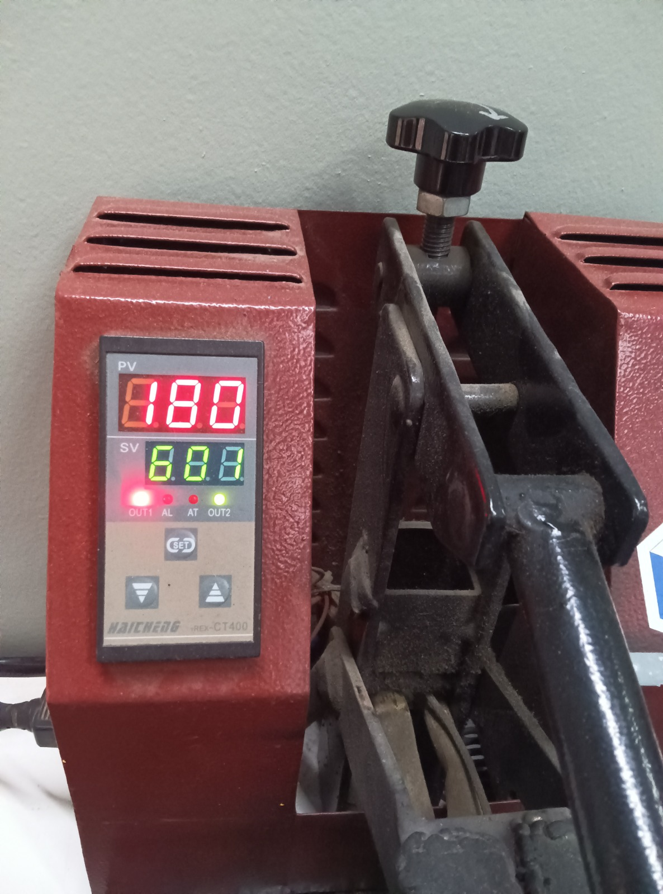

---
hide:
    - toc
---

# PF01-02  PROYECTO INTEGRADOR

## **Proceso de diseño**

### **Introducción**

Acá documentaré el proceso de diseño del proyecto integrador en su evolución.  
En la siguiente pestaña encontrarán una sintésis del proyecto. 

### **Documentación del proceso**

¿cómo nacen los objetos? 
Metodología de Bruno Munari compartida por [Edgardo](https://edg-saracho.github.io/Edgardo_Saracho/) 

**Recolección de Materiales**

Comencé recolectando telas en desuso de prendas que ya no utilizaba.

**1. Selección y Clasificación de Telas**  
Seleccioné distintos tipos de telas y realicé una muestra para determinar su composición mediante la técnica del quemado. Las clasifiqué como tejidos de punto y tejidos planos. (Tiempo: 30 minutos)  

**2. Preparación de Muestras**  
Creé un molde de cartón tamaño A4 para cortar las telas en esa medida. Por cada tela, corté dos capas, logrando un total de 10 tipos de tela diferentes (naturales y sintéticas). (Tiempo: 1 hora y media)

Luego, recorté las telas en piezas de aproximadamente 10x10 cm. Cada tela resultó en 12 capas debido a las diferencias de espesor. (Tiempo: 1 hora)

**3. Preparación de Moldes**  
Construí un molde de 11x11 cm y 5 cm de altura, suficiente para acomodar las capas de tela cortadas. Además, elaboré varios moldes de papel manteca para evitar que las piezas se pegaran al molde de cartón. (Tiempo: 30 minutos)

**4. Preparación de la Receta de Resina**  
Materiales preparados:  
Olla, papel manteca, molde, resina de pino, cera, alcohol, jeringa, balanza, recipiente, cuchara, nylon para cubrir la superficie de trabajo.

**Proceso de Fabricación**

**1. Primera Prueba**  
Medí 50 g de resina y 15 ml de alcohol, llevé la mezcla al fuego y añadí 5 g de cera.  
Intenté unir las capas con un pincel, pero la mezcla se secó demasiado rápido y la resina se quebró.  

**2. Segunda Prueba**  
Medí 50 g de resina y 15 ml de alcohol, llevé la mezcla al fuego y añadí 5 g de cera.  
A diferencia de la primera, volqué el líquido de la receta directamente sobre la tela. Mejoró pero se quebraba. 

<iframe width="560" height="315" src="https://www.youtube.com/embed/ntugpAMKMEA?si=tqD15RpgWiwpyQ2r" title="YouTube video player" frameborder="0" allow="accelerometer; autoplay; clipboard-write; encrypted-media; gyroscope; picture-in-picture; web-share" referrerpolicy="strict-origin-when-cross-origin" allowfullscreen></iframe>

**3. Tercera Prueba**  
Ajusté las proporciones y las multipliqué: 100 g de resina, 50 ml de alcohol y 8 g de cera.  
Utilicé la mezcla directamente desde la olla, aplicándola entre las capas. Dejé secar 30 minutos. El resultado mejoró, aunque no se logró cubrir todas las capas de tela.

**4. Cuarta Prueba**  
Utilicé las mismas proporciones que la prueba anterior.  
Colocaba las capas de tela en pares, esta vez seleccionando un material con mezcla de fibras naturales y sintéticas de mayor espesor. Dejé secar una hora.  

<iframe width="560" height="315" src="https://www.youtube.com/embed/qCLFxvdYhIA?si=qzFv_C4Jx5lw7RdX" title="YouTube video player" frameborder="0" allow="accelerometer; autoplay; clipboard-write; encrypted-media; gyroscope; picture-in-picture; web-share" referrerpolicy="strict-origin-when-cross-origin" allowfullscreen></iframe>

**5. Quinta Prueba**  
Utilicé las mismas proporciones que la prueba anterior.  
Colocaba las capas de tela en pares, esta vez seleccionando un material con mezcla de fibras naturales y sintéticas de mayor espesor. Dejé secar una hora.  

**6. Sexta Prueba**  
Con las mismas proporciones de resina, añadí retazos irregulares de 2x2 cm al molde.  
<iframe width="560" height="315" src="https://www.youtube.com/embed/wKuC34P97oA?si=n7anEU73CoDyBaIh" title="YouTube video player" frameborder="0" allow="accelerometer; autoplay; clipboard-write; encrypted-media; gyroscope; picture-in-picture; web-share" referrerpolicy="strict-origin-when-cross-origin" allowfullscreen></iframe>

<iframe width="560" height="315" src="https://www.youtube.com/embed/Eo0C06jTDBA?si=TbOQtqwoq26Tnlje" title="YouTube video player" frameborder="0" allow="accelerometer; autoplay; clipboard-write; encrypted-media; gyroscope; picture-in-picture; web-share" referrerpolicy="strict-origin-when-cross-origin" allowfullscreen></iframe>

**Investigación sobre paneles acústicos**

**Tipos de paneles acústicos y su función:**  
Paneles absorbentes: 
Absorben las ondas sonoras para evitar que reboten y vuelvan al ambiente, mejorando el aislamiento acústico. 

Paneles difusores: 
Dispersan las ondas sonoras para distribuirlas de manera uniforme en el espacio, evitando ecos y concentraciones de ruido.

_Referencias_  
[Materiales reciclados aislántes](https://www.lowes.com/pd/UltraTouch-R-13-Recycled-Denim-Batt-Insulation-with-Sound-Barrier-15-in-W-x-93-in-L/3731875)   
[Paneles acústicos Akoomi](https://drive.google.com/file/d/10_VzfLcdcONdSLz5rLfXs6bQGcGkz-Q0/view)   
[Patrones de paneles acústicos](https://www.etsy.com/shop/Ecosounds?ref=simple-shop-header-name&listing_id=1266783071&sort_order=price_desc&page=1&epik=dj0yJnU9eF9BTl9tQ0hOa0QtSjdHTWNjSWY4WEszM2pyd1dsX3ImcD0wJm49NEdiWUJ2NUduaU96VDRhZk1JOWs3USZ0PUFBQUFBR2NvQXFr#items/?)   
[Diferentes paneles acústicos](https://www.archdaily.mx/mx/920740/8-paneles-acusticos-y-sus-detalles-constructivos#:~:text=Paneles%20con%20padrones%20triangulares&text=En%20aplicaciones%20para%20muros%2C%20los,cualidades%20ac%C3%BAsticas%20de%20los%20paneles.&text=Los%20paneles%20VERO%20permiten%20aumentar,aspecto%20final%20sea%20m%C3%A1s%20complejo.)   
[Paneles de madera perforada](https://www.decustik.com/es/productos/paneles-acusticos/)   
[Pelusa de tela reciclada](https://diseno.uc.cl/memorias/pdf/memoria_dno_uc_2019_1_FUENTES_UGALDE%20_M.pdf) 
[Paneles acústicos de PET](https://www.baux.com/products/acoustic-felt/flexfelt-system)

PASOS A SEGUIR: 

**Ajuste de proporciones y pruebas de tamaño:** Refinar la receta de resina de pino para lograr un mejor resultado al trabajar con piezas más grandes de textiles. Crear moldes adecuados para placas más amplias y probar cómo las proporciones afectan el rendimiento final.  
**Corte láser y diseño de porosidad:** Incorporar técnicas de corte láser para dar forma a las placas y generar porosidad. Realizar pruebas específicas para evaluar cómo reaccionan las composiciones de textiles y la resina de pino durante el corte láser, diferenciando entre textiles sintéticos y naturales.  
**Evaluación del material:** Medir la resistencia, flexibilidad y durabilidad de las placas fabricadas.
Realizar pruebas acústicas para determinar su capacidad como absorbente o difusor de sonido. 
**Prueba de sensores:** Integrar un sensor de ruido para evaluar su funcionamiento en combinación con las placas acústicas

### **PRE-ENTREGA**  
Miércoles 27 de noviembre

**¿Por qué?**  

**_Problemática_**  
La industria de la moda genera un exceso de producción y desperdicio, fabricando prendas sin una demanda real. Esto resulta en una acumulación significativa de textiles que no son utilizados, lo que contribuye a la contaminación y al uso insostenible de recursos. 

**_Comunidad/contexto_**  
Existen iniciativas en el mundo que trituran textiles en desuso para fabricar nuevos materiales, como ladrillos o placas. El proyecto busca contribuir a este movimiento, pero sin triturar, laminando textiles capa por capa. Esto tiene aplicaciones en la construcción y el diseño sostenible, especialmente en espacios con problemas acústicos, como viviendas sociales, espacios públicos o entornos con ruido excesivo.  

**_Explica de qué manera has considerado los aspectos sociales, económicos y ambientales para dar respuesta a problemáticas locales:_**

- Aspectos sociales: Fomentar la concientización sobre el impacto del desperdicio textil y la necesidad de su reutilización. Se busca inspirar a la comunidad a adoptar prácticas sostenibles y a colaborar en soluciones locales.  
- Aspectos económicos: Proponer un modelo de economía circular, donde los textiles desechados se convierten en nuevos productos útiles, reduciendo costos y generando valor a partir de residuos.  
- Aspectos ambientales: Reducir el impacto ecológico al evitar que los textiles terminen en vertederos y contribuir a la reducción de emisiones asociadas con la producción textil tradicional. Además, el uso de biomateriales biodegradables minimiza el impacto ambiental del proceso. 

**_Explica cómo has incorporado un enfoque de diseño abierto, distribuido y sostenible_**  
El proyecto se enmarca en un enfoque de diseño abierto y distribuido, al compartir el proceso y las recetas del biomaterial, fomentando que otras personas y comunidades puedan replicar y adaptar las placas para sus necesidades locales.  
- Distribuido: Se puede fabricar localmente con herramientas accesibles como carte láser, CNC o impresión 3D.  
- Sostenible: Usa materiales reciclados y biodegradables, alineándose con los principios de economía circular.

**¿Qué?** 

**_Nombre_**  
Mutex (unión de _mu_ tar con _tex_ til)

**_Descripción del proyecto_**  
Creación de placas laminadas usando textiles en desuso, unidas con aglomerantes de biomaterial. 

**_Propuesta de valor_**  
Dar una segunda vida a textiles desechados, transformándolos en placas que pueden ser utilizadas en aplicaciones funcionales como paneles acústicos. Esto fomenta el reciclaje y contribuye a la reducción del desperdicio textil. 

**¿Cómo?**

**_Describe cómo es tu prototipo, funcional y cómo integraste diseño 2D y 3D, procesos aditivos y/o sustractivos, electrónica y programación en tu propuesta_**  
El prototipo consiste en placas textiles laminadas mediante textiles reciclados, en su mayoría telas sintéticas en desuso, utilizando Biomateriales como la resina de pino como aglomerante, y la fabricación mediante diseño 2D y 3D para diseñar el molde y fresado con CNC, y se incorporará la electrónica y programación con un sensor de ruido conectado a un sistema Arduino, para medir el impacto acústico. 

**_Proceso de diseño y cocreación_**  
Primero comencé con la investigación y exploración de diferentes recetas para encontrar el mejor aglomerante biodegradable que uniera las capas textiles. Luego fue el diseño del molde para facilitar el prensado de las capas y transferir texturas al material final. Por último el prototipado para realizar las pruebas con distintos textiles y biomateriales para optimizar adherencia y funcionalidad. 

### **POS PRE-ENTREGA**  

Después de la clase con Edu Chamarro y el simulacro de presentación con Santi y Joaquín, que me sugirieron darle un enfoque más concreto al proyecto y trabajar en un muestrario de recetas que combinara biomateriales con textiles desechados, explorando un perfil de diseño de procesos. Esta recomendación me llevó a reflexionar sobre las aplicaciones prácticas de mi investigación, sobre todo porque en Uruguay no contamos con tecnología como trituradoras que faciliten el reciclaje de textiles para otros usos.

Investigué sobre materiales compuestos, conocidos como composites, que se forman al combinar dos o más materiales diferentes. Este concepto me resultó muy interesante porque, al unirse, los materiales logran propiedades superiores a las que tienen por separado. Los composites suelen estar compuestos por una matriz o aglutinante que sostiene al material, y un refuerzo que aporta resistencia y propiedades mecánicas específicas. Estas combinaciones han resultado ser una mejor alternativa a los materiales tradicionales debido a su resistencia, ligereza y costo.

Referencias sobre composites:

[Composite con fibra de vidrio](https://www.castrocompositesshop.com/es/63-vidrio?srsltid=AfmBOoo1tZGmaWVVcI6VsJnp2FQrqYBXf7CWjs9gA3V_gpJTnp1cAsdG)  
[Materiales composite](https://www.3ds.com/es/make/guide/material/composite)  
[Introducción a los materiales compuestos y su forma de producción](https://www.intechopen.com/chapters/71222)  
[Proceso de fabricación de composite con fibra de carbono](https://formlabs.com/latam/blog/laminacion-fibra-carbono-materiales-compuestos/?srsltid=AfmBOoru5vhu4Ty2pOnY3E-_2PDZ2RbTunIdapMCgTJfyGnYKqsTAGHm)

Inspirada por esta idea, realicé otras pruebas combinando textiles con biomateriales, pero los resultados me generaron ciertas dudas.   
Por un lado, las propiedades de los biomateriales no son lo suficientemente resistentes, ni impermeables, ni tolerantes a altas temperaturas. Por ejemplo, la resina, al secarse rápidamente, dificulta el proceso de creación de un composite.  
Además, a nivel conceptual, no encontraba sentido a combinar textiles sintéticos, que son difíciles de reciclar, con biomateriales biodegradables, ya que esta mezcla parece ir en direcciones opuestas en términos de sostenibilidad. 

**Preparación de cada receta**

**Receta con gelatina**

Ingredientes: 30 gr. de gelatina, 200 ml. agua, 15 ml. de glicerina, 1 cucharada de vinagre.

Materiales: Olla, hornalla, papel manteca, molde, jeringa, balanza, recipientes, cuchara, nylon para cubrir superficie. 

Preparación:  
1. Preparar el molde con papel manteca.  
2. En la olla, agregar el agua, vinagre y glicerina en la olla en frío.  
3. Revolver para que se incorpore bien y encender el fuego medio.  
4. Agregar de a poco la gelatina y revolver para disolver hasta que hierva.   
5. Apagar el fuego y dejar reposar hasta que se entibie.   
7. Verter en el molde con los textiles.   
8. Dejar enfriar y desmoldar   

**Resultado de receta con Gelatina**

<iframe width="560" height="315" src="https://www.youtube.com/embed/VQPeu6vBUuc?si=1_Fo9YhmZySj9LzH" title="YouTube video player" frameborder="0" allow="accelerometer; autoplay; clipboard-write; encrypted-media; gyroscope; picture-in-picture; web-share" referrerpolicy="strict-origin-when-cross-origin" allowfullscreen></iframe>

**Receta con Agar Agar** 

Ingredientes: 7,5 gr. de Agar Agar, 200 ml. de agua, 12 ml. glicerina. 

Materiales: Olla, hornalla, papel manteca, molde, jeringa, balanza, recipientes, cuchara, nylon para cubrir superficie. 

Preparación:   
1. Preparar el molde con papel manteca.   
2. En la olla, agregar el agua y el agar agar en la olla en frío y disolver.   
3. Agregar la glicerina y encender a fuego bajo revolviendo siempre.   
4. Subir el fuego paulatinamente hasta que la mezcla cambie de textura.   
5. Apagar el fuego y verter en el molde.  
7. Sumergir en la olla y escurrir capa por capa.   
8. Dejar enfriar y desmoldar   

Aclaración: Esta muestra del molde se llenó de hongos a los días, seguramente porque me faltó más vinagre o hace una reacción con los textiles. 

**Resultado de receta con Agar agar**

<iframe width="560" height="315" src="https://www.youtube.com/embed/KWfdsLD4G_g?si=jTzJTkzvumQoj4-C" title="YouTube video player" frameborder="0" allow="accelerometer; autoplay; clipboard-write; encrypted-media; gyroscope; picture-in-picture; web-share" referrerpolicy="strict-origin-when-cross-origin" allowfullscreen></iframe>

**Receta con Resina de Pino**

Ingredientes: 100 gr. de resina de pino, 5 gr. de cera carnauba, 15 ml. alcohol.  

Materiales: Olla, hornalla, papel manteca, molde, jeringa, balanza, recipientes, cuchara, nylon para cubrir superficie. 

Preparación:  
1. Preparar el molde con papel manteca.   
2. En la olla, agregar la resina de pino y el alcohol medido con jeringa en frío.   
3. Encender el fuego bajo y tapar la olla.   
4. Esperar a que se derrita sin resolver.   
5. Una vez derretido, agregar la cera carnauba y revolver suavemente.   
6. Volver a tapar por unos segundos hasta que esté todo derretido.   
7. Sumergir en la olla y escurrir capa por capa.   
8. Dejar enfriar y desmoldar   

Para limpiar: volver a poner alcohol en la olla, dejar hervir. Retirar la resina de pino con papel de cocina, repitiendo la operación cuantas veces sean necesarias. 

**Resultado de receta con resina de pino**

<iframe width="560" height="315" src="https://www.youtube.com/embed/sOrUhl1pfv8?si=onQVEIB_cLMSRG5G" title="YouTube video player" frameborder="0" allow="accelerometer; autoplay; clipboard-write; encrypted-media; gyroscope; picture-in-picture; web-share" referrerpolicy="strict-origin-when-cross-origin" allowfullscreen></iframe>

Entendí que, aunque los textiles sintéticos son complicados de reutilizar, representan un desafío interesante porque en Uruguay no hay empresas que trabajen específicamente en su reciclaje. Esto me hizo replantear mi enfoque hacia aplicaciones más prácticas y directas para este tipo de materiales, sin depender de tecnologías complejas como la trituración.

A pesar de los resultados limitados con los biomateriales, creo que hay un potencial importante en seguir explorando cómo reutilizar textiles desechados para crear productos útiles, incluso considerando otras alternativas de aglomerantes. Esta investigación me permitió profundizar en el concepto de los composites, pero también me dejó preguntas abiertas sobre cómo optimizar procesos accesibles para el reciclaje textil en un contexto como el de Uruguay.

Referencias adicionales sobre reciclaje textil y biomateriales

[Fabrick: ladrillos de tela reciclada](https://www.youtube.com/shorts/DpcqMUH_gpI)  
[Brut: ladrillo de tela reciclada](https://www.youtube.com/watch?v=3UrBgMf1554)  
[Recetas con agar agar](https://www.youtube.com/watch?v=5Lji2-vO5KE)  
[Biomateriales](https://drive.google.com/file/d/1Lm147nvWkxxmPf5Oh2wU5a8eonpqHCVc/view)  
[Receta biomateriales Nike Journal](https://www.nike.com/pdf/nike-journal-innovation-make-your-own-bio-materials.pdf)

## **Muestras con BIOMATERIALES**

## **Sistematización de muestras de textiles y biomateriales**

 

## **Exploración con nuevos aglomerantes**

Ante los desafíos de combinar textiles con biomateriales y las limitaciones prácticas y conceptuales que esto presentaba, decidí explorar una alternativa más coherente: utilizar plásticos como aglomerante. Esta opción resuelve la contradicción entre materiales sintéticos y biodegradables, ya que los plásticos, al igual que los textiles seleccionados, es un material sintético.

En Uruguay no había, hasta hace unos días atrás, específicamente iniciativas que trabajen con reciclaje de textiles sintéticos y plásticos como aglomerante.  Sin embargo, investigué proyectos que reutilizan bolsas plásticas y otros desechos sintéticos, como: [eme plásticos](https://www.instagram.com/emeplasticas/?hl=es), [Enanas de jardín](https://enanasdejardin.com/ENANAS_2022.pdf) y [Mare sustentable](https://maresustentable.uy/). 

La semana pasada, Lucía López junto con la EUCD-FADU-UDELAR compartió la investigación que realizó con Casa Urbana Uniformes, una ficha guía de upcycling  llamada: [Cortex](https://www.researchgate.net/publication/384291444_FICHA_GUIA_DE_UPCYCLING_CORTEX). Justamente investigaron sobre la unión de textiles con bolsas plásticas de composición LDPE.

**Pruebas iniciales con plancha casera**

Sin acceso a una trituradora, corté los textiles y plásticos en trozos pequeños usando tijeras de cable. Luego realicé pruebas de fusión con una plancha común (sin agujeros y sin vapor), aplicando presión durante 10 minutos. Aunque fue un método rudimentario, me permitió evaluar las posibilidades de unir estos materiales.

A partir de esta experiencia, me imaginé la posibilidad de crear una prensa térmica casera que pudiera ser utilizada por cualquier persona interesada. Comencé a diseñar un prototipo que incluyera un sistema con Arduino y un sensor de temperatura para mayor precisión. Sin embargo, no contaba con las herramientas necesarias para realizar cortes láser en metal, dado que este proceso implica altas temperaturas, ni con el tiempo suficiente para desarrollarlo por completo. Así, el proyecto quedó como una idea en etapa inicial, una simple ilusión por ahora.

**Colaboración con Precious Plastic**

Me puse en contacto con [Victoria](https://mvicogarcia.github.io/Victoria_Garcia/) de [La Fábrica](https://lafabrica.uy/), que trabaja con el movimiento [Precious Plastic](https://www.preciousplastic.com/).  

En su taller experimenté con la prensa térmica para unir textiles sintéticos con plásticos como bolsas plásticas y plásticos triturados. Ellos disponen de herramientas como trituradoras para plástico de alta densidad y prensas térmicas que facilitan el proceso.
Es importante aclarar que en la página de Precious Plastic está toda la información de cómo reciclar y la documentación para replicar esta práctica tan asombrosa. 

Los plásticos que utilicé son Polietileno, ya que son polímeros derivados del etileno. Podemos encontrar dos tipos: HDPE (polietileno de alta densidad) y LDPE (polietileno de baja densidad), ambos son reciclables, aunque su proceso requiere diferentes puntos de fusión. La diferencia es su estructura molecular que determinan sus propiedades físicas y aplicaciones. 

**Diferencias entre HDPE y LDPE**

**HDPE** (polietileno de alta densidad)  
- Estructura molecular: tiene cadenas lineales y compactas, lo que otorga densidad y rigidez.  
- Propiedades: resistente a impactos, impermeable, duradero y soporta temperaturas más altas que el LDPE.  
- Aplicaciones: botellas rígidas, envases para productos químicos, tuberías, contenedores, entre otros. 

**LDPE** (polietileno de baja densidad)  
- Estructura molecular: tiene cadenas ramificadas, lo que lo hace más flexible y menos denso.  
- Propiedades: flexible, resistente a la humedad, pero menos resistente a la tracción y temperaturas altas en comparación con el HDPE.  
- Aplicaciones: bolsas de plástico, láminas, envoltorios, botellas flexibles, entre otros.

**Realicé múltiples pruebas, variando:**  
- Cantidades de capas de telas.  
- Tipos de bolsas plásticas.  
- Cantidad de plástico triturado.  
- Formas de posición del triturado.  
- Temperaturas y tiempos de prensado.  

Esto me permitió generar láminas con diferentes resultados en resistencia y cohesión.

## **Muestras de textiles con HDPE** 

## **Muestras de textiles con LDPE** 

**3. Preparación de Textiles**  
Recorté varias capas de cada tela en un tamaño promedio de 20x20 cm para llevar al taller y realizar pruebas. Dejando costuras pero eliminando cierre y accesorios. 

**4.  Recolección y Preparación de LDPE**  
Utilicé bolsas plásticas que tenía en casa desde hace años, ya que prefiero no desecharlas. Algunas tienen referencias de fechas. 

**5. Preparación de HDPE**  
Las tapitas plásticas trituradas fueron provistas por Victoria en la fábrica. El proceso utiliza una trituradora con cuchillas que reducen las tapas a partículas de 3-4 mm de forma irregular.  
También recolectan desechos del router CNC mediante aspiradoras y los reutilizan.

También recolectan el desecho del router cnc con una aspiradora y al reuitilizan también.

Comparto un video que le hice al compañero Franco con su proyecto cuando fuimos a La Fábrica. 

<iframe width="560" height="315" src="https://www.youtube.com/embed/-9zorYPvyBE?feature=shared" title="YouTube video player" frameborder="0" allow="accelerometer; autoplay; clipboard-write; encrypted-media; gyroscope; picture-in-picture; web-share" referrerpolicy="strict-origin-when-cross-origin" allowfullscreen></iframe>

**6. Preparación de LDPE**  
Preparé las prendas de LDPE para la prensa térmica, asegurándome de recortar y organizar las capas.

**7. Prensa térmica**  
Materiales utilizados:  
- Colocación de teflón en la prensa para evitar que los plásticos se adhieran.  
- Diferentes temperaturas y tiempos según el tipo de plástico (HDPE o LDPE).

**Proceso de prensado**

**Paso 1.** Preparar los materiales y colocarlos en la prensa. 

**Paso 2.** Ajustar la temperatura y el tiempo (diferente para LDPE y HDPE).

**Paso 3.** Bajar la prensa para iniciar el proceso de prensado.

**Paso 4.** Esperar a que el material esté listo.

**Paso 5.** Retirar el material y colocarlo en la prensa fría.

**Paso 8.** Prensado en frío  
Para asegurar que las placas queden planas, las coloqué en una prensa fría para su enfriamiento.

También probé con una prensa rudimentaria hecha con vidrios y pinzas de presión.

**SEGURIDAD:**  
Trabajé en un ambiente ventilado y, siempre que fue posible, utilicé mascarilla por precaución, ya que al superar el punto de fusión del plástico podrían liberarse componentes perjudiciales.  
Usé guantes de goma para proteger mis manos durante la manipulación de los materiales y muestras.

## **Aplicación de Fabricación digital**

Con la creación de éstas láminas, generé modelados 3D para aplicar con las herramientas de fabricación digital de corte láser y router cnc.

-KERFING- 

**Diseño y modelado en Fusion 360**  
Para probar cómo reaccionaban a corte láser, diseñe un modelo con kerfing utilizando diseño paramétrico en Fusion 360.

**1.** Definí los parámetros iniciales (dimensiones de la placa y grosor estándar de 3 mm).

**2.** Creé un boceto para el tamaño de la placa y lo extrui.

**3.** Diseñe los cortes de kerfing:
Dibujé el primer agujero con las medidas paramétricas y lo distribuí utilizando el patrón rectangular.

**Prueba con CORTE LÁSER**  

Cuando fui al taller de Agustín en Rincón Maker, ya que no logré ir al laboratorio de Durazno, realicé primero pruebas para definir la velocidad y potencia necesarias para cortar según el grosor de cada lámina.  
La máquina utilizada fue un láser de diodo con 40W de potencia óptica.

Para realizar las pruebas de velocidad y potencia, se creó una planilla para saber el espesor de cada placa, porque todas tenían diferentes espesores al hacerlo de forma artesanal. Esto es una variable para seguir mejorando la forma de realización.  

**Resultados con textiles y LDPE**  
El mejor resultado en términos de funcionalidad y terminación de la muestra es con Potencia al 100% y velocidad 20 mm/s. 

Tampoco apliqué el diseño de kerfing porque las láminas de textiles con bolsas plásticas ya tiene la propiedad de ser flexible, cuando realicé el diseño no sabía cómo iban a quedar los resultados de las láminas. 

**IMPORTANTE:** El corte láser es esencial al trabajar con telas sintéticas porque el calor del láser sella los bordes, evitando que se deshilachen. Este efecto es especialmente eficiente en tejidos planos, aunque también es útil en tejidos de punto. Sin embargo, al cortar con tijera, los bordes suelen deshilacharse. Una solución práctica para esto es sellar los bordes con calor usando un encendedor.

**Resultados con textiles y HDPE** 

Durante las pruebas, concluí que las telas con LDPE funcionan correctamente para corte láser, pero las que incluyen triturado de HDPE no son adecuadas, ya que tienden a fundirse y expandirse.

-SOPORTE BOTELLA-

**Diseño y modelado en Fusion 360**  

**1.** Inicié definiendo los parámetros iniciales basándome en un prototipo básico que había realizado previamente.

**2.** Luego, creé un boceto dibujando las dimensiones y formas del prototipo.

**3.** A continuación, extruí el boceto en Fusion 360 para generar el modelo tridimensional.

**Prueba con ROUTER CNC**  

En el taller de La Fábrica, esta vez con la guía de Federico, probé cortar las placas de telas que no funcionaron con el corte láser, para observar su comportamiento en la CNC. Ellxs usualmente utilizan el router para trabajar con placas exclusivamente de plástico, así que era interesante evaluar este material.

Primero, para evitar que la pieza se moviera durante el proceso, se colocaron tabs específicos en el diseño, los cuales resultaron fundamentales para el éxito del corte. Además, previamente fijamos la placa a la cama de la máquina utilizando tornillos.

Luego, trabajamos con un diseño que ya tenía disponible en el sofware de gcode. 

<iframe width="560" height="315" src="https://www.youtube.com/embed/SgABqAl3eFs?si=ZWaYidBN67quN0N4" title="YouTube video player" frameborder="0" allow="accelerometer; autoplay; clipboard-write; encrypted-media; gyroscope; picture-in-picture; web-share" referrerpolicy="strict-origin-when-cross-origin" allowfullscreen></iframe>

 La placa utilizada tiene un espesor aproximado de 2 mm ± 0,5 mm. Como la muestra no estaba completamente plana, experimentamos con diferentes profundidades en la bajada de la fresa:

1. Primera prueba: 1 mm de bajada.  
2. Segunda prueba: 0,5 mm.  
3. Tercera prueba: Nuevamente 1 mm, logrando finalmente cortar todo el diseño.

<iframe width="560" height="315" src="https://www.youtube.com/embed/q5HsXdP6iEc?si=-crBdC9MWFRMQDiw" title="YouTube video player" frameborder="0" allow="accelerometer; autoplay; clipboard-write; encrypted-media; gyroscope; picture-in-picture; web-share" referrerpolicy="strict-origin-when-cross-origin" allowfullscreen></iframe>

En la segunda prueba, cortamos directamente a 2 mm, obteniendo mejores resultados desde el inicio.

**Prueba con diseño de soporte de botella modelado en Fusion 360**

Luego, probamos el diseño que había modelado en Fusion 360 para el soporte de una botella. Como no había diseñado el modelo con líneas completamente rectas, proyecté el modelado en el programa para exportarlo en formato DXF. Esto permitió que el software de la CNC reconociera el diseño en vectores y configurara correctamente el recorrido de corte.

**Resultados y aprendizajes**

Realizamos tres pruebas con este diseño:

**1.** Primera prueba: La pieza se quebró porque no incluía suficientes tabs.   

**2.** Segunda prueba: Se quebró nuevamente, indicando un problema con la estabilidad o el diseño del material.  

**3.** Tercera prueba: Utilizamos una placa diferente para evaluar si el problema era del material o del diseño. Aunque el corte funcionó, fue evidente que había necesidad de mejorar tanto el diseño como la colocación de los tabs.

 

<!DOCTYPE html>
<html lang="en">
<head>
    <meta charset="UTF-8">
    <meta name="viewport" content="width=device-width, initial-scale=1.0">
    <title>YouTube Video</title>
</head>
<body>
    <iframe 
        width="560" 
        height="315" 
        src="https://www.youtube.com/embed/NtZBVgkTKCk" 
        title="YouTube video player" 
        frameborder="0" 
        allow="accelerometer; autoplay; clipboard-write; encrypted-media; gyroscope; picture-in-picture" 
        allowfullscreen>
    </iframe>
</body>
</html>

**IMPORTANTE:** El comportamiento del material podría estar influenciado por su falta de planitud o por la propia composición de la tela.

## **Sistematización de muestras de textiles y HDPE**

## **Sistemización de muestras de textiles y LDPE**

### **Reflexiones**

El proceso fue un recorrido experimental en el que cada material reveló sus límites y posibilidades:

- Los biomateriales abren la puerta a opciones sostenibles y biodegradables, con potencial para aplicaciones en diseño temporal, estructuras ligeras y superficies impermeabilizadas.  
- Los composites con HDPE y LDPE ofrecen alternativas resistentes, moldeables y funcionales a partir del reciclaje de plásticos. La diferencia clave radica en la rigidez (HDPE) y flexibilidad (LDPE), permitiendo una amplia gama de aplicaciones según la necesidad del producto final.

Este proceso no es un producto final, sino una serie de exploraciones que sistematizan conocimientos y muestran el potencial de los textiles reciclados combinados con biomateriales y plásticos. Cada prueba deja abierta la posibilidad de diseñar nuevas aplicaciones, adaptando las propiedades del material a distintas necesidades creativas y funcionales, aportando a una economía circular. 

### **Anexos**

_Lineamientos de EFDI-UTEC_

Especialización en Fabricación Digital e Innovación

**Proyecto final integrador**

Esta unidad curricular (PF01 - PF02) corresponde al proyecto final integrador. 
Los y las participantes deberán aplicar los conocimientos adquiridos en todos los módulos cursados durante la Especialización.  

**Objetivos:**  
El proyecto final tiene como objetivo principal la aplicación práctica de los conocimientos adquiridos en las áreas de Tecnología y fabricación, Diseño, e Innovación y sostenibilidad.Los objetivos específicos del proyecto final son los siguientes:

- Tecnología y fabricación  
Desarrollar y aplicar habilidades técnicas en el uso de tecnologías de fabricación digital para la creación de prototipos y productos finales en un laboratorio de innovación.
- Diseño  
Diseñar soluciones distribuidas y sostenibles basadas en metodologías de innovación, utilizando un modelo de gestión colaborativa que fomente la co-creación interdisciplinaria.
Identificar y desarrollar oportunidades que mejoren las condiciones sociales y de vida en general de la comunidad, con un impacto positivo tanto a nivel local como global.
- Innovación y sostenibilidad  
Identificar y aplicar métodos alternativos de producción enfocados en economías circulares, proponiendo soluciones concretas y sostenibles para productos y/o servicios.  
- Evaluar y demostrar el impacto sostenible del proyecto, asegurando que las soluciones propuestas contribuyan a la sostenibilidad ambiental y social.

**Requisitos mínimos:**  
- Innovación abierta. Dar respuesta a problemáticas actuales y locales, considerando aspectos sociales, económicos y ambientales, fruto de utilizar herramientas, el diseño y metodologías de cocreación.  
- Generar un prototipo funcional, construido con herramientas de fabricación digital. El proyecto debe incorporar diseño 2D y 3D, procesos de fabricación aditivos y/o sustractivos, electrónica y programación.  
- Diseño distribuido, abierto y sostenible. Brindar herramientas para la identificación de métodos alternativos de producción enfocados en economías circulares que apunten a soluciones concretas y sostenibles para productos y/o servicios.

**Presentaciones finales**

Las presentaciones finales serán el 19 de Diciembre a las 10hs Uruguay por la plataforma zoom, cada estudiante deberá presentar en 10 minutos aproximadamente el trabajo realizado para el proyecto final en el siguiente formato: 

Documentar el proceso que realizaste para idear y fabricar tu proyecto final en tu página web respondiendo:

         ¿Qué hace?
         ¿Cómo llegaste a la idea?
         ¿Quién lo ha hecho de antemano? (referencias si las hay)
         ¿Qué diseñaste?
         ¿Qué materiales y componentes se utilizaron?
         ¿Qué partes y sistemas se fabricaron?
         ¿Qué procesos se utilizaron?
         (aditivos, sustractivos etc.)
         ¿Qué preguntas se respondieron?
         ¿Qué funcionó? ¿Qué no?
         ¿Cuáles son las conclusiones?
         ¿Cuáles son los pasos a seguir?

Al final de la documentación agregar una diapositiva de resumen y un video de un minuto que muestre su concepción, construcción y operación:

El slide debe ser de 1920x1080px y ser en formato png. 
El video debe durar un 1 minuto aproximadamente. 

**Evaluación:**
                        
Nivel académico 20% > Actitud académica en general, documentación, presentación. 
                        
Innovación abierta 20% > Respuesta a problemáticas actuales y locales.      
                        
Diseño integrado / honesto 30% > Uso de la tecnología de manera significativa en relación a los temas que plantea, sostenible.
                        
Aplicación fabricación digital 30% > El proyecto debe incorporar diseño 2D y 3D, procesos de fabricación aditivos y/o sustractivos, electrónica y programación.        

**Plazos de entrega**

El documento del proyecto debe ser entregado para el 19 de diciembre a las 23:59 horas de Uruguay en el espacio definido en la plataforma EDU.
