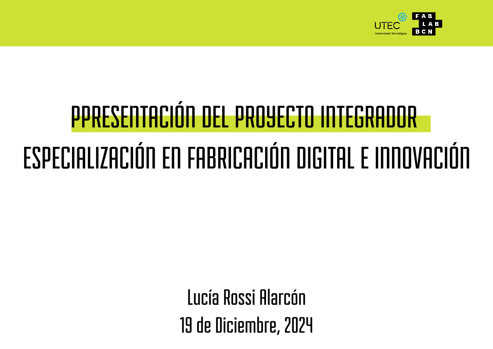
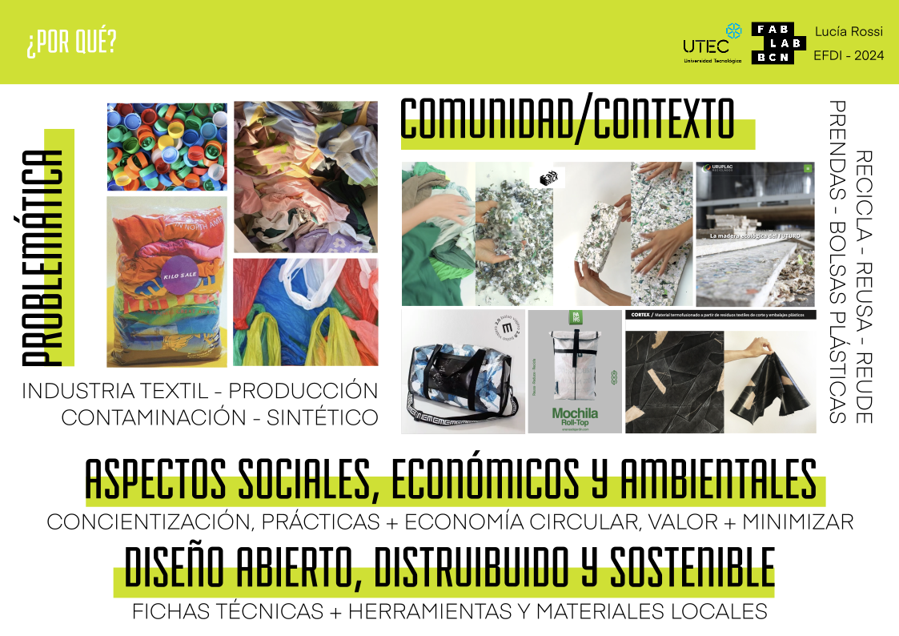
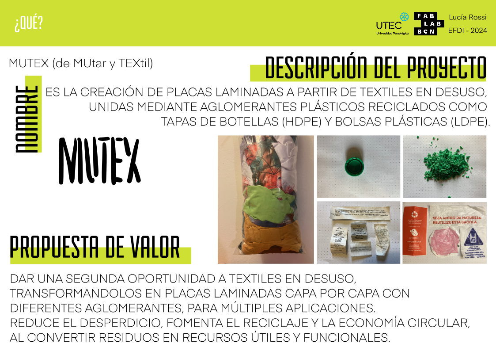
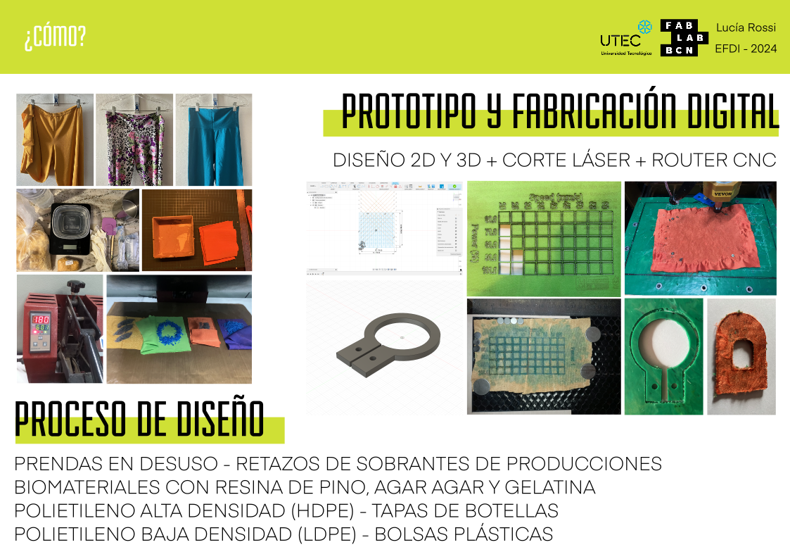
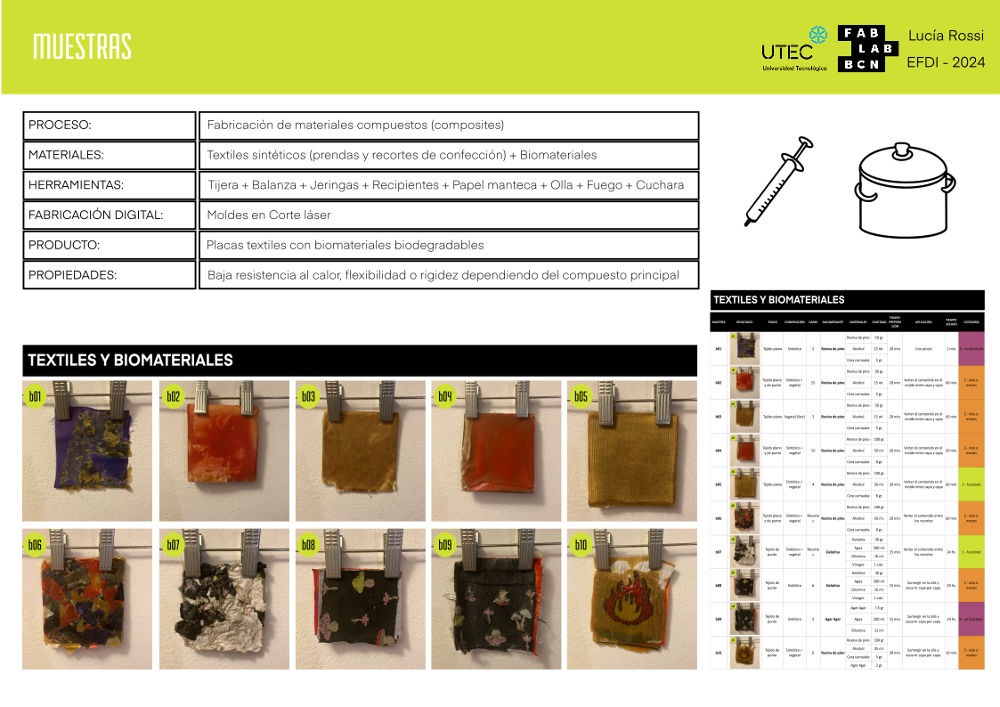
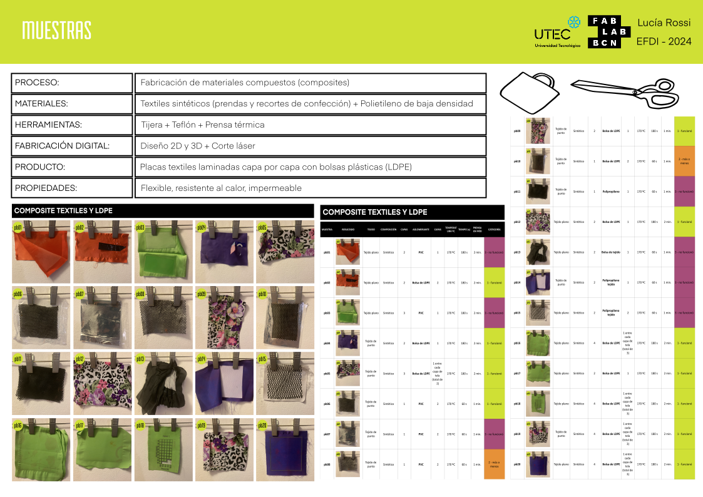
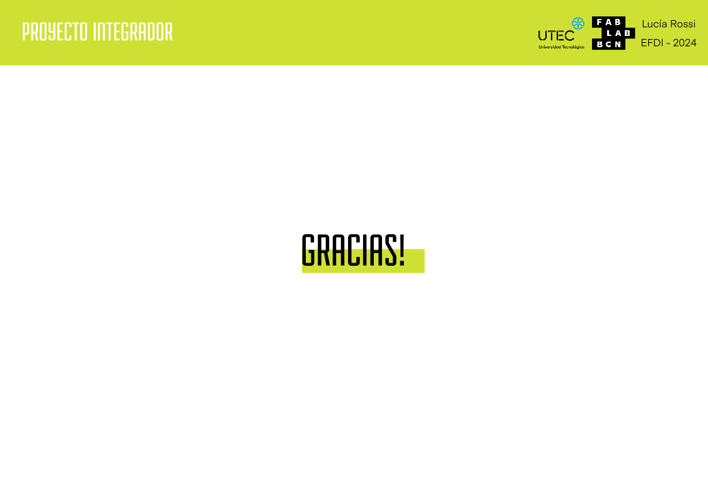

---
hide:
    - toc
---

# PF01-02  PROYECTO INTEGRADOR

## **Proyecto final**

### **Documentación del proceso de idea y desarrollo del proyecto final**

**¿Qué hace?**

El proyecto busca reutilizar desechos textiles, como prendas en desuso y recortes de confecciones, para crear placas y láminas compuestas. Estas combinan textiles sintéticos con aglomerantes sostenibles como biomateriales y plásticos reciclados, como el HDPE (proveniente de tapas de botellas) y el LDPE (extraído de bolsas plásticas). El objetivo es ofrecer un modelo práctico y replicable para transformar estos desechos en materiales útiles, fomentando así la economía circular.

**¿Cómo llegaste a la idea?**

Como diseñadora industrial especializada en textiles e indumentaria, siempre sentí un conflicto interno respecto al modelo de consumo masivo asociado a la moda. La saturación del mercado y el desperdicio textil me desmotivaban de crear más ropa, llevándome a explorar áreas como el vestuario teatral y de danza, donde podía generar un impacto más consciente.

La Especialización en Fabricación Digital e Innovación marcó un punto de inflexión: me mostró enfoques más sostenibles y herramientas tecnológicas que resonaron con mi visión. Inspirada por esta perspectiva, comencé a investigar formas de reutilizar prendas desgastadas o textiles con valor sentimental que suelen descartarse. También noté la ausencia de políticas públicas que fomenten el reciclaje textil. Aunque algunas empresas trituran telas para producir nuevos materiales, quise desarrollar un método más accesible y adaptable, que cualquiera pudiera implementar con herramientas locales.

**¿Quién lo ha hecho de antemano?**

Existen iniciativas que reutilizan textiles para fabricar productos nuevos. Por ejemplo:

- Fabrik: utiliza textiles de origen vegetal, como jeans de algodón, para crear ladrillos y placas.  
- Uruplac: en Uruguay, trabaja con plásticos reciclados, fusionándolos mediante capas de nylon y prensas de calor.  
- Cortex: una reciente investigación desarrollada en la EUCD, FADU (Uruguay), explora alternativas similares en la reutilización textil.

Estas iniciativas inspiraron este proyecto, pero la intención aquí fue centrarse en procesos más accesibles y exploratorios, priorizando textiles sintéticos y su combinación con biomateriales y plásticos reciclados.

**¿Qué diseñaste?**

El resultado del proyecto es un muestrario que documenta recetas, procesos y fichas técnicas para reproducir materiales compuestos.  
Este muestrario incluye:   
- Recetas de biomateriales: utilizando ingredientes como resina de pino, gelatina y agar-agar.  
- Parámetros técnicos: temperatura, tiempo y presión para fusionar textiles sintéticos con HDPE y LDPE.  
- Prototipos y moldes: desarrollados mediante herramientas digitales como el corte láser y el router CNC.

**¿Qué materiales y componentes se utilizaron?**

- Materiales: textiles sintéticos, prendas en desuso, recortes de confección, tapas de botellas (HDPE), bolsas plásticas (LDPE) y biomateriales como resina de pino, gelatina y agar-agar.  
- Procesos: fabricación digital (corte láser y CNC), moldes caseros y pruebas de fusión térmica con diferentes combinaciones de materiales.

**¿Qué partes y sistemas se fabricaron?**

Se desarrollaron:   
- Recetas para biomateriales, empleando aglomerantes como resina de pino.  
- Moldes y parámetros técnicos para la creación de láminas a partir de textiles y plásticos reciclados.  
- Modelos 3D para optimizar procesos de corte láser y CNC, aplicados en los prototipos.

**¿Qué procesos se utilizaron?**

- Procesos sustractivos: como el corte láser y el router CNC, para dar forma a las piezas.
- Fusión térmica: mediante calor y presión controlada, para combinar textiles con plásticos reciclados o biomateriales.

**¿Qué preguntas se respondieron?**

- ¿Es posible reutilizar textiles desechados para crear nuevos materiales?  
- ¿Qué combinaciones de materiales funcionan mejor para lograr resistencia, flexibilidad o rigidez según la aplicación?

**¿Qué funcionó? ¿Qué no?**

- Funcionó: La fusión de textiles sintéticos con plásticos reciclados (HDPE y LDPE), logrando láminas rígidas o flexibles según los parámetros aplicados. Estas combinaciones son viables para crear productos como revestimientos impermeables o estructuras ligeras.  
- No funcionó: La integración de biomateriales con textiles sintéticos, debido a la incompatibilidad en resistencia térmica y mecánica.

**¿Cuáles son las conclusiones?**

Este proyecto demuestra que los textiles desechados pueden reutilizarse en combinación con plásticos reciclados para crear materiales innovadores y funcionales. Sin embargo, el uso de biomateriales en este contexto aún requiere más investigación para garantizar su efectividad y durabilidad.

**¿Cuáles son los pasos a seguir?**

- Profundizar en las aplicaciones prácticas de los materiales compuestos desarrollados, como láminas impermeables para mobiliario, revestimientos o accesorios.  
- Investigar nuevas fórmulas para biomateriales que sean compatibles con textiles sintéticos.  
- Explorar técnicas de fabricación digital avanzadas para optimizar los procesos y adaptarlos a diversas escalas de producción.

### **Síntesis del Proceso de diseño con textiles, biomateriales y plásticos** 

**Proceso de diseño**

El punto de partida fue la recolección y clasificación de textiles: prendas y recortes organizados según el tipo de tejido (punto o plano) y su composición (100% sintético o mezclado con fibras naturales de origen vegetal o animal). Esta fase fue esencial para entender cómo se comportan los materiales durante los procesos de prensado y mezcla. 

Luego, preparé las muestras cortando los textiles en diferentes tamaños, probando tanto piezas grandes como fragmentos más pequeños.

## **Experimentación con biomateriales**

Para explorar opciones biodegradables, trabajé con diferentes recetas a partir de ingredientes accesibles como resina de pino, gelatina y agar-agar. Cada material demandó su propio proceso de preparación, con moldes iniciales construidos en cartón, aunque con la posibilidad de realizar moldes en corte láser o router CNC para obtener resultados más precisos.

**Resultados y Reflexiones**

Resina de Pino:  
- Resultó una mezcla fuerte y con propiedades impermeabilizantes, ideal para superficies de contacto con agua fría, como baldosas de baño.  
- Sin embargo, su rigidez se ve afectada por el calor; al dejarla al sol comenzó a deformarse.  

Gelatina:   
- Proporcionó un material flexible y resistente a la torsión, lo que valida su uso como aglomerante para textiles triturados.  

Agar-Agar:   
- A pesar de su rigidez inicial, se quebró con facilidad y mostró signos de descomposición en pocos días, probablemente por un desequilibrio en la mezcla (faltó vinagre).   

**Aplicaciones Futuras**

Resina de Pino:  
- Creación de azulejos decorativos para ambientes húmedos o estructuras no expuestas a calor extremo.

Gelatina:   
- Comparte principios con empresas que trabajan en composites biodegradables, dando potencial para desarrollar ladrillos modulares ligeros o placas flexibles.

Agar-Agar:   
- Si se ajustara la receta, podría funcionar como una opción para estructuras temporales o efímeras, como piezas de diseño en ferias o instalaciones artísticas.

## **Muestras con BIOMATERIALES**

## **Sistematización de muestras de textiles y biomateriales**

 

## **Composites con Textiles sintéticos y HDPE**

Trabajando con HDPE (polietileno de alta densidad) combinado con textiles sintéticos, los mejores resultados se lograron al triturar finamente el HDPE y al prensarlo térmicamente a 170 ºC durante 10 minutos. Preferentemente darle forma con Router CNC.

**Observaciones y Reflexiones**

- Las telas de tejido plano tienden a arrugarse más, especialmente si son finas, mientras que las telas gruesas y las de punto con spandex/elastano tienen mejor rendimiento al momento de moldear el HDPE.  
- El material resultante es rígido, impermeable y resistente a altas temperaturas.   
Las costuras textiles actúan como puntos de quiebre sin llegar a romperse, lo cual podría aprovecharse como parte del diseño estructural.   
- Aunque las placas laminadas no funcionaron para corte láser, sí fueron efectivas con router CNC, permitiendo tallados y cortes precisos.

**Aplicaciones Futuras**
- Mobiliario rígido para exteriores o espacios públicos (bancos, mesas pequeñas).   
- Placas estructurales para revestimientos de paredes o suelos.  
- Juntas y uniones rígidas en combinación con textiles de punto, aprovechando las propiedades de quiebre controlado.  
- Molduras y marcos diseñados con router CNC.

## **Muestras de textiles con HDPE** 

## **Sistematización de muestras de textiles y HDPE**

## **Composites con Textiles sintéticos y LDPE**

El LDPE (polietileno de baja densidad), en combinación con textiles sintéticos, resultó mucho más flexible que el HDPE, pero igualmente impermeable. El prensado térmico a 170 ºC durante 3 minutos fue suficiente para unir las capas sin comprometer la flexibilidad del material.

**Observaciones y Reflexiones**

- Las bolsas plásticas de LDPE funcionaron perfectamente, a diferencia de otros plásticos como el polipropileno tejido y el PVC, que no lograron unirse.  
- La cantidad de capas define el nivel de rigidez: más capas = más rigidez.  
- Las telas de tejido plano, si son finas, tienden a arrugarse más que las gruesas.  
- Funcionaron muy bien con corte láser, permitiendo diseños precisos y perforaciones, aunque no se probaron con router CNC debido a su flexibilidad.

**Aplicaciones Futuras**

- Cubiertas flexibles e impermeables para mobiliario exterior, para sillas playeras o techos para generar sombras o sombrillas.  
- Fundas y protectores para dispositivos debido a su resistencia a la humedad y flexibilidad.  
- Elementos modulares para aplicaciones en arquitectura temporal (paredes, paneles ligeros).  
- Textiles laminados con patrones funcionales realizados en corte láser, como 

## **Muestras de textiles con LDPE** 

## **Sistemización de muestras de textiles y LDPE**

## **Presentación**

## **¿Por qué?**

**Problemática**

La industria de la moda opera bajo un modelo de sobreproducción y consumo rápido, fabricando prendas que muchas veces no son utilizadas más de una vez o, incluso, nunca llegan a ser usadas. Esto genera una acumulación masiva de textiles sin destino y deriva en un impacto ambiental significativo, ya que los textiles sintéticos, que dominan el mercado por su bajo costo, son difíciles de reciclar debido a su baja biodegradabilidad. 

El proyecto surge como respuesta a esto, proponiendo una alternativa accesible para el reciclaje textil que reutiliza capas de telas sin necesidad de triturarlas, ya que en Uruguay no se cuenta con las herramientas industriales necesarias para estos procesos.

**Comunidad y contexto**

Si bien en otros países existen iniciativas que utilizan textiles triturados para fabricar materiales como ladrillos o placas (ejemplo: Fabrick), este proyecto toma un enfoque diferente, aprovechando herramientas más accesibles como el corte láser o el CNC. Busca ser una solución adaptable al contexto local, explorando aplicaciones prácticas para espacios interiores y exteriores. Las placas laminadas resultantes tienen propiedades como impermeabilidad y resistencia al calor, lo que las hace útiles para diseño de mobiliario, revestimientos u otros productos sostenibles.

**Explica de qué manera has considerado los aspectos sociales, económicos y ambientales para dar respuesta a problemáticas locales**

- En términos sociales, busca concienciar sobre la importancia de reutilizar textiles y fomenta la participación comunitaria mediante la difusión abierta de recetas y procesos.  
- Desde un enfoque económico, promueve un modelo de economía circular que genera valor a partir de desechos y reduce costos.   
- Ambientalmente, contribuye a la reducción de residuos textiles en vertederos y reutiliza plásticos reciclados como aglomerantes, disminuyendo el impacto ecológico general.

**Explica cómo has incorporado un enfoque de diseño abierto, distribuido y sostenible**

Enfoque de diseño abierto, distribuido y sostenible
El diseño abierto y distribuido es central en este proyecto, ya que al compartir las recetas, parámetros técnicos y resultados obtenidos, fomenta y facilita que comunidades locales puedan replicarlo utilizando herramientas digitales disponibles.  
Al utilizar materiales reciclados se alinea con los principios de sostenibilidad, y se demuestra que es posible combinar accesibilidad, innovación, economía circular y responsabilidad ambiental.

## **¿Qué?**

**Nombre**

Mutex (de "mutar" y "textil").

**Descripción del proyecto**

Mutex consiste en la creación de placas laminadas a partir de textiles en desuso, unidas mediante aglomerantes plásticos reciclados como tapas de botellas (HDPE) y bolsas plásticas (LDPE).

**Propuesta de valor**

El proyecto ofrece una alternativa para dar una segunda vida a textiles descartados, transformándolos en placas funcionales con múltiples aplicaciones. Además de reducir el desperdicio, fomenta el reciclaje accesible y la economía circular al convertir residuosp en recursos útiles. 

## **¿Cómo?**

**Describe cómo es tu prototipo, funcional y cómo integraste diseño 2D y 3D, procesos aditivos y/o sustractivos, electrónica y programación en tu propuesta**

El prototipo se materializa en placas laminadas fabricadas mediante el prensado de textiles sintéticos reciclados y plásticos. 

El diseño involucró herramientas de fabricación digital en varias etapas:

- Diseño 2D y 3D para modelar el diseño de corte láser y router cnc. 
- Corte láser y Fresado CNC para las muestras. 
- Fresado CNC 
- No pude incluir electrónica y programación pero estoy segura que podrá ser incoporado en futuras aplicaciones

**Proceso de diseño y cocreación**

El desarrollo del proyecto inició con una investigación sobre el uso de biomateriales como aglomerantes para unir textiles, pero los resultados no fueron efectivos en términos de adhesión ni resistencia. A partir de esta limitación, el enfoque se redirigió hacia el uso de plásticos reciclados, ya que su composición sintética es más compatible con los textiles sintéticos en desuso.

Se realizaron múltiples pruebas utilizando plásticos triturados y bolsas recicladas, ajustando parámetros como la temperatura, la presión y el tiempo para optimizar la adherencia y la funcionalidad de las placas. Estas pruebas fueron sistematizadas detalladamente y documentadas para generar un sistema replicable. 

El uso de fabricación digital permitió experimentar con aplicaciones decorativas y estructurales, ampliando el potencial de las placas para diversos usos. El proyecto se mantiene en constante investigación, buscando perfeccionar técnicas, explorar nuevas combinaciones de materiales y ampliar sus aplicaciones prácticas.

## **PRESENTACIÓN para descargar:**

[Enlace al archivo en Google Drive](https://drive.google.com/file/d/1fgG7iBAle3sHMd6s-vZmtO-9rPAtR0fZ/view?usp=share_link)

## **VIDEOpresentación de todas las muestras**

<iframe width="560" height="315" src="https://www.youtube.com/embed/D3pR22qPbDA?si=LfmiDieS5_vET_BM" title="YouTube video player" frameborder="0" allow="accelerometer; autoplay; clipboard-write; encrypted-media; gyroscope; picture-in-picture; web-share" referrerpolicy="strict-origin-when-cross-origin" allowfullscreen></iframe>

### **Reflexiones finales**

Este proyecto no busca presentar un producto final acabado, sino sistematizar un proceso de exploración que abre puertas a nuevas formas de pensar el reciclaje textil y su integración con biomateriales y plásticos. A través de las múltiples pruebas realizadas, se han generado conocimientos que evidencian el potencial de combinar textiles reciclados con materiales innovadores, adaptando sus propiedades a diversas necesidades creativas y funcionales. Este enfoque no solo responde a una inquietud personal de investigar, sino que también aborda un desafío mayor: la necesidad urgente de aplicar principios de economía circular en una industria textil que tradicionalmente genera altos niveles de contaminación y desperdicio.

Las reflexiones obtenidas durante el proceso refuerzan la idea de que este es un puntapié inicial. El proyecto se posiciona como una invitación a seguir investigando y desarrollando aplicaciones que puedan aprovechar los avances en herramientas de fabricación digital. Estas tecnologías, combinadas con el conocimiento adquirido, permiten diseñar soluciones distribuidas y sostenibles que fomenten la cocreación interdisciplinaria y ofrezcan respuestas innovadoras a problemas sociales y ambientales.

Los objetivos planteados—tecnológicos, de diseño y sostenibilidad—se ven reflejados en cada etapa del proceso. Por un lado, el uso de tecnologías como el corte láser, el router CNC y los moldes personalizados demuestran la capacidad técnica de adaptar y prototipar materiales en un entorno de fabricación digital. Por otro, la experimentación con diferentes materiales y técnicas no solo amplía las posibilidades de diseño, sino que también fomenta la innovación en métodos de producción sostenibles. Este enfoque evidencia la viabilidad de crear soluciones que minimicen el desperdicio y que, además, puedan ser escaladas o replicadas en otros contextos.

En términos de impacto, el proyecto cumple con el objetivo de proponer alternativas sostenibles basadas en principios de economía circular. Desde las propiedades de rigidez y resistencia del HDPE hasta la flexibilidad y versatilidad del LDPE, pasando por el potencial de los biomateriales como la resina de pino o la gelatina, las pruebas realizadas sugieren aplicaciones concretas: baldosas, ladrillos, revestimientos impermeables, placas flexibles, entre otros. Estas propuestas responden a necesidades funcionales mientras revalorizan los desechos textiles, convirtiéndolos en materiales útiles con nuevas cadenas de valor.

Finalmente, este proyecto reafirma la importancia de seguir investigando e innovando en torno al reciclaje textil. Si bien no pretende ser una solución definitiva, sí ofrece un marco de trabajo para pensar en futuros desarrollos que integren sostenibilidad, tecnología y diseño. Es una invitación a colaborar, a experimentar y a construir colectivamente un sistema más eficiente y respetuoso con el planeta. 

