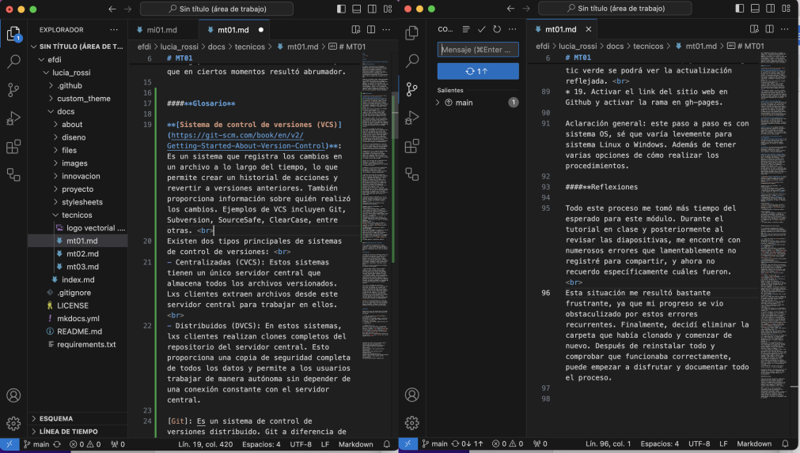

---
hide:
    - toc
---

# MT01

##**Introducción a herramientas digitales**

####**Introducción**

El módulo Introducción a herramientas digitales tuvo como premisa realizar una página web destinada a documentar nuestro proceso en la Especialización de Fabricación Digital e Innovación. Esta experiencia marcó mi primera incursión en el desarrollo web, brindándome la oportunidad de comprender el funcionamiento detrás de las páginas que frecuento en la web. 

Luego de la primera clase, donde aprendimos los fundamentos necesarios, me sumergí a seguir los  tutoriales proporcionados para comenzar la creación de la página. Sin embargo, me encontré con varios errores que dificultaron mi avance. A pesar de estos contratiempos, insistí en la búsqueda de soluciones para superar los obstáculos. Sin embargo, encontré demasiada información, lo que en ciertos momentos resultó abrumador. 

####**Glosario**

**[Sistema de control de versiones (VCS)](https://git-scm.com/book/en/v2/Getting-Started-About-Version-Control)**: Es un sistema que registra los cambios en un archivo a lo largo del tiempo, lo que permite crear un historial de acciones y revertir a versiones anteriores. También proporciona información sobre quién realizó los cambios. Ejemplos de VCS incluyen Git, Subversion, SourceSafe, ClearCase, entre otras.  
Existen dos tipos principales de sistemas de control de versiones:  
* Centralizadas (CVCS): Estos sistemas tienen un único servidor central que almacena todos los archivos versionados. Lxs clientes extraen archivos desde este servidor central para trabajar en ellos.  
* Distribuidos (DVCS): En estos sistemas, lxs clientes realizan clones completos del repositorio del servidor central. Esto proporciona una copia de seguridad completa de todos los datos y permite a los usuarios trabajar de manera autónoma sin depender de una conexión constante con el servidor central. 

**[Git](https://git-scm.com/video/what-is-git)**: Es un sistema de control de versiones distribuido. Git a diferencia de otros VCS, se destaca por realizar una copia de seguridad de todos sus archivos, incluso si no han sido modificados desde la última versión, como si fuera una captura de pantalla del momento a lo largo del tiempo. Si no se realizan modificaciones, no almacena una copia completa del archivo, sino que guarda un enlace al archivo idéntico anterior que ya estaba almacenado, lo que ahorra espacio de almacenamiento. 

**[Github](https://docs.github.com/es/get-started)**: Es una plataforma en línea que utiliza el sistema de control de versiones Git. Es un lugar donde lxs desarrolladores pueden almacenar, colaborar y gestionar proyectos de software de forma eficiente.

**Repositorio**: Es un espacio digital donde se almacena y gestiona los archivos relacionados a un proyecto de software específico. Funciona como una carpeta, además de documentar todo el historial de revisiones. En Github, un repositorio puede ser tanto público como privado. 

**[Fork](https://docs.github.com/es/pull-requests/collaborating-with-pull-requests/wor)**: Es una copia de un repositorio de código en un sistema de control de versiones, que permite a un usuario realizar cambios independientes sin afectar al proyecto original. 

**Template**: Es una estructura predefinida que sirve de base para la creación de documentos, páginas web u otros, facilitando el inicio de nuevos proyectos con un diseño o formato establecido. 

**Software para edición de página web**: Todos los sitios web que visitamos constan de dos elementos principales: un dominio web y un servidor web (hosting).   
Dominio: El dominio de la página web es equivalente a una dirección física, un dominio de internet se forma a partir de dos elementos principales: el nombre del dominio por ejemplo de facebook.com consiste en el sitio web (facebook) y la extensión del dominio (.com).   
Hosting: Es un servicio en línea que permite publicar un sitio o aplicación web en internet. Un servicio de hosting permite que alquiles un espacio en un servidor donde puedes almacenar todos los archivos y datos necesarios para que funcione la página web. 

**[Markdown](https://markdown.es/)**: Es un lenguaje de marcado ligero que se utiliza para dar formato a documentos de texto plano utilizando una sintaxis simple y legible.  
[Tutoriales interactivos](https://www.markdowntutorial.com/es/)

Comandos básicos de Markdown:  
EDITAR TEXTOS  
* cursiva entre guiones bajos _ ejemplo _ (sin espacios es igual a) _ejemplo_  
* negrita entre dos asteriscos ** ejemplo ** (sin espacios es igual a) **ejemplo**  
* cursiva y negrita entre dos asteríscos y guiones bajos ** _ ejemplo _ ** (sin espacios es igual a) **_ejemplo_**  
* encabezado al comienzo con numeral, la cantidad depende del tamaño # ejemplo ## ejemplo (sin espacios es igual a) #ejemplo ##ejemplo   

EDITAR ENLACES  
* enlace a otros sitios entre corcheas [ Nombre ]( link ) (sin espacios es igual a) [Marckdown](https://markdown.es/)  
* se pueden generar referencias también 

EDITAR IMÁGENES  
* para subir una imagen al comienzo es con un signo de exclamación, se agrega una descripción de la imagen entre corcheas y entre paréntesis la ruta del enlace.   Aclaración: antes hay que subir la imagen a la carpeta de la computadora, sincronizar los cambios en VS. ! [ nombre ]( link )  
* se puede generar referencias también

####**Documentación del proceso**

En la siguiente documentación intenté transmitir una sistematización ordenada y sencilla, a pesar de la variedad de pasos y opciones disponibles para crear una página web.  
Pasos para crear una página web utilizando github como hosting y git como control de versiones:

* Crear una cuenta en [Github](https://docs.github.com)  
Aclaración: El username quedará visible en el link de la página web, ejemplo de esta página es: lucia_rossi  
* Instalar [Git](https://git-scm.com/) en la computadora  
* Setear Git ( )
Aclaración: Para este paso, es necesario abrir la Terminal de la computadora. Allí, escribir o copiar: git config –global user.name “username” y git config –global user.name “tu_mail”. Para verificar la configuración escribir en la Terminal git config –global –list  
* Generar una [SSH](https://docs.github.com/es/authentication/connecting-to-github-with-ssh/adding-a-new-ssh-key-to-your-github-account) key  
Aclaración: Una clave SSH es un protocolo de red que permite a los usuarios a acceder de forma segura entre la computadora y Github (en caso de usar más de una computadora, generar una ssh key por cada equipo. Para verificar si ya hay una SSH escribir en la Terminal cat ~/.ssh/id_rsa.pub”  
* Generar la public Key  
ssh-keygen -t rsa -C “mlurossi@gmail.com”  
* 6. Volver a escribir cat ~/.ssh/id_rsa.pub para ver la SSH key  
Copiar el texto de la Terminal   
Volver a Github, en nuestro perfil abrir setting y luego ssh and gpg keys y ahí Add new SSH ley y pegar la public key que generó la terminal.  
* Fork template, al realizar fork de un template se crea un repositorio remoto en Github. Realicé un fork template de https://fablabbcn.github.io/efdi-template/  
* Abrir el efdi-template y dirigirse a Name: Github Repo  
* Abrir Github y presionar fork y crear un nuevo fork  
owner es el nombre del usuario, ejemplo de esta página es bitacoraLu y respository es el nombre y apellido, ejemplo en esta página es lucia_rossi  
* Luego de crear el fork, se crea un repositorio remoto con un template del sitio web listo para editar.  
* Clonar el repositorio remoto para crear el repositorio local en la computadora   
* Crear una carpeta en la computadora (recomendado en desktop para menor ruta de acceso)  
* Abrir Terminal, hay dos opciones: una es abrir la terminal e ir a la carpeta creada con el comando list y cd y la otra es abrir directamente desde la carpeta creada “nuevo terminal en la carpeta”  
* Abrir Github e ir a Visual Studio Code, ahí se encontrará en la pestaña SSH el link del repositorio remoto de Github. Para clonarlo hay que copiarlo e ir a la terminal y escribir git clone pegar la ssh key, ejemplo: git clone git@hithub.com:edi-docs/efdi-repo.git comenzar a descargar los archivos en la carpeta creada  
* Descargar visual studio code https://code.visualstudio.com/  
Visual Studio Code (VS) nos muestra los mismos archivos que aparecen en la carpeta que descargamos del repositorio para realizar el clon.  
* Para que éstos archivos los veamos en VS, tenemos que abrir la carpeta donde están los archivos de la página web y agregarlos al VS: File /Add Folder to workspace…/elegir la carpeta creada en Desktop  
Aclaración: Acá se encuentra toda la información y es donde se edita para que sea visualizado en la página web. Existen varios comandos como Markdown que nos permiten editar el estilo de tipografía, adjuntar enlaces e imágenes.  
* Para realizar un cambio y que se vea en la página web, hay que salvar y guardarlos en VS. Esto hay que hacerlo cada vez que se quiera actualizar la página web. En la pestaña de cambios escribir el comando change readme (o donde se haya editado) y darle Commit (es un comando utilizado para confirmar los cambios realizados en un repositorio).  
* Luego de sincronizar los cambios. Revisar la página de Github que aparecerán todos los commit a la vista, y cuando tenga tic verde se podrá ver la actualización reflejada.  
* Activar el link del sitio web en Github y activar la rama en gh-pages.

Aclaración general: este paso a paso es con sistema OS, sé que varía levemente para sistema Linux o Windows. Además de tener varias opciones de cómo realizar los procedimientos. 

####**Reflexiones**

Todo este proceso me tomó más tiempo del esperado para este módulo. Durante el tutorial en clase y posteriormente al revisar las diapositivas, me encontré con numerosos errores que lamentablemente no registré para compartir, y ahora no recuerdo específicamente cuáles fueron.   
Esta situación me resultó bastante frustrante, ya que mi progreso se vio obstaculizado por estos errores recurrentes. Finalmente, decidí eliminar la carpeta que había clonado y comenzar de nuevo. Después de reinstalar todo y comprobar que funcionaba correctamente, puede empezar a disfrutar y documentar todo el proceso. 

