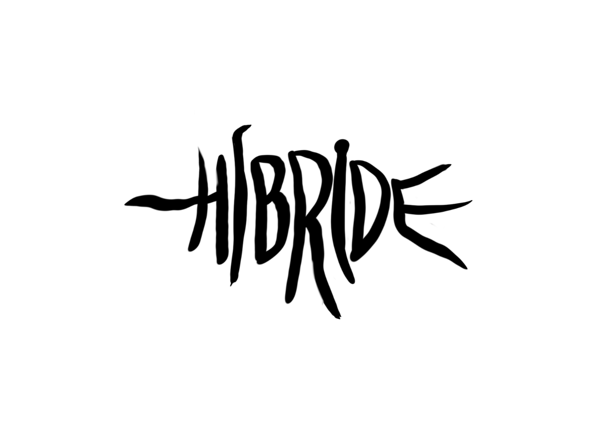
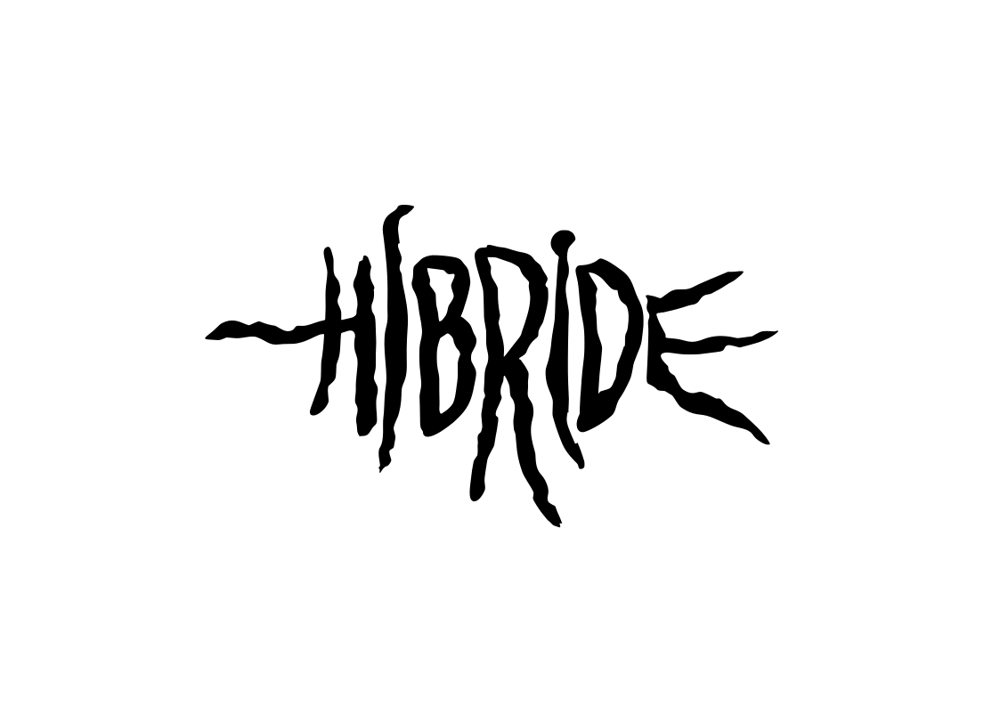
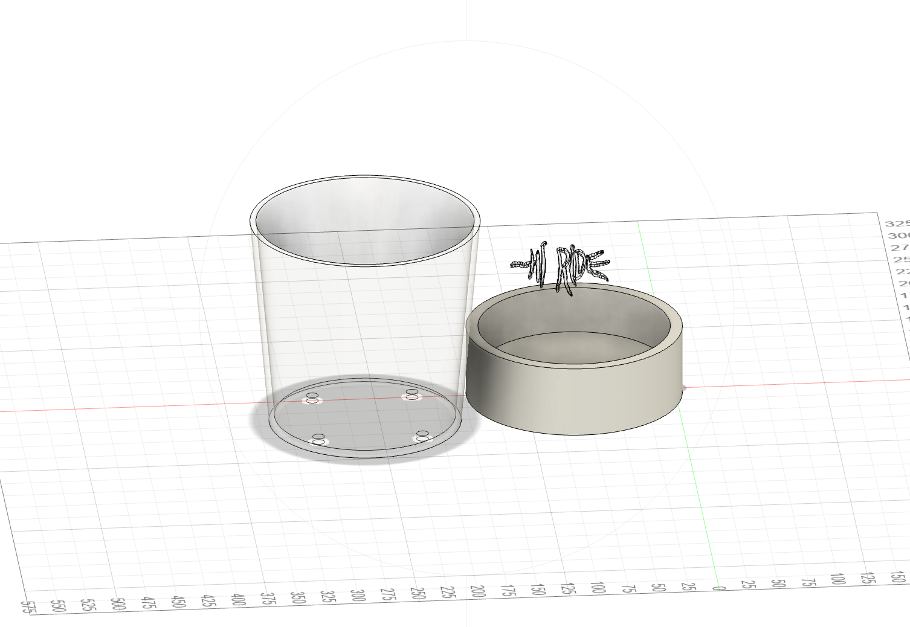
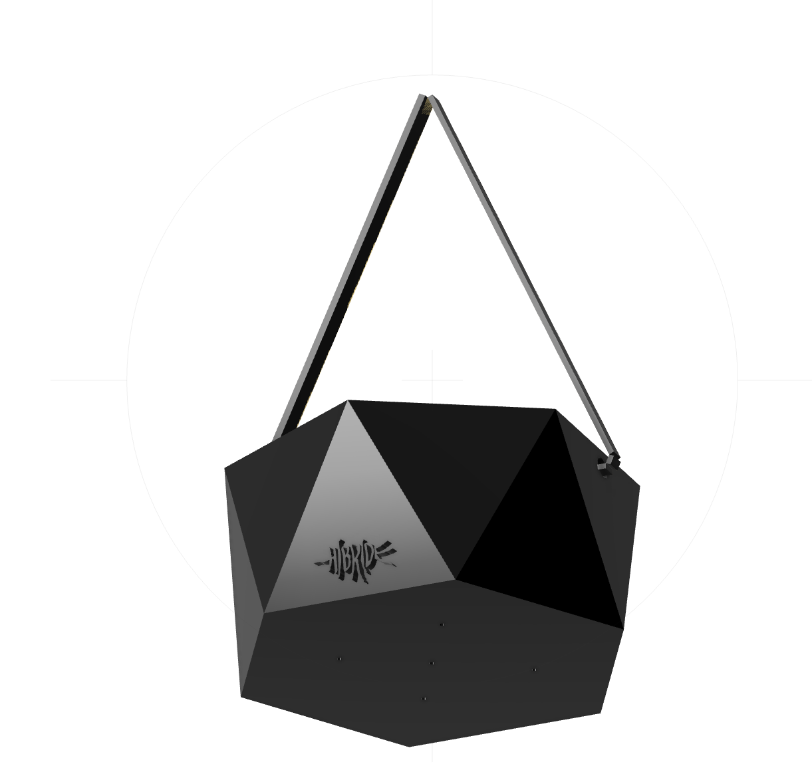
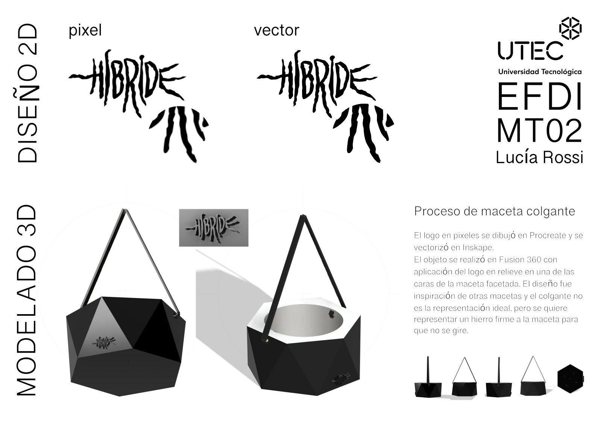

#MT02
##**Diseño 2D y Modelado 3D**

####**Introducción**

En este módulo nos mostraron programas diseñados para trabajar tanto en diseño 2D como en modelado 3D, así como a una variedad de formatos para obtener los archivos según sea necesario. Además, realizamos una actividad práctica que implicaba crear un objeto utilitario con al menos dos piezas y agregar un logotipo en relieve, seguido de la elaboración de una lámina de presentación. 

####**Glosario**

###**Diseño 2D**

Existen dos tipos de imágenes: Pixel y Vector

Las imágenes de píxeles, también conocidas como raster o mapas de bits, se componen de cuadrículas de numerosos cuadros que contienen colores. La desventaja es que pierden resolución al aumentar su tamaño. La resolución está determinada por el número de píxeles, siendo 300 ppp (puntos por pulgada) el promedio de lo que puede percibir el ojo humano.   
Por otro lado, los gráficos vectoriales son capaces de cambiar el tamaño sin perder resolución. Estas imágenes representan descripciones geométricas (matemáticas) utilizando puntos, líneas, curvas y polígonos. 

####Tipos de formatos 
JPG Es el formato más flexible porque permite controlar el nivel de compresión  
PNG Es un formato sin pérdidas con excelente compresión, ideal para imágenes formdas por grandes áreas de clor plano o con poca variación de color.  
TIFF Es un formato popular que puede contener imágenes de alta calidad.  
PSD Formato de archivo editable de alta calidad utilizado principalmente por Adobe Photoshop.  
RAW-NEF Formato utilizado por cámaras, y conserva todos los datos de la imagen original.  

####Programas 

**PIXEL**  
Software para descargar gratuitos y de código abierto:  
GIMP [Descarga]( https://www.gimp.org/downloads/) y [Tutoriales](https://www.youtube.com/watch?v=wLSvubMGb8A)  
Krita [Descarga](https://krita.org/en/download/) y [Tutoriales](https://docs.krita.org/en/)

Software online y de forma gratuita:   
[Photopea](https://www.photopea.com/)  
[Pixlr](https://pixlr.com/es/)

Software comercial:   
[Adobe Photoshop](https://www.adobe.com/es/products/photoshop.html) 

**VECTOR**  
Software para descargar gratuitos y de código abierto:  
INKSPAPE [Descarga](https://inkscape.org/es/release/inkscape-1.1/) y [Tutoriales](https://inkscape.org/es/learn/tutorials/)

Software comercial:   
[Adobe Illustrator](https://www.adobe.com/es/products/illustrator.html)  
[Corel DRAW](https://www.corel.com/la/)

###**Modelado 3D**

El modelado 3D es el proceso de desarrollo de una representación matemática de cualquier objeto tridimensional a través de un software especializado. 

Los modelos 3D representan un objeto tridimensional usando una colección de puntos en el espacio dentro de un espacio 3D, conectados por varias entidades geométricas tales como triángulos, líneas, superficies curvas, etcétera. 
Los modelos 3D pueden ser sólidos o solo representar el contorno del objeto. 

La apariencia se puede representar de 3 formas: 

**MESH** (modelo poligonal): son puntos en un espacio 3D que están conectados entre sí para formar una malla poligonal. En sí, es una colección de vértices, aristas y caras, que crea objetos 3D de forma no matemática. Utiliza puntos de referencias en los ejes X, Y y Z. La suavidad de los objetos se logra aumentando el número de polígonos para controlar los detalles.

**NURBS** (modelo de curvas): es un modelado de superficie de forma libre, es un modelo matemático que utiliza puntos de control para generar curvas. La curva sigue los puntos y cada uno se puede mover individualmente. 

**Escultura digital**: se crea un objeto 3D a partir de una estructura sólida, moldeando a través de la técnica de esculpido digital. 

La gran mayoría de los modelos 3D están construidos con MESH, porque son flexibles y porque las computadoras pueden renderizarlos muy rápido. Sin embargo, los polígonos son planos y solamente se pueden aproximar a superficies curvas usando varios polígonos.

El software de modelado 3D es un tipo de software de gráficos 3D utilizado para producir modelos tridimensionales. Se utiliza el formato STL. 

**Diseño paramétrico**
El diseño paramétrico es la abstracción de una idea o concepto, relacionado con los procesos geométricos y matemáticos, que nos permite manipular con mayor precisión nuestro diseño para llegar a resultados óptimos.  
El término “paramétrico” proviene de las matemáticas y se refiere al uso de parámetros o variables que permiten manipular o alterar el resultado final de una ecuación o sistema. 

**Diseño generativo**
El diseño generativo se trata de diseñar el sistema para la creación de los diseños 

Software online y de forma gratuita:   
[Tinkercad](https://www.tinkercad.com/)

Software para descargar gratuitos y de código abierto:  
[Rhinoceros](https://www.rhino3d.com/)  
[Blender](https://www.blender.org/)  
[Fusion 360](https://www.autodesk.com/products/fusion-360)  
[Openscad](https://openscad.org/)
 

####**Documentación del proceso**

Después de revisar todo el material proporcionado en las clases y explorar más recursos que compartieron desde la especialización, empecé descargando los programas que necesitaría para realizar la actividad de este módulo.  
En mi carrera de Diseño Industrial comenzamos con herramientas como Gimp e Inkscape, luego usé Corel, Illustrator y Photoshop. Reconectar con estas herramientas, especialmente Gimp me resultó desafiante, aunque encuentro que Inkscape sigue siendo una opción sólida.  
La actividad consistía en diseñar un objeto utilitario compuesto por al menos dos piezas con logo, y diseñar una lámina de presentación. 
Para empezar con la actividad, necesitaba descargar los programas adecuados para cada tarea. Descargué Gimp para trabajar con la creación del logo en formato de píxeles, y posteriormente utilicé Inkscape para convertir el logotipo en vectores. 
Para el modelado tridimensional del objeto utilitario, opté por Fusion 360, aprovechando la licencia disponible para estudiantes.  
Este fue mi primer acercamiento al mundo del diseño en tres dimensiones y explorar nuevas posibilidades creativas. 

Diseño 2D  
Para el diseño 2D, mi primer paso fue trabajar en el logo. Como ya contaba con un diseño creado en Procreate en formato píxeles, decidí utilizarlo como base. 

Luego, trasladé el diseño a Inkscape para vectorizarlo utilizando la función de "Vectorizar mapa de bits". Durante este proceso, aproveché la oportunidad para ajustar los nodos, añadiendo un toque de irregularidad a los contornos de las letras y otorgarles un aspecto más dinámico al logotipo.

Guardé el logo en dos formatos distintos: PNG, para conservar la transparencia y poder utilizarlo sin fondo en la lámina de presentación, y SVG, para su posterior uso en Fusion 360.  
Este proceso me permitió obtener un logotipo más versátil y adecuado para su aplicación en diferentes contextos y plataformas.

Modelado 3D  
En Fusion 360, mi primer paso fue explorar y experimentar con la herramienta. Realicé mi primer boceto, diseñando una maceta cilíndrica con agujeros de drenaje. Durante este proceso, intenté insertar el logotipo en el diseño, pero tuve dificultades al extruirlo correctamente. Después de varios intentos, descubrí que simplemente tenía que seleccionar esa parte del boceto y eliminarla para lograr el resultado deseado.

En cuanto a la dinámica de trabajo en Fusion 360, aprendí que consiste básicamente en:  
> elegir un plano  
> realizar el boceto  
> darle volumen al objeto  
> ajustar su apariencia   
> finalmente renderizarlo  

Después, empecé a ver los tutoriales proporcionados por Joaquín, que me ayudaron a comprender mejor el software. Decidí empezar un nuevo documento y complejizar la maceta, agregando caras facetas y que sea para colgar. Durante este proceso, experimenté algunas dificultades al encontrar el plano adecuado para realizar los bocetos, especialmente al trabajar en los agujeros para colgar. Sin embargo, después de varios intentos, logré superar estos obstáculos aunque no quedó como me lo imaginaba.  

Una vez que obtuve un resultado que consideré aceptable, procedí a diseñar la lámina de presentación. Incluí información básica sobre el proyecto, como la descripción de los ejercicios de diseño 2D con el logo en píxeles y en vector, así como el ejercicio de modelado en 3D del objeto utilitario. Además, añadí capturas de pantalla de las perspectivas del diseño y una breve descripción de los software utilizados en la creación del diseño y el modelado.

Este proceso me permitió experimentar y aprender más sobre el diseño en tres dimensiones, así como desarrollar mis habilidades en Fusion 360 y la presentación de proyectos. Aunque enfrenté algunos desafíos, estoy satisfecha con el resultado final y emocionada por seguir explorando nuevas posibilidades en el mundo del diseño.

####**Reflexiones**

Aunque logré completar la actividad, me resultó desafiante aprender una nueva herramienta y sus mecanismos de acción. A medida que avanzaba, encontraba alegría en cada pequeño logro, luego de superar errores, probar, empezar de nuevo, y dedicando tiempo a la visualización de tutoriales para aprender cómo indicarle al programa lo que quería hacer en mi imaginación.  
Para ser mi primera incursión en el modelado 3D, encontré estimulante y alentador. Descubrí las infinitas posibilidades que se abren en el mundo de la creación de objetos.  
La masterclas con Andrés Roppa fue muy enriquecedora, ya que me permitieron conocer de cerca ejemplos y procesos de diseño, lo que avivó mi interés por seguir explorando y aprendiendo en el campo del modelado 3D. Además de tener una instancia con mis compañerxs de presentación de la actividad.  
Quedo ansiosa por investigar y describir más sobre diseño paramétrico, y me quedó con la reflexión, como mencionó Andrés Ropa, que la fabricación 3D nos permite no solo hacer por hacer, sino crear según la demanda, lo cual es muy revelador.
