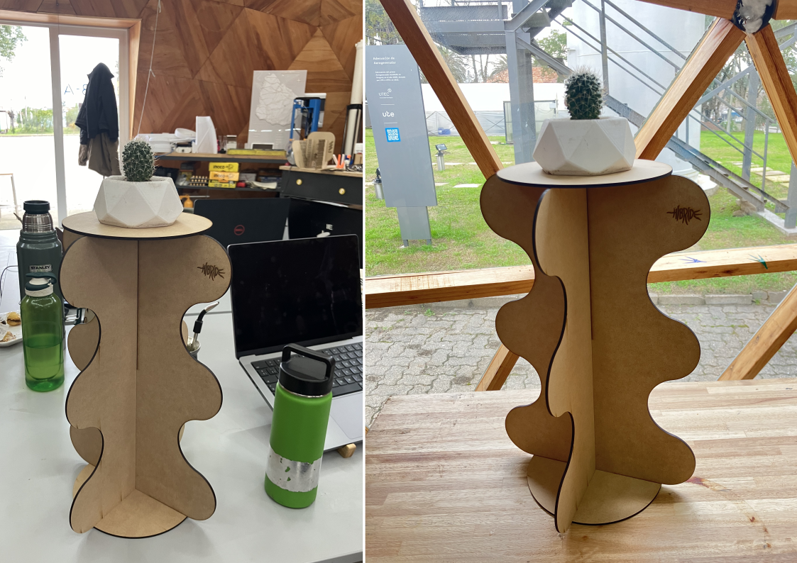

---
hide:
    - toc
---

#MT03 Tecnología y Fabricación 

##**Corte láser controlado por computadora**

####**Introducción**

En este módulo, experimentamos nuestro primer contacto con la fabricación digital a través del corte láser y nos sumergimos en el diseño paramétrico. 
Nos introdujeron al proceso mediante explicaciones detalladas y numerosos ejemplos prácticos.  Además, en la master class con Joaquín Rosas, un diseñador multifacético cuya inspiración se basa en el concepto de open source y la experimentación con una amplia variedad de materiales y diseños, promoviendo así la innovación e inspiración en el campo. 

También tuvimos nuestra primera experiencia práctica en el laboratorio de Durazno. La tarea consistía en crear un objeto utilizando diseño paramétrico, con la particularidad de que debía ser ensamblable sin necesidad de utilizar pegamento u otras formas de unión. Utilicé Fusion 360 para el diseño y luego llevé a cabo el corte láser en la máquina de CO2 disponible en el laboratorio. 

####**Glosario**

**CAD**: son las siglas Computer Aided Design, en español Diseño asistido por computadora. Se refiere al software utilizado para realizar los diseños de forma digital, ya sea en 2D o 3D.

**CAM**: son las siglas Computer Aided Manufacturing, en español Fabricación asistida por computadora. Se refiere a software que genera el archivo con las instrucciones para que lo procese la máquina CNC con el diseño que se realizó en CAD, es el nexo entre el diseño y la producción. El formato suele ser del tipo .gcode.

**Laser**: son las siglas Light amplification by stimulated emission of radiation, en español Amplificación de luz mediante emisión estimulada de radiación. La tecnología láser comenzó con Albert Einstein a principios del siglo XX.

**Corte Láser**: Es una técnica de manufactura digital que se basa en sustraer material, puede ser [corte](https://www.youtube.com/watch?v=SIjUVCho_xU&t=2s), [marcado](https://www.youtube.com/watch?v=lq_BsejihZ8&t=37s) y [grabado](https://www.youtube.com/watch?v=BiIeXWPRO0I).  
Funciona sobre una superficie plana (en dos ejes), a través de un haz de luz que es dirigido hacia la pieza mediante un sistema de espejos de reflexión de alta precisión y un lente de enfoque convergente. La zona a sustraer o marcar se obtiene de una elevada densidad de energía térmica concentrada que produce la volatilización del material. Puede alcanzar mínimos de diámetro de sustracción de 0.1 mm. Es una forma rápida, fácil y precisa de corte y grabado.  
La máquina es controlada por la computadora, a esto se le llama Control Numérico Computarizado (CNC), puede ser a través de diseños en formato vectorial o raster. 

Las cortadoras láser pueden ser:  
- CO2, es la mezcla de gases principalmente compuesta por dióxido de carbono. Se puede cortar madera, papel, cartón, acrílicos, algunos plásticos, entre otros.  
[¿Cómo funciona una cortadora láser C02?](https://www.youtube.com/watch?v=Mt5U-ARuBHY)  
- Fibra de vidrio u óptica. Se puede cortar todos los materiales anteriores pero básicamente innova en cortar metales (para materiales reflectivos hay que cubrir la superficie).  
[¿Cómo funciona una cortadora láser de Fibra?](https://www.youtube.com/watch?v=3gSNjsUO8E8&list=PLeQKxo8vDk-wOlXEdIlwPl1yQg1L7zYc3&index=5)  
- Neodymium (neodimio) (no es tan común). Se pueden cortar materiales más gruesos y robustos como metales y algunas cerámicas.  
[¿Cómo funciona una cortadora láser de Neodymium?](https://www.youtube.com/watch?v=om164bWBGp8)

Consideraciones al momento de configurar la máquina:  
1. Distancia focal, determina el ajuste del foco, podría estar también desenfocada y genera otro efecto. 
Parámetros de potencia que se mide en porcentaje, debería coincidir con el número de PPI del archivo.  
2. La velocidad se mide por segundo. 
Si se quisiera un grabado con relieve, es mejor hacer varias pasadas , por ende se necesita menos potencia y alta velocidad, y repetirlo varias veces
La frecuencia para madera tendría que ser de 1000 Hz.
3. Formatos de archivos: para corte o marcado son archivos en vectores y para grabado es en raster. 

Las aplicaciones de corte pueden ser muy variadas: en [MDF](https://www.youtube.com/watch?v=s3BrBtG0FHM&t=98s), en [textiles](https://www.youtube.com/watch?v=-xIb5-t26kU&t=10s), en [metal](https://www.youtube.com/watch?v=Ywy71uc_qBo), como [decoración](https://www.youtube.com/watch?v=F3ji3n5lkOE&t=237s), para [luminaria](https://www.youtube.com/watch?v=LD3xrdJzAnU&t=1s), en [cartelería](https://www.youtube.com/watch?v=RCYlqtlu9Gw), en [cuero](https://www.youtube.com/watch?v=DHc22dKZkdY), en [cartón](https://www.youtube.com/watch?v=eIouh_ElYHU&t=3s), entre otras. 

Aplicaciones de grabado en todos los de más y además en [metal](https://www.youtube.com/watch?v=eBlsG3SktOo&t=69s
https://www.youtube.com/watch?v=tVMcRzRFWi4)

Tipos de plásticos aptos para corte láser:   Poliamida (PA), Policarbonato (PC), Polietileno (PE), Polipropileno (PP), Polioximetileno (POM), Poliaril Sulfona (PSU), Poliéter cetona (PEEK), Copolímero de acrilonitrilo butadieno estireno (ABS), Poliimida (PI), Poliestireno (PS), Polimetilmetacrilato o Acrílico (PMMA), Poliéster (PES), Tereftalato de polietileno (PET) y Silicona. 
Los acrílicos son el material más utilizado ya que genera un acabado perfecto.

Tipos de maderas aptos para procesar con láser:   
DM o MDF, Multiplex, Madera contrachapada, Bambú, Cartón gris, Madera Natural (de aliso, madera de cerezo, de arce, entre otras), Madera de bambú, Madera Maciza, Corcho y Madera laminada. 

Tipos de textiles adecuados para procesamiento láser:   
Algodón, Fieltro, Seda, Lino, Encaje, Poliéster, Lana, Softshell, Mezclilla, Terciopelo, Polar, entre otras. 

**Kerf Bending o Kerfing**: Es la técnica de generar patrones de corte en un material rígido y plano con el fin de debilitarlo de forma controlada para lograr que se pueda [doblar](
https://www.youtube.com/watch?v=QvcpBnxsQws&t=1s)

**Software** que permiten transformar modelos 3D en piezas planas encastrables para corte láser 
[Fusion 360](https://www.youtube.com/watch?v=puh35b5SX3Q&t=8s)
[FlatFab](https://www.youtube.com/watch?v=C_2dtZftMww)

**Nesting** es el término que se utiliza para describir la acción de ubicar de forma eficiente las piezas a cortar en la lámina del material. Hay software gratuitos y open source como [SVGnest](https://svgnest.com/)  y [Deepnest.io](https://deepnest.io/)  que simplifican dicha acción. 

Preparar los archivos:
CAD> Colores: Rojo para corte, azul para grabado vectorizado y negro para rasterizado. Se guarda en PDF 
CAM> [RDWorks](https://www.youtube.com/watch?v=UwjH-HMmGuY&t=97s)

**Cortadora de vinilo**(plotter de corte): Se utilizan cuchillas afiladas para cortar diseños a partir de láminas de vinilo adhesivo. 

**Fresado CNC**: Es otro método de fabricación controlado por computadora, es similar al corte láser pero se diferencia porque utiliza cabezales de corte de metal que se mueven hacia arriba y hacia abajo por un tercer eje. Esto permite mayor libertad de diseño y formas más complejas. 

##**Diseño paramétrico**

Es un proceso basado en el pensamiento algorítmico que permite establecer relaciones entre los objetos de diseño que se están haciendo. 

Idea (desarrollo de concepto) > Lógica (creación de script) > Diseño (ajuste de parámetros)  
Ajustar los parámetros, permite que se pueda ajustar a medida luego. Esto permite mayor creatividad y diseños exclusivos. 

Tutorial de cómo hacer una caja encastrable en [Fusion 360](https://www.youtube.com/watch?v=ZrcqauNvt0M&t=706s) y 
[Theveymany](https://theverymany.com/project-gallery) diseña en 3D pero fabrica en 2D. 

**Diseño generativo** (generative design): El objetivo acá es diseñar el sistema que diseña el objeto. La topología es una forma que a través del diseño generativo, puede encontrar la forma más adaptativa a los requerimientos de los objetos. 

Herramientas  
[Fusion 360](https://www.autodesk.com/latam/products/fusion-360/overview?term=1-YEAR&tab=subscription)  
[Grasshopper](https://www.grasshopper3d.com/)  
[Rihno](https://www.rhino3d.com/es/)  
Flat lab Plane Sketch  
[Beegraphy](https://beegraphy.com/)  
[Openscad](https://openscad.org/)  
[Origami simulator](https://origamisimulator.org/)  
[Tinkercad script](https://www.tinkercad.com/)

####**Documentación del proceso**

La actividad era diseñar un objeto para fabricación mediante corte láser, con al menos tres piezas parametrizables y ensamblables mediante encastre. Además el objeto debía incluir las tres operaciones de la máquina láser: grabado (50x50mm.), marcado y corte láser en vector. Utilizamos MDF de 600 a 450 mm y 3 mm de espesor. 

Inicialmente, tras investigar sobre kerf y estudiar la documentación, opté por diseñar una panera, pero me resultó complicado en Fusion 360. Después de crear bocetos y moldes en cartón para pruebas, decidí reiniciar sin considerar kerf para cumplir con los plazos. Acá el resultado fallido de esta etapa. 

Decidí seguir directamente el tutorial de Joaquin sobre su diseño parametrizable para asegurarme de cumplir con la entrega a tiempo y tener un diseño para realizar la práctica de corte láser. El resultado que obtuve fue similar al suyo, lo que me permitió adquirir un mejor entendimiento sobre el funcionamiento del programa. 

Después de buscar inspiración, me incliné por diseñar un pedestal para macetas. A pesar de que Fusion seguía siendo un desafío, no me rendí. Realicé bocetos a papel y prototipos con cartón para trasladar mi diseño a Fusion.

Sin embargo, cometí errores al intentar corregirlos directamente luego de la extrusión, en lugar de abordarlos en el boceto inicial. A pesar de ello, logré parametrizar los espesores y las holguras, lo que me permitiría adaptar el diseño a diferentes grosores de placa si fuera necesario. 

Aún enfrentaba dificultades con Fusion 360, finalmente logré diseñar el objeto que tenía en mente para el corte láser. Al llegar al laboratorio, recibí ayuda de Joaquín y mis compañerxs, quienes me guiaron en el uso del programa y me mostraron diferentes técnicas para evitar errores al construir bocetos. 

Uno de los aspectos clave que aprendí sobre Fusion 360 es la importancia de fijar las líneas y trabajar con planos como referencia. También comprendí la necesidad de realizar ediciones en el boceto inicial en lugar de intentar modificar el objeto extruido posteriormente, lo cual me había llevado a cometer varios errores. 

Además, aprendí a preparar el archivo en Rdworks para la máquina de corte láser y a configurar correctamente. 

Estoy muy satisfecha con el resultado final y con todo lo que aprendí durante este proceso. 

####**Reflexiones**

Este módulo fue más que una simple actividad, fue un proceso de aprendizaje en cada etapa, desde la búsqueda de inspiración hasta la ejecución del diseño en Fusion 360 y la fabricación en el laboratorio. Enfrenté desafíos y obstáculos que me obligaron a pensar de manera creativa y a buscar soluciones innovadoras.  
Además, me enseñó la importancia de buscar ayuda cuando sea necesario y de aprovechar los recursos disponibles, ya sea de orientación de profesores o ayuda de mis compañerxs. Reconocí que no tengo todas las respuestas y que es un aprendizaje compartir nuestros errores para crecer.  
Por último, este proyecto me dejó un sentimiento de satisfacción al ver el resultado final no solo de mi diseño, sino también de los proyectos de mis compañerxs. Fue gratificante ser parte de un proceso colaborativo y de forma presencial. 

[def]: ../images/MT03/paneral.jpg