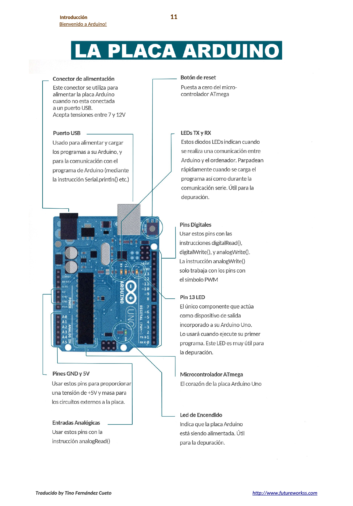
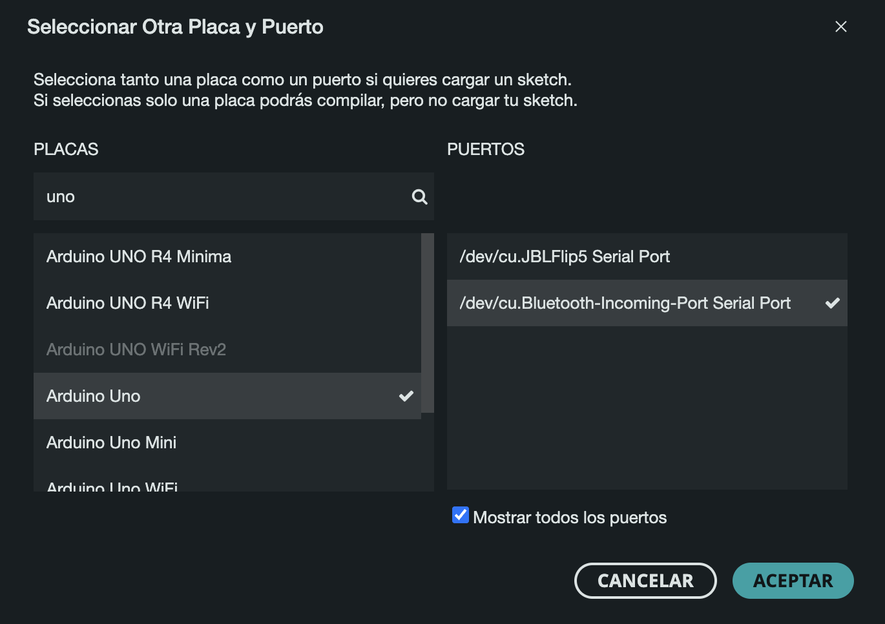
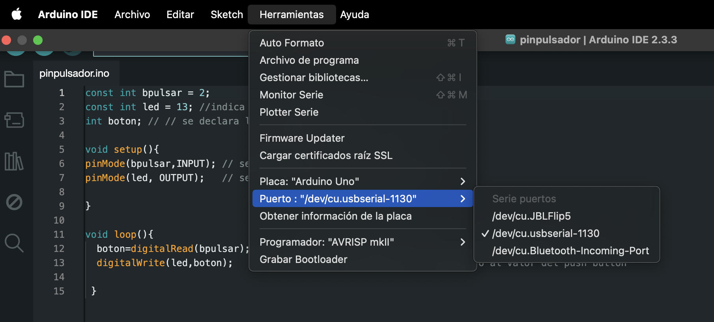
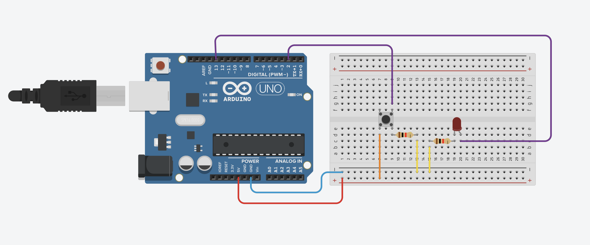
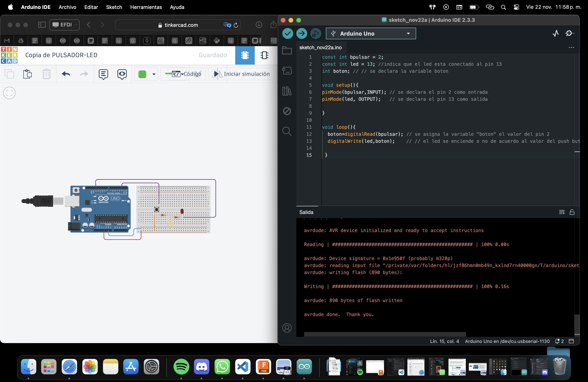
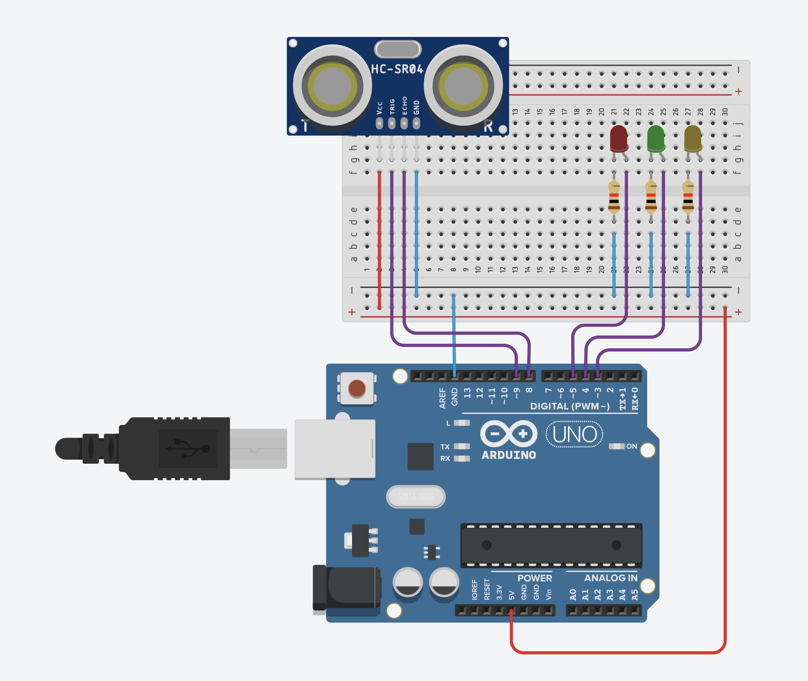
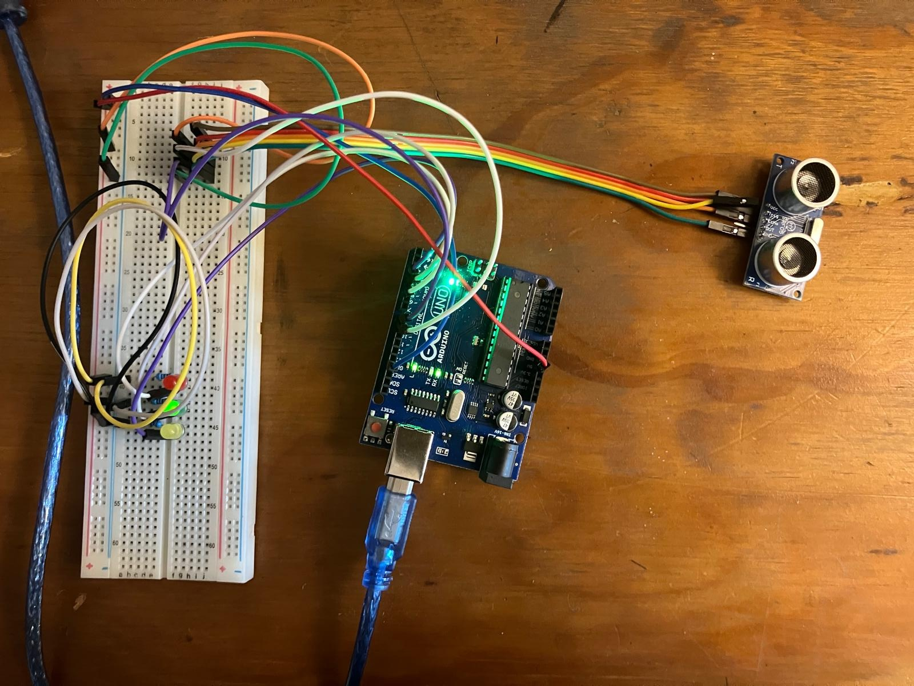

# MT04 Tecnología y Fabricación 

## **Introducción a la electrónica y programación (Arduino IDE)**

### **Introducción**

### **Glosario**

**[Placa Arduino](https://arduino.cl/que-es-arduino/)**

La placa Arduino es una plataforma de hardware libre que integra un microcontrolador programable y una serie de pines hembra. Estos pines permiten conectar la placa a diferentes dispositivos de entrada y salida, facilitando la creación de sistemas electrónicos interactivos. Arduino es una herramienta clave para desarrollar proyectos que combinan software y hardware de manera sencilla.
 
**¿Para qué sirve?**  
La placa Arduino es capaz de leer entradas como la luz detectada por un sensor, la presión de un botón o mensajes digitales, y transformar esas entradas en acciones, como encender un LED, activar un motor o incluso publicar datos en línea. Para realizar estas acciones, se escribe un conjunto de instrucciones (un programa) que se carga en el microcontrolador. Este programa se desarrolla en el **_Arduino IDE_**, un software que utiliza un lenguaje de programación basado en C/C++, diseñado para ser fácil de aprender y aplicar.

**¿Por qué elegir Arduino?**  
Aunque existen otros microcontroladores en el mercado, Arduino es preferido por muchas razones, como económico, accesible, multiplataforma, fácil de usar, es de código abierto y extensible. 

**¿Qué es diseño de interacción?**  
El diseño de interacción se refiere a la creación de experiencias que permiten la interacción entre seres humanos y objetos, ya sea a través de interfaces físicas o digitales. En el caso de Arduino, este diseño se traduce en cómo los usuarios interactúan con sistemas electrónicos a través de entradas (sensores, botones) y salidas (motores, luces).

**¿Qué es informática física?**  
La informática física implica construir sistemas interactivos que respondan al entorno físico utilizando hardware y software. Esto puede incluir la captura de datos del mundo real mediante sensores, y la generación de respuestas físicas o digitales en consecuencia, como encender luces o activar mecanismos.

**¿Qué es una placa electrónica?**  
Una placa electrónica es una placa de circuito impreso (PCB), que es la forma más eficiente y compacta de ensamblar un circuito electrónico. La placa Arduino es, esencialmente, una PCB con un diseño de circuitos predefinido, lo que permite a los usuarios concentrarse en la programación y el desarrollo de aplicaciones sin preocuparse por las conexiones eléctricas subyacentes.

**Modelos de Arduino**  
Arduino ofrece una amplia gama de modelos, cada uno diseñado para diferentes aplicaciones y necesidades. Estos modelos varían en tamaño físico, número de pines, tipo de microcontrolador y otras características. Sin embargo, la mayoría comparte un conjunto común de librerías de software, arquitectura y documentación, lo que facilita el desarrollo y la compatibilidad entre diferentes placas.

**¿Qué es un microcontrolador?**  
Un microcontrolador es un circuito integrado que contiene una unidad central de procesamiento (CPU), memoria y periféricos de entrada y salida. Es responsable de ejecutar las órdenes almacenadas en su memoria, permitiendo que el sistema realice las tareas programadas.

**Conceptos básicos de electricidad**

- Electrón (-), Protón (+) y Neutrón: Son las partículas fundamentales de los átomos que conforman los materiales.
  
- Voltaje (V): Es la diferencia de potencial entre dos puntos de un circuito, medida en voltios (V). Representa la energía disponible para mover los electrones a través de un circuito. El voltaje puede ser alterno (AC), como el que se encuentra en los enchufes, o continuo (DC), como el de una batería.
  
- Corriente (I): Es el flujo de electrones que se desplazan a través de un conductor debido a una diferencia de voltaje, y se mide en amperios (A). Cuantos más electrones se muevan, mayor será la corriente.
  
- Resistencia (R): Es la oposición al flujo de corriente en un circuito, medida en ohmios (Ω). La resistencia controla cuánta corriente puede fluir a través de un circuito.

**Ley de Ohm**  
La Ley de Ohm establece que \( V = I \times R \), es decir, el voltaje (V) es igual a la corriente (I) multiplicada por la resistencia (R). Esto significa que si la resistencia es alta, la corriente será baja, y viceversa. Si la resistencia es casi nula, la corriente puede ser excesiva, lo que podría causar un cortocircuito.

- Corto circuito: Ocurre cuando hay una resistencia muy baja, permitiendo que una gran cantidad de corriente fluya de manera descontrolada. Esto puede dañar el circuito.  
- Circuito abierto: Ocurre cuando no hay flujo de corriente debido a una interrupción en el circuito.

**Control de flujo eléctrico**  
En un circuito, se puede controlar el flujo de electrones usando un interruptor. Cuando el circuito está cerrado, los electrones fluyen, generando corriente. Al abrir el circuito, se interrumpe el flujo de electrones, deteniendo la corriente. Esto es esencial para diseñar sistemas que reaccionen o se apaguen cuando sea necesario.

**Arduino uno** 

**[Kit Arduino Uno](https://candy-ho.com/Drivers/librodeproyectosdearduinostarterkit-151212174250.pdf)**  

El Kit Arduino Uno es una de las opciones más completas para quienes desean iniciarse en el mundo de la electrónica y la programación. Este kit incluye una placa Arduino Uno, acompañada de una variedad de componentes y accesorios que permiten realizar una amplia gama de proyectos electrónicos interactivos. Al adquirir un kit de Arduino, los usuarios tienen todo lo necesario para aprender los conceptos básicos de la informática física y desarrollar proyectos prácticos desde el principio.

**Componentes del Kit Arduino Uno**  
El kit suele incluir varios componentes esenciales que permiten experimentar con las diferentes capacidades de Arduino.  
Algunos de estos componentes son:  
- Placa Arduino Uno: La placa principal del kit, equipada con un microcontrolador y pines de entrada y salida.  
- Cables de conexión (Jumpers): Se utilizan para realizar conexiones rápidas entre los diferentes componentes y la placa.  
- LEDs: Diodos emisores de luz que permiten realizar proyectos básicos de iluminación y señales visuales.  
- Resistencias: Controlan la cantidad de corriente que pasa a través de un circuito.  
- Pulsadores: Permiten activar o desactivar un circuito cuando se presionan.  
- Sensores: Dispositivos que permiten captar información del entorno, como luz, temperatura, humedad, distancia (ultrasónico), movimiento, presión, gas, acelerómetro y micrófono.  
- Actuadores: dispositivos que permiten convertir las señales eléctricas procesadas por arduino en acciones físicas, como leds, servomotores, motores DC, relés, buzzer o zumbador, pantalla LCD, vibrador, termistores.  
- Potenciómetros: Resistencia variable utilizada para ajustar niveles de voltaje. 

**Entradas y Salidas en Arduino**  
Arduino se destaca por su capacidad para interactuar con el entorno mediante entradas y salidas programables. Estas entradas y salidas pueden ser de dos tipos: digitales o analógicas, y son fundamentales para controlar los dispositivos conectados a la placa.

Pines Digitales  
Los pines digitales en Arduino son capaces de trabajar con señales que solo pueden adoptar dos valores: alto (1) o bajo (0). Este tipo de señal es binaria y se utiliza en situaciones donde solo se requieren dos estados, como encender o apagar un LED, o detectar si un botón está presionado o no. Por ejemplo, un interruptor de luz es una entrada digital, ya que solo tiene dos estados posibles: encendido o apagado.

Pines Analógicos  
Por otro lado, los pines analógicos permiten trabajar con señales en las que el voltaje puede variar continuamente dentro de un rango específico. Las señales analógicas son útiles cuando es necesario medir niveles intermedios de voltaje, como al usar un sensor de temperatura o un potenciómetro. En el caso de la corriente alterna, la señal analógica fluctúa entre valores positivos y negativos en ciclos repetidos. Arduino convierte estas señales analógicas en valores digitales utilizables en los programas, a través de un proceso llamado conversión analógica-digital.

**Arduino Software (IDE) y Bocetos (Sketches)**  
El Arduino Software (IDE) es el entorno donde se escribe y se carga el código que controla la placa Arduino. Dentro del IDE, los programas se llaman bocetos o sketches, y se guardan con la extensión .ino.  
El IDE tiene varias herramientas clave:  
- Editor de texto: Permite escribir y editar el código, con funciones como cortar, pegar, buscar y reemplazar texto.
Área de mensajes: Muestra notificaciones, errores y comentarios sobre las acciones realizadas, como guardar o cargar el código.  
- Consola de texto: Proporciona detalles de los procesos, incluidos los errores de compilación o carga.  
- Barra de herramientas: Facilita acciones comunes como verificar, cargar, crear, abrir y guardar bocetos, además de abrir el monitor en serie para ver la comunicación entre la placa y la computadora.  
- Esquina inferior derecha: Muestra la placa Arduino seleccionada y el puerto serie conectado.  
- Los bocetos son las instrucciones que el Arduino sigue para controlar sus componentes y se cargan desde el IDE a la placa mediante un cable USB.

#### **Documentación del proceso**

Antes de documentar todo, tildaré los materiales claves para el funcionamiento en sí del [kit de arduino](https://candy-ho.com/Drivers/librodeproyectosdearduinostarterkit-151212174250.pdf) 

**Materiales a utilizar:**  

**- Arduino Uno:** La tarjeta de desarrollo del microcontrolador la cual será el corazón de tus proyectos. Es un simple ordenador, pero uno con el cual todavía no puedes realizar nada. Construirás circuitos e interfaces para hacer cosas y decirle al microcontrolador como trabajar con otros componentes.  
**- Placa de pruebas:** Una placa sobre la cual puede montar componentes electrónicos. Es como un panel con agujeros, con filas de agujeros que le permite conectar juntos cables y componentes electrónicos. También están disponibles tarjetas sobre las que hay que soldar y también sin necesidad de usar un soldador como la mostrada aquí.  
**- Cables puente:** Utilizarlos para conectar unos componentes con otros sobre la placa de prueba, y la tarjeta de Arduino.  
**- Foto resistencia:** (también llamada foto célula o resistencia dependiente de la luz). Se trata de una resistencia variable que cambia su resistencia según el nivel de luz que incide sobre su superficie.  
**- Resistencias:** Se opone al paso de la corriente eléctrica en un circuito, dando como resultado a un cambio en la tensión y en dicha corriente. El valor de las resistencias se mide en ohmios (se representa por la letra griega omega). Las bandas de colores en un lado de la resistencia indica su valor.  
**- Potenciómetro:** Una resistencia variable con tres terminales. Dos de estos terminales están conectados a los extremos de una resistencia fija. El terminal central se puede mover a través de la superficie de la resistencia fija (dispone de un mando), consiguiendo de esta forma dos valores diferentes de resistencia según el terminal extremo que se tome como referencia. Cuando los terminales extremos del potenciómetro se conectan entre una tensión y masa, en el terminal central aparece una tensión que es proporcional al giro del mando central, entre cero (un extremo) y la máxima tensión (el otro extremo).   
**- Pulsador:** Interruptores momentáneos que cierran un circuito cuando son presionados. Se colocan con facilidad sobre la placa de pruebas. Son buenos para abrir o cerrar el paso a una señal.   
**- Servo motor:** Un tipo de motor reductor que solo puede girar 180 grados. Es controlado por las señales eléctricas en formato de pulsos que son enviadas desde la tarjeta Arduino. Estos pulsos le dicen al motor a que posición se debe de mover.   
**- Diodos Emisores de Luz (LEDs):** Un tipo de diodo que emite luz cuando la corriente lo atraviesa. Como en todos los diodos, la corriente solo fluye en un sentido a través de estos componentes. Estará probablemente familiarizado con ellos al verlos como indicadores dentro de una gran variedad de dispositivos electrónicos. El ánodo, que normalmente se conecta al positivo de la alimentación, es generalmente el terminal mas largo, y el cátodo el terminal mas corto.   
**- Cable USB:** Permite conectar la placa Arduino Uno a un ordenador para que se pueda programar. También proporciona la alimentación necesaria tanto a la placa Arduino como a todos los componentes electrónicos que forman parte de los proyectos de este kit.

Después de estudiar toda la información de arduino, ya que nunca había hecho nada al respecto y me llevó mucho tiempo para entender su funcionamiento y lógica. Empecé a con la tarea de este módulo que consistía en leer dos inputs y dos outputs. Para eso, descargué arduino a mi computadora. 
Usé tinkercad pero necesité ir a probar directamente con los materiales para entender mejor. Programé una luz que se prende con un pulsador y calculé la distancia con el sensor de distancia. 

**Aclaración:** pasó un tiempo de la primera prueba a la segunda y cuando volví a conectar la placa arduino, no me reconoció el puerto. Estuve mucho tiempo investigando el motivo y como la placa arduino es una copia, supuestamente se necesitaba un driver CH340g que es el chip. Lo descargué pero seguí sin poder solucionarlo, me auxilié con chat gpt que me brindó muchas opciones, probé muchas opciones y finalmente era el cable de conexión, compré otro y funcionó correctamente. La alegría fue enorme. 

Después de muchas pruebas, la solución fue comprar un nuevo cable de datos y funcionó correctamente. 

**Ejercicio 1: Prender un led con un pulsador**

Materiales: Un LEDs, una placa arduino uno, un cable de impresora, una computadora, cables para el montaje del circuito, placa de prueba, resistencia eléctrónica, un botón pulsador. 

Paso 1: Armé el circuito en Tinkercad para realizar la simulación de que realmente la conexión funcionara.

Referencia de colores: rojo conexión de 5V al positivo, anaranajado de los “aparatos” al positivo, azul de GNR al negativo, amarillo de los aparatos al negativo, violeta de los aparatos a los pines digitales o analógicos

<iframe width="560" height="315" src="https://www.youtube.com/embed/OnWI7UgqTWs?si=6-H3TRgdvoniakBf" title="YouTube video player" frameborder="0" allow="accelerometer; autoplay; clipboard-write; encrypted-media; gyroscope; picture-in-picture; web-share" referrerpolicy="strict-origin-when-cross-origin" allowfullscreen></iframe>

Paso 2: Armé las mismas conexiones en la placa de prueba y utilicé el código que me proponía tinkercad para arduino IDE.  

Paso 3: Verifiqué y cargué el código y funcionó correctamente. 

<!DOCTYPE html>
<html lang="en">
<head>
    <meta charset="UTF-8">
    <meta name="viewport" content="width=device-width, initial-scale=1.0">
    <title>Embed YouTube Short</title>
</head>
<body>
    <iframe 
        width="560" 
        height="315" 
        src="https://www.youtube.com/embed/DXATQqKQnVc" 
        title="YouTube video player" 
        frameborder="0" 
        allow="accelerometer; autoplay; clipboard-write; encrypted-media; gyroscope; picture-in-picture; web-share" 
        allowfullscreen>
    </iframe>
</body>
</html>

**Sensor de distancia con luces leds**

Materiales: Tres LEDs, una placa arduino uno, un cable de impresora, una computadora, cables para el montaje del circuito, placa de prueba, resistencia eléctrónica, un sensor de distancia. 

Paso 1: Armé el circuito en Tinkercad para realizar la simulación de que realmente la conexión funcionara.

Referencia de colores: rojo conexión de 5V al positivo y de los “aparatos” al positivo, azul de GNR al negativo y de los aparatos al negativo, violenta de los aparatos a los pines digitales o analógicos

Paso 2: Armé las mismas conexiones en la placa de prueba y utilicé el código que me proponía tinkercad para arduino IDE.  

Paso 3: Verifiqué y cargué el código y funcionó correctamente. 

<!DOCTYPE html>
<html lang="en">
<head>
    <meta charset="UTF-8">
    <meta name="viewport" content="width=device-width, initial-scale=1.0">
</head>
<body>
    <iframe 
        width="560" 
        height="315" 
        src="https://www.youtube.com/embed/wnnoIFpS-Go" 
        title="YouTube video player" 
        frameborder="0" 
        allow="accelerometer; autoplay; clipboard-write; encrypted-media; gyroscope; picture-in-picture; web-share" 
        allowfullscreen>
    </iframe>
</body>
</html>

<!DOCTYPE html>
<html lang="en">
<head>
    <meta charset="UTF-8">
    <meta name="viewport" content="width=device-width, initial-scale=1.0">
</head>
<body>
    <iframe 
        width="560" 
        height="315" 
        src="https://www.youtube.com/embed/OWvlV5XM_MY" 
        title="YouTube video player" 
        frameborder="0" 
        allow="accelerometer; autoplay; clipboard-write; encrypted-med

#### **Reflexiones**

Arduino me permitió comprender cómo funcionan los sistemas que ya forman parte de nuestra vida cotidiana, como los sensores que encienden luces o activan alarmas. Esto amplía mi conocimiento y me proporciona más herramientas para diseñar soluciones que mejoren algún problema. Sin embargo, en este módulo no profundicé en la programación con código. Si trabajara con Arduino en el futuro, preferiría colaborar con alguien que tenga más experiencia técnica en ese campo.

Es inimaginable todo lo que se puede hacer con Arduino, hay sensores para todo y para mezclar con cualquier tipo de fabricación digital. 

