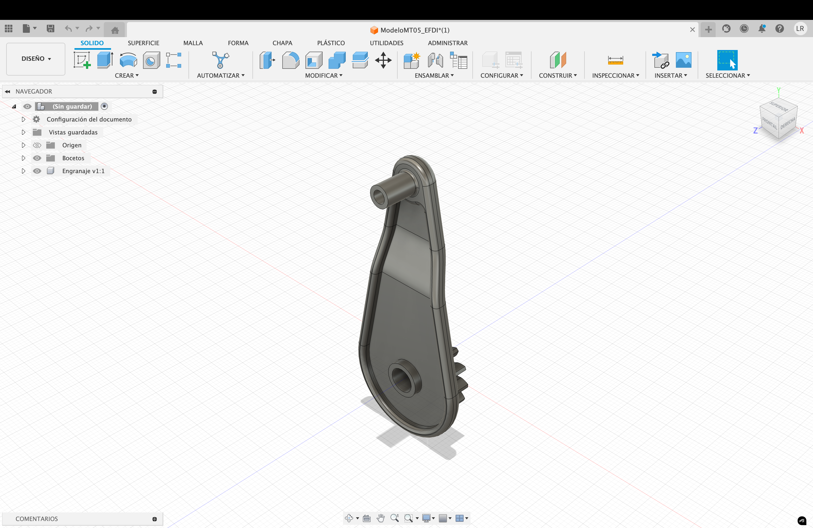
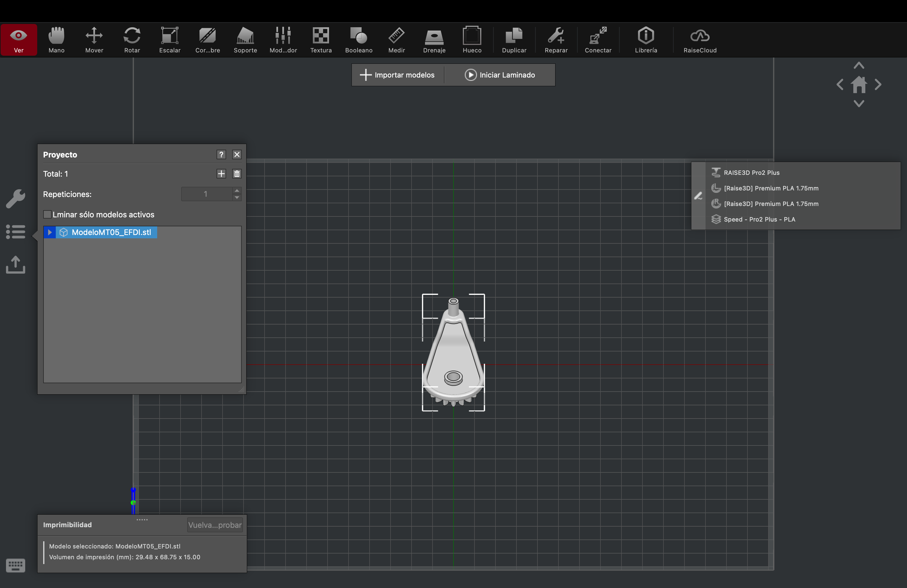
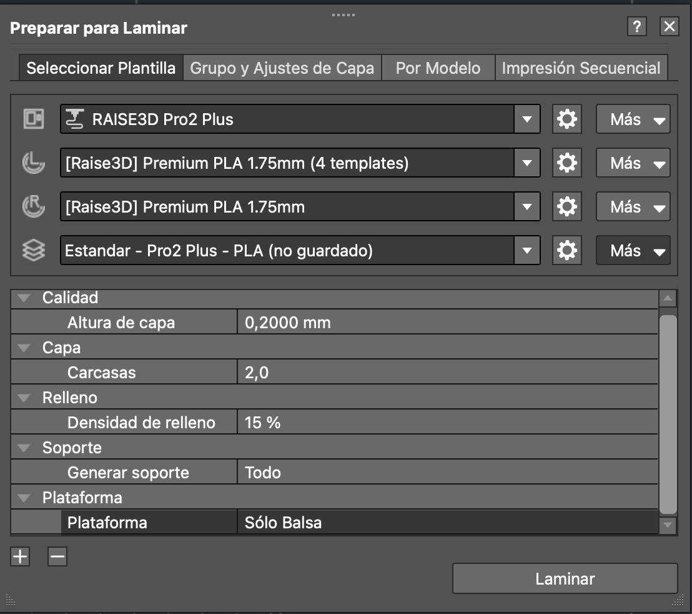

---
hide:
    - toc
---

#MT04 Tecnología y Fabricación 

##**Introducción a la electrónica y programación (Arduino IDE)**

####**Introducción**

# MT05 Tecnología y Fabricación

## **Impresión y escaneo 3D**

#### **Introducción**

En este módulo exploramos diversas exposiciones de personas profundamente involucradas en la impresión 3D, quienes nos demostraron la amplia variedad de creaciones posibles. Además, nos proporcionaron información técnica detallada sobre los distintos tipos de impresoras, materiales, configuraciones, software disponibles y el proceso completo para imprimir un producto 3D a partir de un diseño digital. 

#### **Glosario**

**CAD y CAM**
CAD (Diseño Asistido por Computadora) se refiere al software utilizado para realizar diseños digitales en 2D o 3D. Por otro lado, CAM (Fabricación Asistida por Computadora) es el software que genera el archivo con las instrucciones para que máquinas como CNC o impresoras 3D puedan fabricar el diseño. Ambos son cruciales, ya que cualquier error en ellos puede resultar en un producto defectuoso.

**Impresión 3D**
La impresión 3D es el proceso de creación de objetos mediante el depósito de capas de material una sobre otra. Este proceso se denomina fabricación aditiva, a diferencia del fresado CNC, que es un método sustractivo.

Características principales de la Impresión 3D

- Elaboración bajo demanda: Reduce el costo de matricería y desperdicio de materiales.  
- Fabricación compacta y portátil: Utiliza muy poco espacio y no requiere un taller fijo.  
- Precisión en la reproducción física: Las máquinas ofrecen un nivel de detalle y precisión muy aceptable. 
- Bajo costo: Permite crear piezas personalizadas y únicas a un precio muy bajo en comparación con la fabricación tradicional.

Las piezas impresas en 3D por FDM suelen ser menos precisas y duraderas que otros métodos de fabricación aditiva como SLS, SLA o DLP. Una gráfica comparativa podría ayudar a visualizar estas diferencias.

**FDM** (Fused Deposition Modeling) [Video explicativo sobre FDM](https://www.youtube.com/watch?v=rkUILe3zv98)

Funcionamiento: Extrusión del filamento, que luego se funde.

Tipos de impresoras FDM:  
- Cartesianas: Tres motores que mueven los ejes del sistema de coordenadas cartesianas: Y (adelante y atrás), X (izquierda y derecha), y Z (arriba y abajo).  
- CoreXY: Similar a las cartesianas, pero el movimiento en los ejes X e Y depende uno del otro.  
- Delta: La superficie de impresión se mantiene fija y tres motores mueven el hotend. 
- Polares: Utilizan un sistema de coordenadas polares, con una cuadrícula circular que se mueve y gira, permitiendo que el extrusor solo suba y baje.

**SLA** (Stereolithography) [Video explicativo sobre SLA](https://www.youtube.com/watch?v=yW4EbCWaJHE)

Funcionamiento: Polimerización en tanque, donde un líquido fotosensible (resina) se cura capa por capa mediante un láser.

**DLP** (Digital Light Processing) [Video explicativo sobre DLP](https://www.youtube.com/watch?v=97ARLiTHjX0&t=26s)

Funcionamiento: Similar a SLA, pero utiliza una fuente de luz proyectada en lugar de un láser para curar toda la capa a la vez.

**SLS** (Selective Laser Sintering) [Video explicativo sobre SLS](https://www.youtube.com/watch?v=FiMQ8kG7394)

Funcionamiento: Un láser de alta potencia sinteriza pequeñas partículas de polímero en polvo para convertirlas en una estructura sólida basada en un modelo 3D.

**Conceptos clave en la impresión 3D**

Altura de capa = Resolución

En la impresión 3D, la resolución es sinónimo de la altura de capa, ya que el producto se construye capa por capa. Cuanto menor es la altura de la capa, mejor es la definición y el acabado, resultando en una superficie más lisa y con menos visibilidad de las capas. Sin embargo, una menor altura de capa también implica un mayor tiempo de impresión.

Grosor de paredes = Resistencia

El grosor de las paredes en una impresión 3D determina la resistencia y durabilidad del objeto final. Un grosor insuficiente puede provocar warping, donde el objeto se dobla o tuerce, desviándose de su forma original.

Relleno = Material y Tiempo

El relleno es la estructura interna de una pieza impresa en 3D. Su objetivo es optimizar la cantidad de material utilizado, el peso, la resistencia y el tiempo de impresión. Existen varias estructuras de relleno, como:  
Rectilíneo: Trama en 90º en capas alternas.  
Concéntrico: Líneas hacia adentro que no se tocan.  
Giroide: Líneas onduladas alternas de capa en capa.  
Rejilla: Rejilla cúbica que se cruza sobre sí misma en 90º.  
Octetos: Crea volúmenes piramidales.

Soporte = Forma

Los soportes en la impresión 3D son estructuras temporales impresas junto con el diseño del producto para lograr la forma deseada. Se utilizan cuando el diseño tiene paredes sobresalientes que no pueden sostenerse por sí solas debido a la gravedad.

Plataforma de adherencia = Resultado

Cuando el objeto ocupa una gran superficie de la plataforma de adherencia, las esquinas tienden a levantarse, fenómeno conocido como warping. Para evitar esto, se utilizan métodos como:  
Brim: Una capa de altura que forma un perímetro alrededor de la primera capa del modelo impreso, que se elimina después.  
Raft: Una base de varias capas de altura que se extiende ligeramente más allá del área máxima de la primera capa de la impresión.

**Preparación de archivos .STL**
Para evitar errores en archivos .STL antes de imprimir, se recomienda utilizar programas de reparación. Uno de los más populares es Netfabb, que permite corregir defectos y asegurar una impresión exitosa.  
[Video explicativo sobre Netfabb](https://www.youtube.com/watch?v=GZArmZUk8cU&t=15s)

**Materiales de impresión**

En impresoras FDM se utiliza filamento de material termoplástico. A continuación, se describen algunos de los materiales más comunes y sus aplicaciones:

**PLA** (Ácido Poliláctico)  
Origen: Fabricado a base de recursos renovables como almidón de maíz, raíces de tapioca o caña de azúcar.  
Temperatura de ablandamiento: Alrededor de 50ºC.  
Aplicaciones: Prototipos en general, objetos de decoración, figuras, piezas de gran envergadura, maquetas de arquitectura.

**ABS** (Acrilonitrilo Butadieno Estireno)  
Características: Compuesto por varios disolventes y ácidos; la superficie de la pieza puede ser pulida con un baño de vapor de acetona.  
Resistencia: Muy resistente al impacto y tolerante a altas temperaturas; debe usarse en impresoras cerradas.  
Aplicaciones: Prototipos en general, objetos funcionales, piezas que necesiten resistencia mecanizada, piezas de vehículos, carcasas en general, piezas ligeras.

**PET-G** (Tereftalato de Polietileno Glicolizado)  
Origen: Es un intermedio entre PLA y ABS.  
Características: Gran resistencia mecánica, se utiliza para piezas con resistencia al impacto, es muy versátil.  
Aplicaciones: Piezas resistentes a impactos, objetos decorativos, envases para alimentos (aprobado para uso alimentario), piezas que requieran transparencia, resistencia a agentes oxidantes y líquidos, piezas que requieran esterilización.

**TPU** (Poliuretano)  
Características: Muy flexible, resistente a la fricción y al desgaste.
Recomendación: Imprimir a baja velocidad para evitar deformaciones del filamento.  
Aplicaciones: Piezas que requieran flexibilidad y resistencia al desgaste.

**PVA** (Alcohol Polivinílico)  
Características: Material de soporte soluble en agua, mejora el acabado superficial en la superficie de contacto del soporte, que permite utilizarlo para soporte de piezas muy complejas.  
Recomendación: Conservar en lugares secos y herméticamente cerrados.  
Aplicaciones: Soportes para piezas complejas.

**PP** (Polipropileno)  
Características: Excelente resistencia a los químicos, ligero y relativamente flexible.  
Recomendación: Usar en impresoras cerradas para evitar warping.  
Aplicaciones: Piezas funcionales en el sector industrial.

**PA** (Nylon o Poliamidas)  
Características: Capacidad de trabajar a temperaturas de hasta 120ºC, higroscópico (absorbe mucha humedad).  
Aplicaciones: Piezas que requieran alta resistencia térmica.

**Materiales con carga de fibras**  
Estos materiales están compuestos con fibra de vidrio o de carbono, lo que los hace muy resistentes, solo superados por el metal. Entre los más comunes se encuentran:

**PP** GF (Polipropileno con Fibra de Vidrio)  
Características: Alta resistencia química del polipropileno y resistencia mecánica de la fibra de vidrio.  
Aplicaciones: Piezas que requieran alta resistencia química y mecánica.

**PAHT CF** (Poliamida de Alta Temperatura con Fibra de Carbono)  
Características: Tolerancia a altas temperaturas de la poliamida combinada con resistencia mecánica.  
Aplicaciones: Piezas que requieran alta resistencia térmica y mecánica.

**PET CF** (Tereftalato de Polietileno con Fibra de Carbono)  
Características: Equilibrio de resistencia química, térmica y mecánica entre PP GF y PAHT CF.  
Aplicaciones: Piezas que necesiten un equilibrio entre resistencia química, térmica y mecánica.

**Slicer**

El software Slicer juega un papel clave en la generación de código G para la impresión 3D. Toma un modelo 3D, generalmente en formato de archivo STL u OBJ, y lo divide en capas. Luego, genera comandos de código G para cada capa, indicando a la impresora dónde mover y extruir el filamento. Los programas más populares son Cura, Slic3r y Simplify3D, que ofrecen una variedad de configuraciones ajustables para optimizar la impresión, como la altura de capa, la velocidad y la densidad del relleno. Estos programas permiten traducir el modelado 3D digital al lenguaje que la impresora entiende.

**Cura**  
Descripción: Programa de código abierto creado por Ultimaker para sus impresoras 3D, aunque también puede ser utilizado en otras impresoras con configuraciones adecuadas.  
Características: Ofrece configuraciones de calidad y es ampliamente utilizado en la comunidad de impresión 3D.  
Enlace: [Ultimaker Cura](https://ultimaker.com/es/software/ultimaker-cura/)

**OrcaSlicer**  
Descripción: Programa destacado por sus funciones de calibración de la impresora, maximizando el rendimiento de la máquina.  
Características: Ideal para usuarios que buscan precisión y ajustes detallados en su impresión.  
Enlace: [OrcaSlicer](https://github.com/SoftFever/OrcaSlicer/releases)

**PrusaSlicer**  
Descripción: Programa de código abierto mejorado de Slic3r, con funcionalidades clave como estructuras de soporte personalizables, soporte de múltiples materiales y funciones de altura de capa variable.  
Características: Amplia personalización y soporte para impresoras Prusa y otras marcas.  
Enlace: [PrusaSlicer](https://www.prusa3d.com/es/pagina/prusaslicer_424/)

**IdeaMaker**  
Descripción: Software diseñado para impresoras Raise3D, aunque se adapta a otras impresoras.  
Características: Capacidad de incorporar texturas en las impresiones, facilitando la personalización y el marcado de piezas.  
Enlace: [IdeaMaker](https://www.raise3d.eu/?my_region=Spain)

**Perfiles de impresión FDM**  
Los perfiles de impresión se utilizan para asegurar que la impresora 3D produzca piezas de alta calidad y con una precisión adecuada. Los programas de laminado (slicer) son software que controlan y coordinan la impresión de objetos 3D. Para utilizar un perfil de impresión, se debe cargar el archivo en la impresora 3D y luego seleccionarlo desde la interfaz de la impresora o el software de impresión. La impresora utiliza estas configuraciones específicas para realizar la impresión.

Los perfiles de impresión son específicos de cada impresora y de cada material.

- Ultra alta resolución: Altura de capa 0,05 mm  
- Alta resolución: Altura de capa 0,1 mm  
- Estándar: Altura de capa 0,2 mm  
- Speed: Altura de capa 0,25 mm  

**Configuración del material**  
La temperatura de impresión es crucial para lograr una impresión 3D de calidad. Generalmente, el filamento ya trae las especificaciones de rango de temperatura a utilizar por la impresora. Sin embargo, hay factores que pueden modificar estas especificaciones, como la condición climática, la velocidad de impresión y el modelo de impresora.

**ABS**  
Temperatura del filamento: 210º a 260ºC
Cama caliente: 80º a 110ºC
**PLA**  
Temperatura del filamento: 190º a 230ºC
Cama caliente: 30º a 60ºC
**PETG**  
Temperatura del filamento: 230º a 260ºC
Cama caliente: 70º a 80ºC

**Pasos Generales**  
1. Archivo STL del modelo a imprimir en 3D: El primer paso es tener un modelo 3D en formato STL, que es el estándar para impresión 3D.  
2. Transformarlo en láminas usando Slicer: Utilizar un software slicer para dividir el modelo en capas (láminas).  
3. Grabarlo y exportarlo en G-code: El slicer generará un archivo G-code a partir del modelo dividido en capas.  
4. Imprimir y controlar la impresión 3D usando un Host: El archivo G-code se carga en la impresora 3D para controlar y realizar la impresión.

**Código G**  
El código G es un lenguaje utilizado para indicar a la máquina qué hacer. En la impresión 3D, el código G contiene comandos para mover las piezas dentro de la impresora. Estos comandos se dividen en dos tipos principales:

- Comandos G: Instrucciones de movimiento (por ejemplo, mover a una posición específica).  
- Comandos M: Instrucciones de acción (por ejemplo, iniciar o detener la extrusión de filamento).

**Proceso de preparación de un modelo 3D**  
1. Crear el modelo 3D en software de diseño (CAD) y exportarlo en formato STL.  
2. Abrir el archivo STL en un software Slicer y configurarlo según las especificaciones de la impresora y el material.  
3. Realizar los ajustes necesarios en el modelo (mover, rotar, escalar) y configurar los parámetros de impresión.  
4. Generar el archivo G-code desde el software Slicer.  
5. Cargar el archivo G-code en la impresora 3D RAISE Pro2 Plus y comenzar la impresión.

#### **Documentación del Proceso**

En los laboratorios de la UTEC, se cuenta con impresoras 3D del tipo RAISE, modelo PRO2 PLUS. Para estas impresoras, utilizaremos el software IdeaMaker para generar los códigos G necesarios para la impresión. 

**Generación de Código G**  
El proceso de preparación de archivos para la impresión 3D implica varias etapas desde el diseño inicial hasta la impresión final. A continuación, se describe el proceso general y específico para las impresoras RAISE Pro2 Plus de los LAB-A UTEC.

**Pasos para la Generación de Código G**
1. Obtener el archivo de diseño 3D:  
Desde la especialización nos proporcionaron el archivo de diseño 3D en Fusion 360. Descargué y abrí el software para exportarlo como archivo .STL. 

2. Descargar y configurar IdeaMaker:  
[Descargué IdeaMaker](https://www.raise3d.com/download/) y configuré la impresora Raise Pro2 Plus para importar el archivo .STL generado por Fusion 360. 

3. Importar y ajustar el archivo en IdeaMaker:  
Después de importar el archivo en IdeaMaker, probé mover, rotar y escalar la pieza para decidir su posición final y el tamaño solicitado (escalado a un 150%) para la fabricación en impresoras FDM. 

4. Configurar los parámetros de impresión:  
En la sección de inicio de laminado, edité los siguientes parámetros:  
- Altura de capa: 0,2 mm  
- Grosor de la carcasa: 2,0 mm  
- Relleno: 15%  
- Soporte: En todo  
- Plataforma: Solo balsa 

5. Previsualizar y exportar el archivo G-code:  
Previsualicé todas las capas de la construcción capa por capa para asegurarme de la correcta configuración.  
Exporté el archivo en formato G-code (g-code).

{:download=”lucia_rossi.gcode”}

#### **Reflexiones**

Ver la película "Print the Legend" fue una buena experiencia para comprender mejor la historia de la impresión 3D y la creación de empresas relacionadas con esta tecnología. La película destaca la importancia del open source en la evolución tecnológica y cómo este enfoque puede contribuir a un futuro más ecológico y sustentable.

Durante mi proceso, esperaba encontrarme con un software más complejo y difícil de entender. Sin embargo, gracias a que estudié previamente toda la información sobre las impresoras 3D, la actividad me resultó bastante sencilla. Esto me da esperanza para aventurarme próximamente en el modelado 3D e imprimir mis propios diseños. Estoy emocionada por experimentar con distintas configuraciones y observar cómo varían los resultados, aunque el modelo 3D sea el mismo. Puedo modificar parámetros como la altura de las capas, el grosor de las paredes, entre otros, para explorar todas las posibilidades y aprender a través del método de prueba y error.

Este módulo me dio las herramientas para asegurarme que un modelo 3D se imprima con alta calidad y precisión, utilizando configuraciones optimizadas para cada impresora y material específico. Estoy entusiasmada por continuar aprendiendo y aplicando estos conocimientos en futuros proyectos.

