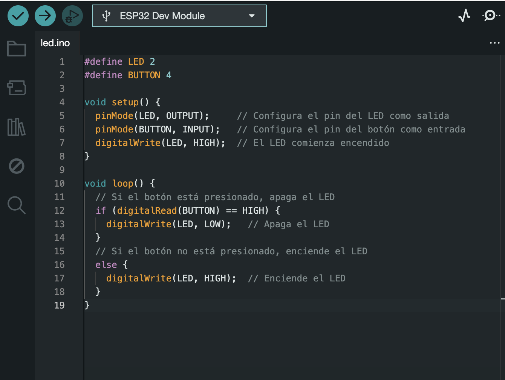
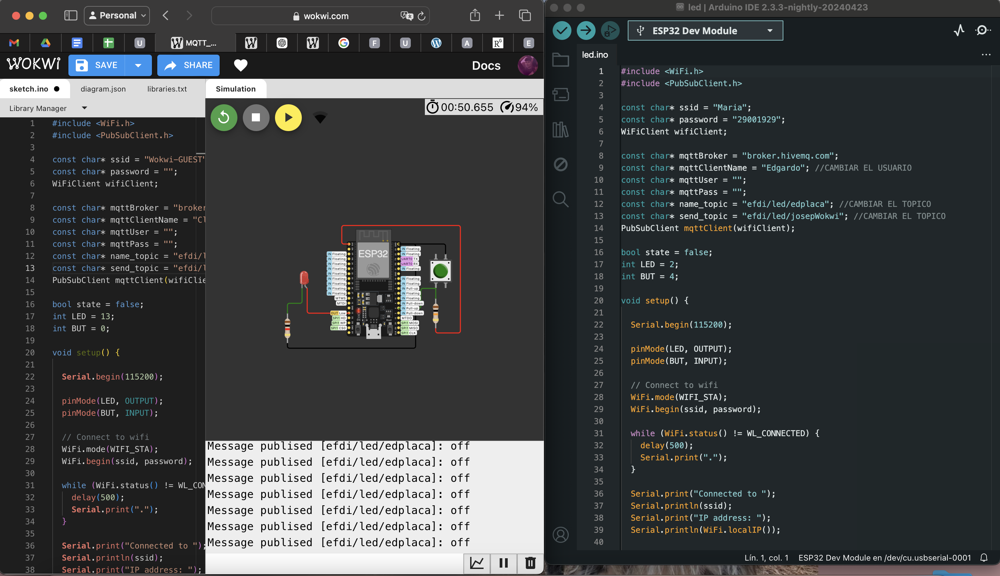

---
hide:
    - toc
---

#MT06 

##**Networking**

####**Introducción** 

En este módulo revisamos el MT04 de Arduino, pero con la particularidad de que podemos programar de manera colaborativa con otras personas, incluso si no están en el mismo lugar físico, aprovechando el uso de redes.

#### **Glosario**

**Redes**  
El uso de redes y protocolos de comunicación se basa en distribuir y conectar sistemas para:  
- Ubicación: Permite realizar tareas de procesamiento o gestión de hardware desde distintos lugares.  
- Paralelismo: Posibilita la ejecución de tareas en simultáneo.  
- Modularidad: Facilita el desarrollo de módulos con funciones específicas, haciéndolo escalable y más fácil de reparar. 
- Interferencia: Evita que los sistemas interfieran entre sí.

**Protocolo vs Red**  
Una red es un conjunto de ordenadores conectados mediante líneas de comunicación. Los protocolos son normas que definen cómo los dispositivos intercambian información.

**Redes por cable**  
El protocolo RX/TX es uno de los más conocidos.  
En vehículos se utiliza CAN o LIN, en iluminación DMX, y en instrumentos electrónicos MIDI.

**Protocolos**  
- Radiofrecuencia: WiFi, ZigBee, Bluetooth, BLE, RFID, NFC.  
- Óptico: Infrarrojo, LiFi.  
- Acústico: AFSK.

**ESP32**  
Los dispositivos conectados a una red WiFi se llaman estaciones (STA), y un punto de acceso (PA) actúa como concentrador para estas estaciones. El PA se conecta a una red cableada, y suele estar integrado en un router, que a su vez permite el acceso a internet a través de la red WiFi. El nombre de la red es identificado por su SSID (Service Set Identifier).

**MQTT**  
MQTT es un protocolo de mensajería basado en eventos que utiliza un modelo de publicación/suscripción. Los mensajes son gestionados por un broker, que los distribuye entre emisores y receptores. Los clientes se suscriben a temas (topics) para recibir mensajes específicos, sin necesidad de conocerse entre ellos.

#### **Documentación del proceso**

**Ejercicio 1. Comunicación Serial**  
Conectar la placa al ordenador mediante USB utilizando un código.

Primero armé la placa de prueba con un controlador WiFi/Bluetooth, un LED con resistencia de 1K, un pulsador con resistencia de 10K y cables. 

Después de montar la placa, la conectamos al IDE de Arduino con un cable de datos.

Antes de iniciar, instalamos la placa ESP32 para poder programarla y comunicarla con Arduino. Añadimos el siguiente enlace en preferencias:  
https://raw.githubusercontent.com/espressif/arduino-esp32/gh-pages/package_esp32_index.json. Además descargamos la librería de pubsubclient que permite utilizar MQTT. 

Una vez instalada, la seleccionamos para programar. Cuando verifiqué y cargué el código me aparecía un error, estuve investigando y probando varias soluciones y la resolución fue elegir el puerto que estaba conectado a la placa, modificando en Herramientas/Puerto y ahí seleccioné la que estaba usando.  
Luego volví a probar utilizando el mismo código, y la luz permanece encendida y se apagó cuando se presiona el pulsador. 

https://youtube.com/shorts/mWzvKdjqlkU?feature=share)

https://youtube.com/shorts/mWzvKdjqlkU?si=-xSa5AjWaz8NtS8K

El ejercicio se puede encontrar en [Wokwi](https://wokwi.com/projects/408547688225738753)

**Ejercicio 2. Conectarse con unx compañerx**  

Después de probar con éxito la placa física, comenzamos a utilizar la plataforma Wokwi para enviar comandos desde la computadora y reflejar la interacción en la placa, sin necesidad de tocarla físicamente.

Pasos a seguir:

**1. Copiar el código a IDE Arduino**
Cambiar algunos datos como el nombre y la contraseña del WiFi, así como los "topics" y el nombre del cliente, para personalizarlo.

**2. Código para IDE Arduino**

**3. Invertir los "topics" en Wokwi y Arduino**  
Para que ambos sistemas interactúen, se deben intercambiar los "topics". En Arduino:

IDE arduino  
onst char* name_topic = "efdi/led/luplacai"; //CAMBIAR EL TOPICO
const char* send_topic = "efdi/led/luwokwi"; //CAMBIAR EL TOPICO
wokwi 
onst char* name_topic = "efdi/led/luwokwi"; //CAMBIAR EL TOPICO
const char* send_topic = "efdi/led/luplaca"; //CAMBIAR EL TOPICO

**4. Código en Wokwi**  
Similar al anterior, pero con el SSID "Wokwi-GUEST" y sin contraseña:

Funcionando

<iframe width="560" height="315" src="https://www.youtube.com/embed/kF3em14l4u4?si=jLDo01wgQ3glwO2Q" title="YouTube video player" frameborder="0" allow="accelerometer; autoplay; clipboard-write; encrypted-media; gyroscope; picture-in-picture; web-share" referrerpolicy="strict-origin-when-cross-origin" allowfullscreen></iframe>

El ejercicio se puede encontrar en [Wokwi](https://wokwi.com/projects/382553903776292865)

### **Reflexiones**
Para este módulo, nos reunimos presencialmente con Victoria, Franco y Edgardo. Trabajar en red nos permitió programar y entender mejor los protocolos de comunicación. Durante el proceso, nos enfrentamos a errores que buscamos la forma de solucionar y probamos intercambiar placas y cables de datos entre computadoras para identificar fallos. 
Finalmente, logramos que todas las placas funcionan con los códigos y realizar el ejercicio.