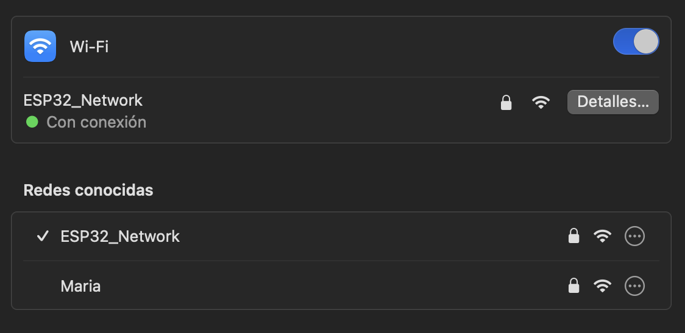
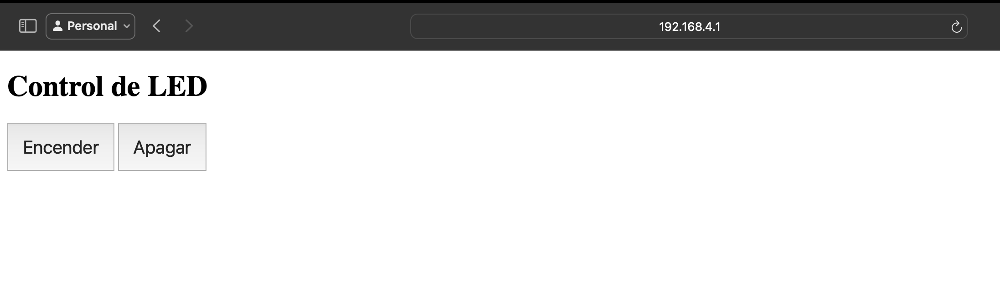
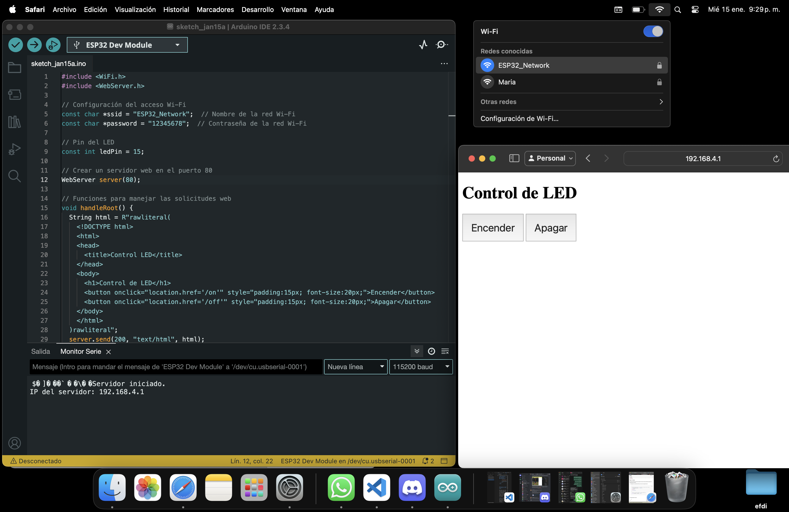

---
hide:
    - toc
---

#MT07 Tecnología y Fabricación

## **Interfaces y aplicaciones**

### **Introducción** 

#### **Documentación del proceso**

**Preparación de componentes**
Materiales necesarios: placa esp32, cable de conexión, luz led, protoboard 
Poner la placa ESP32 al protoboard, conectar el ánodo de la luz led (extremo más largo) al pin D15 y el cátodo (extremo más corto) al pin de GND. 

**Preparación en Arduino IDE**
Configurar la Placa ESP32 DEV Module y el Puerto correspondiente (varía en todas las computadoras el nombre) 

Instalar en configuraciones la placa ESP32 en arduino IDE, agregar a “URLs adicionales de gestor de placas”: https://dl.espressif.com/dl/package_esp32_index.json 

**Generación de código**
Le pedí a chat gpt: que genere un código para Arduino IDE que utilice una placa ESP32, conectado a un led rojo en el pin D15. El código tiene que permitir conectarse a una red wifi generada por la placa y acceder a una dirección IP, donde abre una interfaz web que contenga dos botones: uno de encendido y otro de apagado. 

**Arduino IDE**
Verificamos y cargamos el código. 

**Wifi** 
Conectarse a la red wifi generada por la ESP32, que se llama “ESP32_Network” en el dispositivo a utilizar (computadora o celular). 

**Interfaz**
La dirección IP se encuentra en Herramientas/Monitor serie. Aparecerá la dirección IP, en mi caso fue: http://192.168.4.1 . Donde aparecen los botones de Encender y Apagar. 

 
  

**Funcionamiento**

Cuando apretamos el botón de ENCENDER en la dirección IP creada se prende la luz led y cuando apretamos el botón de APAGAR, se apaga. 

<!DOCTYPE html>
<html lang="en">
<head>
    <meta charset="UTF-8">
    <meta name="viewport" content="width=device-width, initial-scale=1.0">
    <title>YouTube Short</title>
</head>
<body>
    <h1>Embed de YouTube Short</h1>
    

        <iframe 
            width="560" 
            height="315" 
            src="https://www.youtube.com/embed/54UzbyKwbKc" 
        
            frameborder="0" 
            allow="accelerometer; autoplay; clipboard-write; encrypted-media; gyroscope; picture-in-picture" 
            allowfullscreen>
        </iframe>
    

</body>
</html>

### **Reflexiones**

