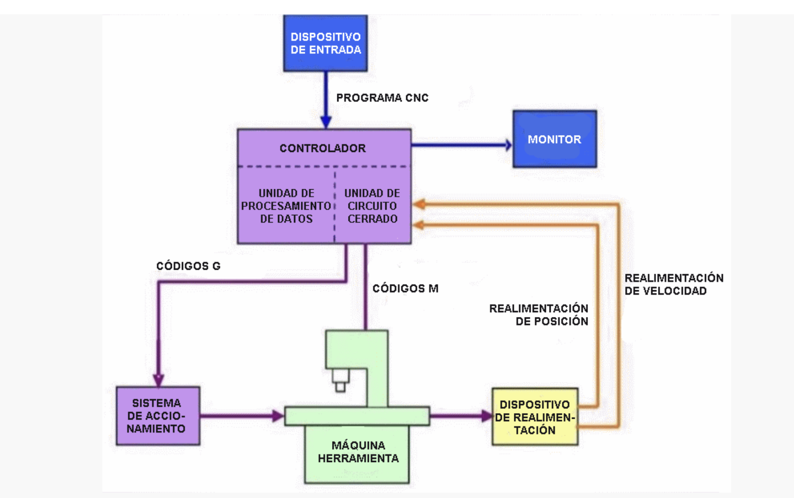
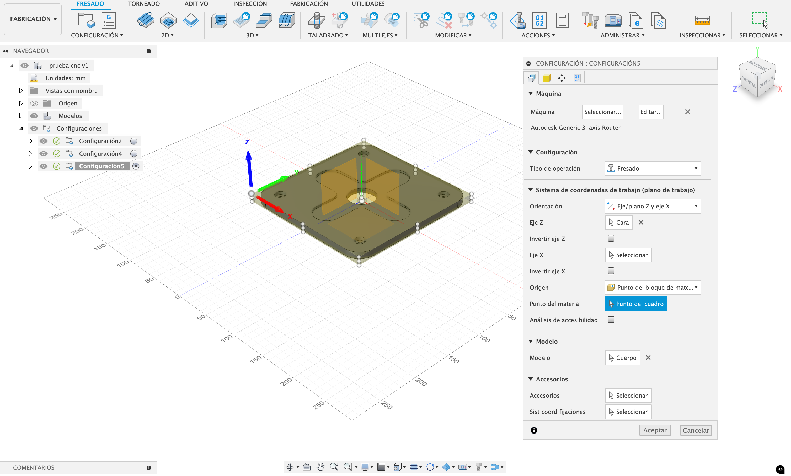
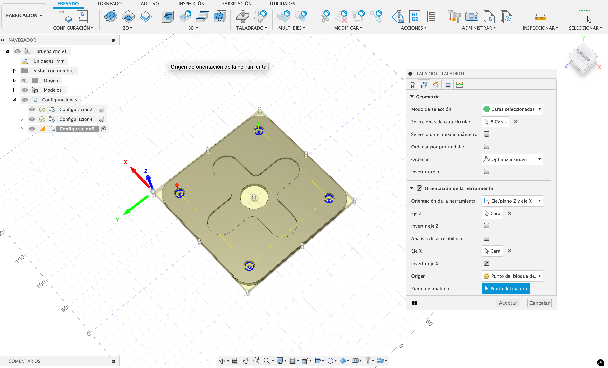
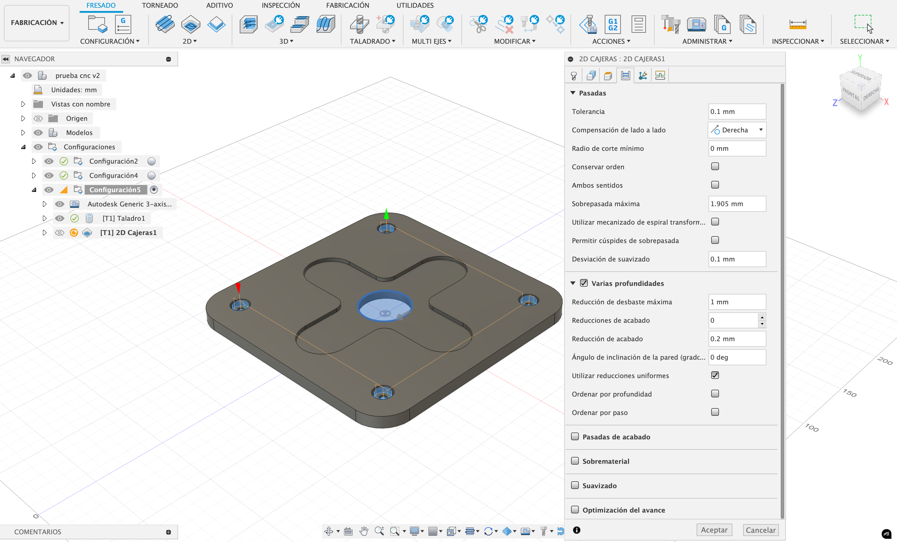

#MT08 Tecnología y Fabricación 

## **Control numérico computarizado (CNC)**

### **Introducción**

Este módulo consistió en conocer la máquina CNC y preparar una pieza en Fusion360 para mecanizar en la máquina CNC. 

### **Glosario**

**Control numérico computarizado (CNC)**  
Es todo aquel dispositivo que posee la capacidad de controlar la posición y velocidad de los motores que accionan los ejes de la máquina para realizar movimientos que no se pueden lograr manualmente como círculos, líneas diagonales y figuras complejas tridimensionales. 

Componentes principales: sistema de conducción, movimiento y un sistema de retroalimentación 

Funcionamiento:  
- Incrementar la productividad   
- Disminuir el uso de talento humano   
- Generar una mayor autonomía para el uso de máquinas y herramientas

El CNC es el uso de una computadora para controlar y monitorear los movimientos de una máquina herramienta. 
El controlador CNC trabaja en conjunto con una serie de motores (servomotores y/o motores paso a paso), así como componentes de accionamiento para desplazar los ejes de la máquina de manera controlada y ejecutar los movimientos programados. 

El código G describe las funciones de movimiento de la máquina (movimientos rápidos, avances, avances radiales, pausas, ciclos) y el código M describe las funciones misceláneas que se requieren para el mecanizado de la pieza (arranque y detención del husillo, cambio de herramienta, refrigerante, detención del programa). 

**Fabricación sustractiva**  
Es una técnica utilizada en la fabricación de piezas, donde dichas piezas se consiguen a partir de un bloque sólido al que se le va eliminando el material sobrante, hasta conseguir el resultado deseado. 

Formas: tornos, sierras, fresadoras, cortadoras, taladros, etcétera. 

Fresadora: es una máquina herramienta diseñada para realizar trabajos de mecanizado por arranque de viruta, mediante el movimiento de una herramienta rotativa de varios filos de corte, denominada fresa.  
Se usa para materiales como la madera, acero, fundición de hierro, metales no férricos y materiales sintéticos, superficies planas o curvas, de entalladura, de ranuras, de dentado, etcétera. 

Hay varios tipos de router CNC que dependen de la cantidad de ejes, se encuentran de varios ejes:  
[3 ejes](https://www.youtube.com/watch?v=lcWn4VEjaio)  
[4 ejes](https://www.youtube.com/watch?time_continue=64&v=QC90mruG-bY&embeds_referring_euri=https%3A%2F%2Fedu2.utec.edu.uy%2F&embeds_referring_origin=https%3A%2F%2Fedu2.utec.edu.uy&source_ve_path=NzY3NTg)  
[5 ejes](https://www.youtube.com/watch?v=3VzSk1iOE8Q)

**Fresas**  
A veces se confunde mechas con fresas. Las mechas están diseñadas para sumergirse directamente en el material, cortando axialmente y creando agujeros cilíndricos. Las Fresas se utilizan para tallar horizontalmente y cortar lateralmente.   
Hay [fresas planas](https://www.youtube.com/watch?v=MJhGBDVPnQc) que se utilizan para hacer ranuras y cortes planos en madera, [fresas de bolilla](https://www.youtube.com/watch?v=FFJyN3hzcSk) que se utilizan para ranurado o relieve 3D y se usan para tallar y grabar y [fresas en V](https://www.youtube.com/watch?v=zFCzYww1Cj0) para hacer ranuras y grabados con gran precisión y también se usan para tallar y grabar. 

Mecanizado  
El proceso de mecanizado es aquel en el que a través de una serie de operaciones de torno mediante la eliminación de viruta o abrasión conseguimos el moldeado de una pieza destinada a una función específica. 

**Router CNC X Carve**  
Hay que tener en cuenta varios factores al utilizar el router:  
- Mesa de trabajo: eje X 750 mm, eje Y 750 mm, eje Z 114 mm.   
Tener en cuenta la altura máxima del modelo y la dimensión total.  
La posición de los sujetadores, el área mínima es de 10 mm.    El área para mecanizar es desde el vértice (0) 20 mm. en sentido horizontal (x) y vertical (y).   
- Corte 2D: estratégia de corte sobre vectores   
Mecanizar por dentro (la pieza va a quedar más pequeña al igual que el diámetro de la fresa), por fuera (se respetan las dimensiones de la pieza), y por sobre la pieza (la mitad del diámetro de la fresa por dentro y por fuera). La fresa siempre va a tener un diámetro, por ende hay que tener en cuenta para los encastres por ejemplo.  
- Tolerancia: calibrar las tolerancias de las fresas con pruebas. 
- Encastres: las fresas son herramientas circulares que al trabajar dejan siempre un
radio, eso depende del diámetro de la fresa. Al producirse esto, debemos realizar un espacio extra en el corte interno que permita ingresar la otra pieza, de manera tal que el encastre se produzca de forma exacta.   
Encastre de en tipo T (herramienta de 6 mm de cada lado) o tipo H (prolongar en sentido vertical).   
- Altura: el largo de la herramienta que estamos utilizando tiene que ser mayor a la profundidad del diseño a mecanizar.  
- Anidado (nesting): software que optimice y organice la placa para cortar.  
- Toolpath: la ruta de la herramienta, son representadas por líneas.

**Mecanizado**  
Es aquel que a través de una serie de operaciones de torno mediante la eliminación de viruta o abrasión, conseguimos un modelado de una pieza.
Existe varios mecanizados en una CNC de 3 ejes:  
Estrategias 2D: mecanizado de cara, mecanizado de contorno, mecanizado por ranura, taladro. 

Estrategias 3D: mecanizado por relieve de planos, mecanizado de relieve en paralelo, mecanizado de relieve en espiral, mecanizado por relieve en espiral transformada. 

**Fusion360**  
Mecanizado en Fusion 360 nos permite realizar todo tipo de operaciones de mecanizado y guardarlas en un código G (.nc) para mecanizado CNC. 

### **Documentación del proceso**

Después de ver los tutoriales, descargué el archivo brindado por la EFDI para empezar a trabajar en Fusion360.  
Abrir el archivo e ir al módulo de Fabricación. 

**Configurar la máquina a utilizar como fresadora en Autodesk generic 3-axis Router**

Administrar/ Biblioteca de máquina / Seleccionar Autodesk Generic 3-axis Router  
Configuración/ Nueva configuración  
Configuración:  
- Máquina/ Seleccionar Autodesk Generic 3-axis Router  
- Configuración/ Tipo de operación/ Seleccionar Fresado  
- Orientación/ Eje/plano Z y eje X  
- Punto del material/ Punto del cuadro  

Para realizar las operaciones de mecanizado, se parte de tabla de 200x200x10mm de madera multilaminada, y para darle forma hay que utilizar:

**1. Las perforaciones se ejecutan con el Taladrado**

**_2D/ Taladro_**  
Herramienta:  
- Herramienta/ Seleccionar la fresa #1 - 1/8” plano (⅛” Flat Endmill)  
- Refrigerante/ Desactivada  

Geometría:  
- Modo de selección/ Caras seleccionadas   
- Selecciones de cara circular/ 8 Caras   
- Marcar Orientación de la herramienta   
- Orientación de la herramienta/ Seleccionar Eje/plano Z y eje X  
- Origen/ Punto del bloque de material   
- Punto del cuadro/ Seleccionar   

Altura:  
- Altura del espacio libre/ Seleccionar Altura superior 10mm   
- Altura de retracción/ Altura superior 5mm   
- Altura superior/ Altura superior del augero 0mm  
- Altura inferior/ Altura inferior del agujero 0mm  

<iframe width="560" height="315" src="https://www.youtube.com/embed/h5UnY33Lszo?si=5cqUWB1v_5RgbJIv" title="YouTube video player" frameborder="0" allow="accelerometer; autoplay; clipboard-write; encrypted-media; gyroscope; picture-in-picture; web-share" referrerpolicy="strict-origin-when-cross-origin" allowfullscreen></iframe>

**_2. Para el desbaste se usa 2D cajera que realiza el desbaste inicial_**

2D/ 2D Cajera para círculo central 

Herramienta:   
- Herramienta/ Seleccionar la fresa #1 - 1/8” plano (⅛” Flat Endmill)   
- Refrigerante/ Desactivada  

Geometría:  
- Selecciones de Cadena cerrada 1 (círculo central)   
- Orientación de la herramienta/ Seleccionar Eje/plano Z y eje X  
- Origen/ Punto del bloque de material   
- Punto del cuadro/ Seleccionar   

Altura:  
- Altura del espacio libre/ Seleccionar Altura superior 10mm   
- Altura de retracción/ Altura superior 5mm   
- Altura superior/ Más alto de la selección/ Parte superior del material 0mm  
- Altura inferior/ Más bajo de la selección/ Parte inferior del material y Parte inferior del modelo 0mm  

Pasadas:  
- Tolerancia 0.1 mm  
- Compensación de lado a lado/ Derechav
- Varias profundidades/ Reducción de desbaste máxima 1mm v

Eje:  
- 3 ejes   

Conexiones:  
- Sin modificar  

<iframe width="560" height="315" src="https://www.youtube.com/embed/iQZlxgZbDP8?si=2rUgZ5kUl3Abu3Lx" title="YouTube video player" frameborder="0" allow="accelerometer; autoplay; clipboard-write; encrypted-media; gyroscope; picture-in-picture; web-share" referrerpolicy="strict-origin-when-cross-origin" allowfullscreen></iframe>

2D/ 2D Cajera para cruz central 

Herramienta:  
- Herramienta/ Seleccionar la fresa #1 - 1/8” plano (⅛” Flat Endmill)   
- Refrigerante/ Desactivada  

Geometría:  
- Selecciones de Cadena cerrada 1 (cruz central)   
- Orientación de la herramienta/ Seleccionar Eje/plano Z y eje X  
- Origen/ Punto del bloque de material v
- Punto del cuadro/ Seleccionar   

Altura:  
- Altura del espacio libre/ Seleccionar Altura superior 10mm   
- Altura de retracción/ Altura superior 5mm   
- Altura superior/ Más alto de la selección/ Parte superior del material 0mm  
- Altura inferior/ Contorneados seleccionados  

Pasadas:  
- Tolerancia 0.1 mm  
- Compensación de lado a lado/ Izquierdav  
- Varias profundidades/ Reducción de desbaste máxima 1mm   
- Sobrematerial 0.5mm radial y axial   

Eje:  
- 3 ejes   

Conexiones:  
- Sin modificar  

<iframe width="560" height="315" src="https://www.youtube.com/embed/O72skLSe3KQ?si=RSc9AgKg9Q0l_lNj" title="YouTube video player" frameborder="0" allow="accelerometer; autoplay; clipboard-write; encrypted-media; gyroscope; picture-in-picture; web-share" referrerpolicy="strict-origin-when-cross-origin" allowfullscreen></iframe>

2D/ 2D Cajera para perforaciones de la herramienta taladro 

Herramienta:  
- Herramienta/ Seleccionar la fresa #1 - 1/8” plano (⅛” Flat Endmill)  
- Refrigerante/ Desactivada 

Geometría:
- Selecciones de cajera/ Seleccionar las cuatro perforaciones  
- Orientación de la herramienta/ Seleccionar Eje/plano Z y eje X  
- Origen/ Punto del bloque de material   
- Punto del cuadro/ Seleccionar 

Altura:   
- Altura del espacio libre/ Seleccionar Altura superior 10mm   
- Altura de retracción/ Altura superior 5mm   
- Altura superior/ Más alto de la selección/ Parte superior del material 0mm  
- Altura inferior/ Más bajo de la selección   

Pasadas:
- Tolerancia 0.1 mm  
- Compensación de lado a lado/ Izquierda  
- Varias profundidades/ Reducción de desbaste máxima 1mm  

Eje:  
- 3 ejes 

Conexiones:  
- Sin modificar

<iframe width="560" height="315" src="https://www.youtube.com/embed/fPO7G1VTl1w?si=eFf-dUF3HiT-VQGz" title="YouTube video player" frameborder="0" allow="accelerometer; autoplay; clipboard-write; encrypted-media; gyroscope; picture-in-picture; web-share" referrerpolicy="strict-origin-when-cross-origin" allowfullscreen></iframe>

**3. Contornos para contornear la pieza final de la tabla inicial**

2D/ 2D Contorneado para delimitar la pieza 

Herramienta:  
- Herramienta/ Seleccionar la fresa #1 - 1/8” plano (⅛” Flat Endmill)  
- Refrigerante/ Desactivada

Geometría:  
- Selecciones de cajera/ Seleccionar las cuatro perforaciones  
- Orientación de la herramienta/ Seleccionar Eje/plano Z y eje X  
- Origen/ Punto del bloque de material   
- Punto del cuadro/ Seleccionar 

Altura:  
- Altura del espacio libre/ Seleccionar Altura superior 10mm   
- Altura superior 5mm   
- Altura superior/ Más alto de la selección/ Parte superior del - material 0mm  
- Altura inferior/ Contorneados seleccionados

Pasadas:  
- Tolerancia 0.1 mm  
- Compensación de lado a lado/ Izquierda  
- Varias profundidades/ Reducción de desbaste máxima 1mm 

Eje  
- 3 ejes 

Conexiones  
- Sin modificar

Después de setear las operaciones de mecanizado, realicé la simulación para confirmar las operaciones. 

<iframe width="560" height="315" src="https://www.youtube.com/embed/0__3t9T2k5Q?si=SFLCl-t_3KzzIlCq" title="YouTube video player" frameborder="0" allow="accelerometer; autoplay; clipboard-write; encrypted-media; gyroscope; picture-in-picture; web-share" referrerpolicy="strict-origin-when-cross-origin" allowfullscreen></iframe>

[Código G (en formato .nc) para descargar]

### **Reflexiones**

La exposición de Gonzalo Reis fue muy buena, porque logró simplificar temas que inicialmente parecían inalcanzables, haciéndolos parecer incluso fáciles.

Tuve una experiencia similar al comenzar el ejercicio: al principio todo parecía confuso debido a la cantidad de acciones a realizar. Sin embargo, a medida que fui leyendo y simulando las acciones, las opciones comenzaron a tener sentido.

Cabe aclarar que no llegamos a probarlo en el laboratorio, ya que la visita planificada para este módulo fue suspendida.
