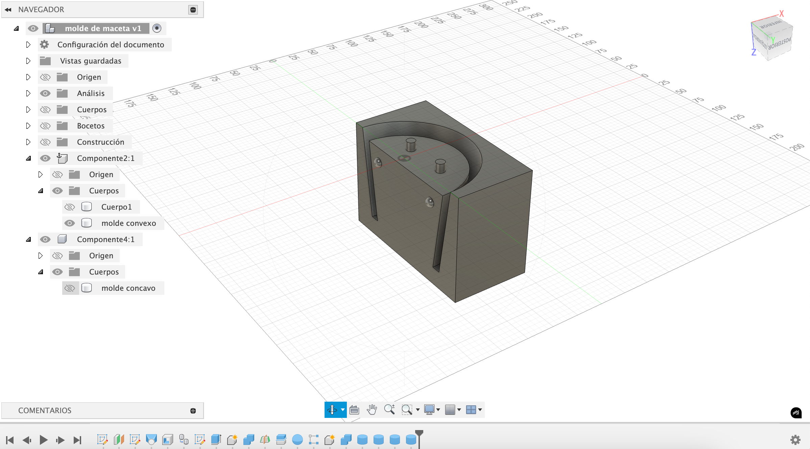

---
hide:
    - toc
---

#MT09 Tecnología y Fabricación 

## **Moldes**

### **Introducción**

En este módulo conocimos diferentes formas de crear moldes, diseñamos una maceta y el molde de una maceta para impresión 3D. 

En este módulo exploramos diversas formas de crear moldes. Diseñamos una maceta y su molde para impresión 3D, aplicando conceptos técnicos y prácticos en el modelado y la fabricación.

### **Glosario**

**Molde**  
Es una impresión negativa de un modelo positivo que deseamos reproducir. Generalmente, se utiliza un material líquido que se vierte en un molde hueco con la forma deseada, dejándolo solidificar. Este proceso, también conocido como fundición, implica retirar o romper el molde una vez que el material ha endurecido. 
Las aplicaciones de los moldes son amplias: prototipos, odontología, joyería, componentes mecánicos (engranajes, turbinas) y piezas de alta resistencia. Los moldes pueden fabricarse mediante herramientas digitales como impresión 3D, fresadoras CNC o corte láser, dependiendo del diseño y los materiales.

**Tipos de moldes**  
Cada molde requiere un diseño de molde específico.  
- Molde blando: El producto final es rígido (ejemplo: hielo en cubeteras de silicona).  
- Molde rígido: El producto final es blando (ejemplo: flan en un molde metálico).  

**Diseño de molde**  
Cada procedimiento de fabricación requiere un diseño específico.  
- Molde de una cara: Tiene una superficie tridimensional y una base plana.  
- Molde tridimensional: Puede requerir dos o más partes. Incluye marcas para alineación precisa (encastres macho/hembra).

**Procesos de moldeo**  
- [Colada](https://www.youtube.com/watch?v=3Afzt0DqqlY): Material líquido vertido en el molde.  
- [Laminado](https://www.youtube.com/watch?v=cj26c3V54SQ): Capas de fibras y resinas trabajadas con presión o vacío.  
- Estampado: Un material se presiona entre las caras del molde hasta tomar forma.  
- [Inyección](https://www.youtube.com/watch?v=LrmMfAhMJwo&t=347s): Material caliente inyectado en un molde mediante inyectoras.  
- Termomodelado: Placas planas moldeadas con calor.

**Materiales de moldeo**  
Resinas: epoxi, [poliuretano](https://www.youtube.com/watch?v=OuE3b1ra7VQ), poliéster.
[Caucho siliconado](https://www.youtube.com/watch?v=tQ8GrtDTggE), [cera mecanizable](https://www.youtube.com/watch?v=iO9pw_tLYBs), espumas rígidas, entre otras. 

Agentes desmoldantes: facilitan la extracción y minimizan el desgaste.  
Moldes desechables como cartón. 

**Diseño para moldes**  
- Ángulo de inclinación: Facilita el desmolde al reducir la fricción.  
- Agujeros de vertido y ventilación: Aseguran un flujo uniforme del material y previenen burbujas.  
- Alineadores: Garantizan un encastre preciso en moldes de varias piezas.

Moldes en impresión 3D:  
FDM: Para impresoras se podría generar dos opciones: 1 es imprimir el molde madre y generar el molde con silicona y 2 imprimir directamente el molde si vamos a replicar algo blando o elástico imprimimos en TPU  
SLA: Alta resolución, adecuado para detalles finos.  

**Seguridad y precauciones**  
Uso de guantes de nitrilo, mascarilla, gafas de protección y ropa de trabajo para evitar riesgos.

### **Documentación del proceso**

Actividad: Diseñar una maceta de hasta 10 cm de altura y 15 cm de diámetro, junto con su molde, utilizando Fusion 360.

**Diseño de la maceta:**

1. Creé un boceto en el plano XY con un círculo de 150 mm de diámetro.  
2. En un plano superior a 100 mm, diseñé un segundo círculo de 120 mm.  
3. Utilicé la herramienta Loft (solevación) para unir ambos círculos y generar la forma cónica.  
4. Modifiqué el modelo con un vaciado de 10 mm para las paredes.  

**Diseño del molde:**

1. Comencé con un cuadrado de 175x175 mm y lo extruí a 120 mm.  

2. Dividí el cuerpo del molde en dos mitades utilizando un plano medio.  
3. Añadí alineadores creando esferas y ajustando las mitades para un encastre perfecto.  

4. Incorporé un vertedor en la base de la maceta, aunque luego reflexioné que este diseño podría mejorarse.  

Espero que la impresión 3D del molde sea exitosa para comprobar su funcionalidad. 

### **Reflexiones**

Hacer este ejercicio me permitió comprender la importancia del diseño en función de la complejidad del objeto que deseamos replicar. Hay muchos aspectos técnicos que, aunque parecen pequeños, hacen la gran diferencia. Por ejemplo, es fundamental pensar cuántas caras tendrá el molde, cómo se alinearán las partes para que encajen perfectamente, o incluso algo tan básico como darle inclinación a las paredes para facilitar el desmolde. También aprendí que incluir agujeros para verter el material y liberar burbujas es clave para lograr una réplica limpia y uniforme.

Cuando comencé el ejercicio, quise retomar el diseño que había hecho para el [MT02](https://bitacoralu.github.io/lucia_rossi/tecnicos/mt02/), pero me di cuenta de que la construcción inicial no había sido adecuada y eso complicaría mucho el proceso. Decidí entonces diseñar desde cero una maceta básica y funcional, esta vez con un enfoque más claro. Me sorprendió cómo al volver a Fusion 360 le encontré mayor sentido y facilidad al programa. Cada herramienta que utilizaba parecía tener más lógica, y disfruté realmente el proceso de modelado y diseño.

Por último, aunque el resultado del molde no fue perfecto (invertí la orientación y coloqué el vertedor en la base, lo cual podría mejorarse), siento que todo el aprendizaje que adquirí en este módulo me dio una base sólida para abordar futuros proyectos con más confianza. Estoy entusiasmada por probar la impresión 3D y ver cómo funciona este molde en la práctica. Este ejercicio me hizo reflexionar sobre la importancia de aprender de los errores y encontrar satisfacción en el progreso.

